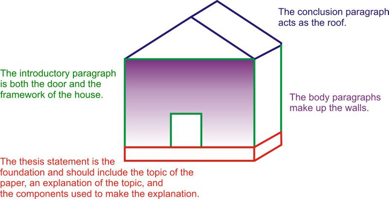
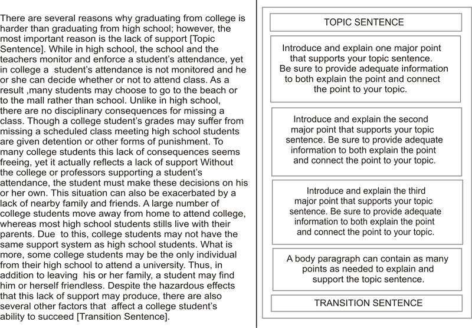
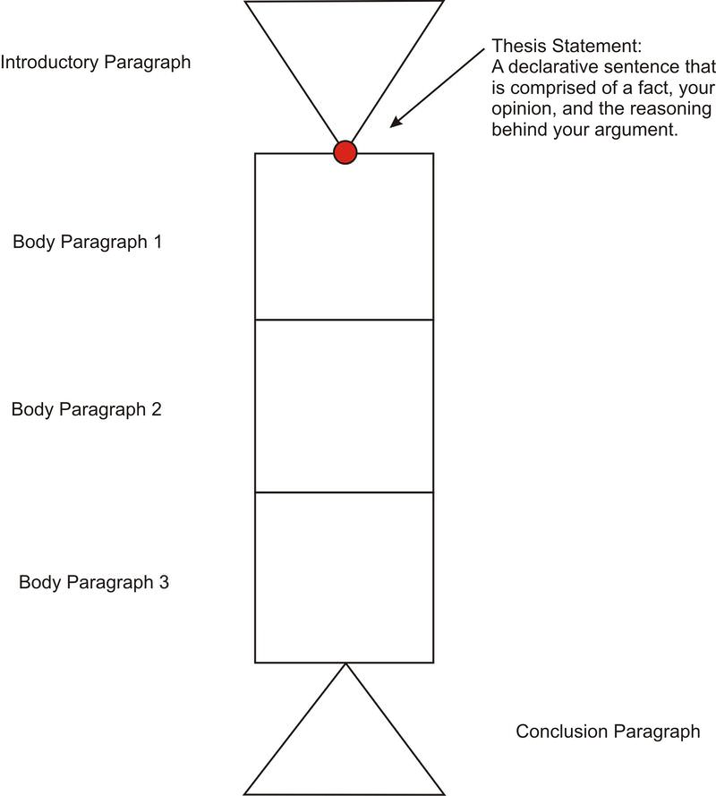
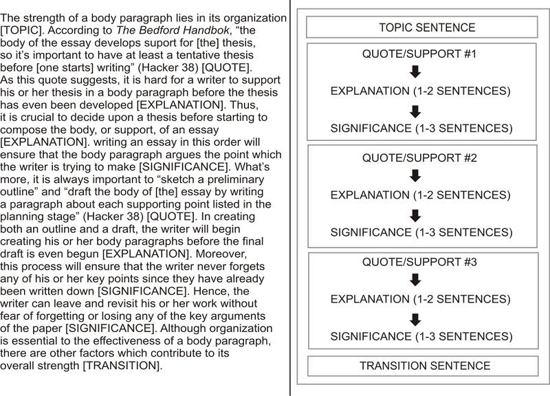
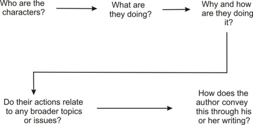
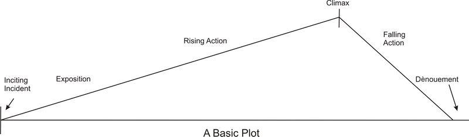
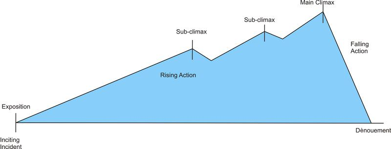
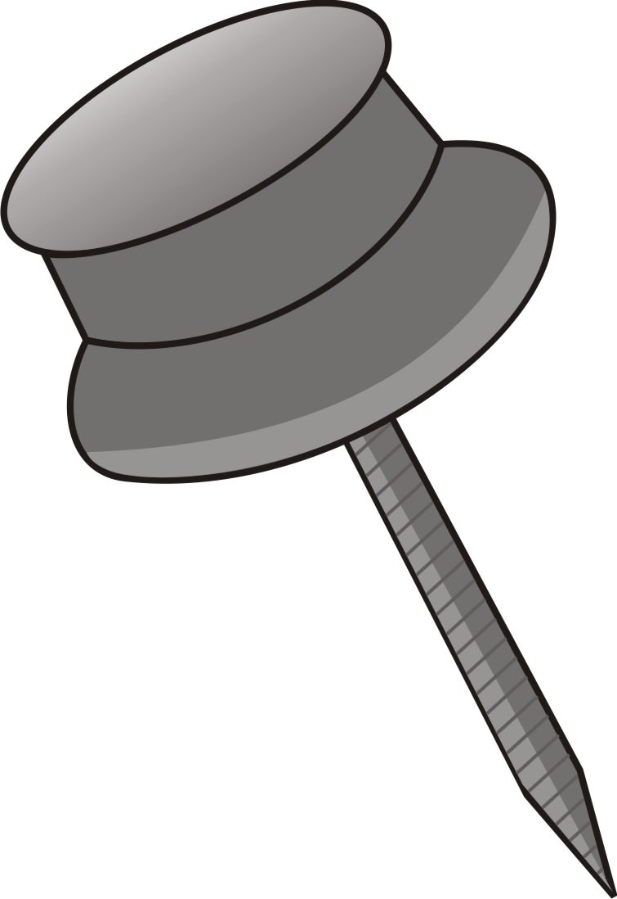

<!--
author:   Crystle Bruno

email:    LiaScript@web.de

version:  0.0.1

language: en

narrator: US English Female

comment:  This textbook follows California Language Arts Standards for grades 9-12 to provide a generalized understanding of composition and to serve as a supplementary aid to high school English teachers.

logo:     ../cover.jpg

tags:      composition, english, writing, commonsense

-->

# Commonsense Composition

> This document was automatically translated to LiaScript from
>
> https://www.ck12.org/book/commonsense-composition/

## 1.0 Descriptive Essays

<article>

</article>

### 1.1 Descriptive Essays

<article>

**Learning Objectives**

* Understand and utilize the descriptive language associated with the five senses.
* Conceptualize the difference between showing the reader and telling the reader.
* Identify the different types of descriptive essays: person, place, object, and event.
* Describe a person, a place, an object, or an event adequately and concisely.
* Master the organizational schemes associated with descriptive essays.
* Indicate in writing the significance of a person, place, object, and event.

**Introduction**

A descriptive essay provides a vibrant experience for the reader through vivid language and descriptions of something. Unlike narrative essays, which must include personal thoughts, feelings, and growth, descriptive essays do not need to be personal in nature. Instead, descriptive essays must focus on vividly and objectively describing something to the reader. In order to provide this vivid detail and language, the writer must use language that appeals to the reader’s five senses: sight, smell, sound, taste, and touch. To appeal to these senses, the writer must use descriptive language, usually in the form of adjectives, that describes the sensations felt by the senses. For instance, examine the differences between the descriptions below:

**Sentence 1**: The tree was tall and green.

**Sentence 2**: The soft and damp pink-flowers of the Dogwood tree smelled sweetly in the cool spring air as the wind whistled through its yellow-green leaves.

How do these descriptions compare? If these two sentences both describe the same tree, which sentence provides a better picture for the reader? Why?

While the first description does provide some detail (that the tree is both “tall” and “green”) it does not help the reader picture the tree. Saying that the tree is “tall” and “green” does not help separate the tree being described from any other tree. The second sentence, however, provides the reader with descriptive information that makes the tree unique. Unlike the writer of the first sentence who only vaguely described how the tree looked, the writer of the second sentence appeals to at least four of the reader’s five senses. This writer describes how the tree feels (“soft” and “damp”), how the tree smells (sweet), how the tree sounds (it whistles), and how the tree looks (pink and yellow-green). Through these descriptions the reader can see, hear, feel, and smell the tree while reading the sentence. Additionally, as with this case, in some instances not all of the senses will be applicable for the description. In this case, most descriptions of trees would not include a sense of how the tree tasted, especially when so many trees are inedible or poisonous!

| --- | --- | --- | --- | --- |Below is a table of words associated with each of the five senses.
| **See** | **Hear** | **Smell** | **Taste** | **Feel** |
| --- | --- | --- | --- | --- |
| Colors (green, blue, red)  Contrast (light vs. dark)  Depth (near vs. far)  Texture (rough, pebbly, smooth)  Shape (round, square, triangular)  Dimensions (height, width, length) | Loud\\Soft  Grating  Metallic  Atonal  Melodic  Euphonious  Discordant  Screeching  Gravelly  Harmonious | Sweet  Pungent  Acrid  Delicious  Disgusting  Appetizing  Fresh  Stale  Fruity  Tantalizing | Delicious  Sour  Sweet  Savory  Salty  Spoiled  Bitter  Earthy  Spicy  Bland | Soft\\Hard  Creamy  Rubbery  Firm  Cool/Hot  Unctuous  Porous/Smooth  Knobby  Sticky  Dry/Moist |

Providing good details in a descriptive essay also rests on the idea that a writer must **show** and not **tell** the reader. While good details in an essays are important, the most essential part of a descriptive essay is the reason for writing the essay. Since descriptive essays should explain to the reader the importance of what is being described, in addition to helping the reader picture it, the author must show the reader how and why something is significant rather than simply telling the reader. A good writer must help the reader picture what he or she is describing; however, a better writer shows the reader the purpose or reason for describing something. Consider the differences between the two sentences below:

**Example 1**: Ever since grade school, I have always been nervous during tests.

**Example 2**: Staring blankly at my exam, I tapped my pencil rapidly on the side of my desk and desperately tried to focus. Mustering up some courage, I wrote an answer to the second question, and just as quickly, I erased the answer frantically, not wanting to leave a trace of it on the blank, white paper. As the teacher announced that time was almost up, I remembered the taunt of my evil grade-school teacher, “You’ll never pass this test. Just give up already.” The memory of her words paralyzed my mind. Even more panic stricken than before, I stared wildly at my blank test, trying to remember what the teacher had said in class last week or what I had read in the textbook with no success.

While the first example does not explain how the narrator is nervous, it also fails to show why this nervousness is important. Ultimately, the first example tells and does not show the reader how the narrator is nervous or why this reaction is important. Meanwhile, the second example not only shows how the narrator expresses this nervousness (tapping the pencil on the desk, erasing answers, etc.), it begins to show why this is significant by relating it to earlier experiences in the narrator’s life. Through this connection, the writer is beginning to develop the description and the importance of the test-taking nervousness. Developing the second example into a full essay, the writer would go on to describe the experiences from grade school that led to this current bout of test-taking anxiety.

By showing and not telling the reader and by using descriptive language that appeals to the five senses, descriptive essays provide the reader with a detailed account and the significance of something. Thus, this something being described is the most important aspect of the descriptive essay. Generally, descriptive essays describe one of four some-things: a person, a place, an object, or an event.

Person
------

Like any other descriptive essay, the most important aspect of a person essay is the reason for writing it. Have you ever read a book or article for school wondering what the point is? Perhaps, even feeling disinterested because of what you felt was a lack of point or reason for reading or even writing the book, poem, article, etc.? Essentially, the same can be true for your own essays if you do not write with a purpose. In choosing the person you want to write about, you have a reason for the choice you have made. It is your job as the writer to show the reader your point. Why have you chosen this person instead of another? What makes them interesting? You must draw your readers into your essays just as every other author draws their readers into their work, even if your only audience is your teacher. Remember, teachers do not like reading pointless essays any more than you do!

Thus, whenever writing a descriptive essay about a person, you must ask yourself: Why did I choose this person? What makes this person special? Is it a memory? Which of this person’s characteristics has inspired me to write about him or her? In answering these questions, you not only find the reason or purpose for writing your essay, but you also inadvertently discover how to format your essay as well. Generally, essays can be formatted in a number of different ways. The formatting of an essay rests almost entirely on what you are trying to do or to say within your paper. For instance, let us consider the answer to some of the questions provided above.

Imagine that you have decided to write your descriptive essay about your aunt because you spent your summers with her when you were younger. Let’s say that during one of your visits to her house, she taught you how to swim in the lake behind her house, and this is one of the fondest memories from your childhood. In this case, your descriptive essay would be a chronological account of this experience. You would organize your essay around the experience by having an introduction and conclusion that indicate the topic and purpose of your essay while detailing the event in the body of the essay. For instance, in a descriptive essay about your aunt, the introduction and conclusion would indicated that this memory was the highlight of your childhood while the body paragraphs would describe the event in chronological order. Since this is a descriptive essay about a person and not an event, you must be sure to center your discussion of the event on the person involved, the person who made the event special.

However, you could also write a descriptive essay about your aunt that details some of your favorite characteristics about her. Perhaps you want your essay to describe a few reasons why your aunt is your favorite relative. In this essay, you would focus on the several characteristics that show why your aunt is so special. To do so, you may choose to explain briefly an event that supports one characteristic. For instance, if you want show that your aunt is spontaneous and that this is one of your favorite things about her, you may choose to describe a day when she woke you up early to take you on an unplanned, spur-of-the-moment trip to the beach. Through describing this event in one of your body paragraphs, you help support your claim that your aunt is spontaneous.

**Review Questions**

2.  Write a person descriptive essay about an important person in history using the event organization. Instead of indicating how the person is important to you, indicate how the person is important or significant within history.

Place
-----

Much like a person descriptive essay, the most important aspect of a descriptive essay about a place is your reason for writing it. Consider all of the places you have been to in your life -- not only the places you have visited on vacation but also those that you visit in everyday life. Every day, or at least during the school week, how many different places do you go to? Most likely, you would start your day at home before leaving for school. Do you stop to get breakfast or coffee along the way or do you stop and pick up a friend? While you would spend the majority of your day at school, do you leave campus to get lunch? How about after school, do you go straight home or do you go to a friend’s house or to a local hang out? Considering all the places you visit in one day, which would you pick to write about and why? These are the most important questions to answer when writing your place descriptive essay, and answering them will help you decide the organization of your paper.

The organization of a descriptive essay about a place is much like the organization of a descriptive essay about a person. Thus, there are two main organizational schemes that you can choose from when composing a descriptive essay about a place: one that focuses on certain characteristics of the place or one that focuses on a specific event (or set of events) related to a place. For instance, for the first type of organization, you would focus on the reasons, or characteristics, that indicate why you enjoy, or dislike, a place. For the second type, you would focus on the events that explain why this place is important to you. For example, if you were writing a descriptive place essay about Disneyland, these are the two ways in which you could organize your paper.

While it may not matter which type or organization you choose, you must always make the place the focus of your paper. Thus, be sure the events are characteristics you describe in the essay do not outshine the importance of the place they are describing. For instance, following the example above, when discussing the rides at Disneyland, do not focus too much on rides at other theme parks. While comparing the rides at Disneyland to rides at other theme park rides does stress how much better they are, do not let the rides at other amusement parks overshadow the rides at Disneyland. Additionally, remember to stress why the place being described is important to you regardless of the organizational scheme you choose.

**Review Questions**

2.  Write a descriptive essay about one of the original towns settled in New England by the early colonists (i.e. Massachusetts Bay Colony). Describe the location and environment of the town, paying close attention to how the location of the colony was integral to the colonists’ survival.

Object
------

By now, you may have noticed a pattern when it comes to organizing a descriptive essay. As you remember, you organize a descriptive essay about a person or place based either upon the characteristics associated with the person/place or an event associated with the person/place, and an object descriptive essay is no exception to this organizational scheme. When writing a descriptive essay about an object, you must first decide why you have chosen this specific object to write about. In answering this question, you will know how to organize your paper. If you decide that an object is important to you because of the characteristics the object possesses, then you would organize the body of your paper around these characteristics or reason. However, if an object is important to you because it was part of a significant event in your life, then you would produce body paragraphs that explain the event in chronological order.

<table id="x-ck12-MzQyOWIxODM5OTk1MDY4NTA2MzcxMGJkMDVlZTViYWU.-5o2"><thead><tr><th><strong>Organization Type</strong></th><th><strong>Characteristics</strong></th><th><strong>Event</strong></th></tr></thead><tbody><tr><td>Criteria</td><td><ol class="x-ck12-lower-alpha" id="x-ck12-MzhmMWNmNjI2NDc2MTNjM2RlMTJiNzE5ZGNhMWQ1ZGU.-ia1"><li>Good for climbing</li><li>Tire swing</li><li>Displays the change in seasons</li></ol></td><td>You received your first kiss from your first crush under this tree</td></tr><tr><td>Explanation</td><td>You would organize your paper around the main reasons why this is your favorite tree with each of these characteristics serving as a body paragraph.</td><td>You would organize your paper around this event and how it has made this tree more important to you.</td></tr></tbody></table>

Although the organizational scheme you choose rests solely on the content you intend to include, the object must be the focus of either paper. Make sure the characteristics of an object or the retelling of an event does not overshadow the impact of the object being described. For example, when describing the event of your first kiss, you would need to make sure that you did not spend too much of your paper focusing on your first crush. Additionally, when writing about an event connected to the object, be sure to connect the event to the significance of the object so that the event itself does not outshine the object being described. In focusing on not only the organization of the essay but also the significance of the object, the object descriptive essay that you compose will stress both the description and importance of the object being described.

**Review Questions**

2.  Write a descriptive essay about one of the state birds. Be sure to indicate why the bird is important to the state it represents.

Event
-----

Although the three previous types of descriptive essays follow the same two organizational schemes, event descriptive essays differ slightly in the way in which they are organized. While other descriptive essays either describe the person, place, or object in question or detail the event connected to it, event descriptive essays chronologically describe an event from the past or from the future. Thus, descriptive essays that focus on an event can either detail a memory that is significant or your hopes about an upcoming event. For instance, your event descriptive essay about a past event would describe a memory that is in some way important to you, be it positively or negatively; however, your event descriptive essay about a future event would describe something to occur in the future that you are hopeful of or that you dread.

While the other descriptive essays also employ organizational schemes that outline events connected to a person, place, or object, a descriptive essay about an event must focus on the event itself. For example, you could write a descriptive essay detailing the event of your graduation from high school that could be based on a person, place, object, or event. If you wanted to stress a person through this event, you could write an essay that details how your graduation is important because it was the first time you saw your grandparents in ten years. If you wanted to stress a place through this event, you could write an essay that details how important the stadium you graduated in is to you. If you wanted to stress an object through the event, you could write an essay that describes how important your diploma is to you. However, if you wanted to stress the importance of the graduation, or the event itself, you could write an essay that describes how all the things listed above, your grandparents, the location, and your diploma, all make the event significant to you.

Hence, while in the other descriptive essays you must never let the event overshadow the significance of the person, place, or object being described, in an event descriptive essay you should focus on how the people, place, and objects surrounding the event make it important. In this way, an event descriptive essay is a lot like the characteristics person, place, and object essays. Thus, think of the objects, people, and place of an event as the characteristics that make the event important to you whenever constructing an event descriptive essay.

**Review Questions**

2.  Write a descriptive essay about the 2008 Presidential Election, focusing on why this election was significant in the United States.

</article>

## 2.0 Narrative Essay

<article>

</article>

### 2.1 Narrative Essay

<article>

**Learning Objectives**

* Identify the differences in form between descriptive and narrative essays.
* Know the major differences between autobiographical and biographical narratives.
* Recognize the structure of autobiographical and biographical narratives.
* Identify the importance of personal growth in a narrative essay.
* Stress the importance of personal growth within your own narrative essay.

**Introduction**

Unlike the descriptive essays that strive to explain why a person, a place, an object, or an event is important, a narrative essay demonstrates the development of a person through the chronological retelling of an important event. In addition, a narrative essay should indicate how a person has changed or learned from this experience. The experience should unfold much like the plot of a novel or short story, beginning with the individual facing a problem and ending in the resolution of the problem and subsequent growth of the individual. Thus, the action of the problem should unfold as the telling of the event unfolds, much like the action of a short story builds as the plot progresses.

However, just as in descriptive essays, you must describe the event that is progressing, effectively drawing your readers into the development of the individual. Think of how invested, or perhaps uninvested, you become in the stories you read. Why do you connect with certain characters and not with others? Often, you connect with characters you feel you can relate to in some way or with events that you can imagine experiencing. Thus, it is essential to clearly and concisely indicate the action of the event being described. Your readers must be able to imagine being at and participating in the event. However, you must keep in mind that you can provide too much information to the reader. Make sure all the details you provide are relevant to the narration. For instance, when narrating an event, you do not need to include details that do not add to the feeling of an event. Otherwise, the readers will feel unconnected and disinterested in the development of the individual.

While describing the event is crucial to the reader's understanding and interest, the person's feelings, thoughts, desires, or insights are integral to creating the sense of personal growth. Without these components, the reader will be unable to track the person's development and change. Essentially, in order for the reader to see that the individual has transformed, you must present the inner thoughts, desires, and feelings of the person before and after the alleged transformation. This way the reader can compare the thoughts and feelings from before the change with those after and ultimately evaluate the personal growth of the individual on their own.

Since the personal growth in the narrative is the most essential component, choosing the individual and experiences is an important decision. As a writer hoping to engage the reader, you must carefully consider both the events and the individual that you choose. Not only must you choose events that share a common theme, or that point toward the same idea, eventual personal growth, but you must also choose an individual who is compelling. Generally, a narrative essay can either be autobiographical or biographical in nature. That is, the narrative can be written by you and about you or the narrative can be written by you and about someone else. Moreover, in choosing to write about yourself or about someone else, you decide the organization of your paper.

Autobiographical Narrative
--------------------------

An autobiographical narrative is one of the most personal types of essays. Not only are you writing a paper that expresses your own views and thoughts, but autobiographical narratives are based upon your own life experiences. Thus, it follows that the organization of the paper will also be more personal in nature. Unlike a narrative essay based on another individual, an autobiographical narrative will always contain your personal thoughts, desires, and motivations. While it is hard to know the motives of other individuals when writing a biographical narrative, unless you know the individual well, you always have access to the motivations for your own personal development. Hence, when you organize your autobiographical narrative you must format your essay around the events that promote your personal growth and the feeling you experienced before, during, and after these events.

There are several ways to incorporate your thoughts, feelings, and motivations into the organization of your paper. First, you can consider integrating your description of certain events with your motives and thoughts for the events. This way, you present the events and your motivations both in chronological order and simultaneously. This means that you are describing the events and your feelings as they occurred, or at the same time. Second, you can consider blocking your description of your events and your feelings, providing a paragraph describing the event followed by a paragraph describing your motivations. Also, you could also reverse this blocking format to first provide your motivations and then the description of the event.

| --- | --- |Below is a table containing examples of both table types.
| **Integrated description and motivations** | **Blocked descriptive and motivations** |
| --- | --- |
| My sixteenth birthday was when it all began. It was the first girl-boy party I had ever had. I had had to beg my parents for month to have that party. Once they said yes, I had worried for weeks about what I was going to wear. When the day came, I was so excited that my crush Brandon was coming. As I sat next to him during the movie, I could feel my heart race. We were sitting side by side, close enough to touch. I slowly moved my hand towards his, wondering if he wanted to hold my hand like I wanted to hold his and fearing that he didn’t. | My sixteenth birthday was at my house on a Saturday during the summer, and it would be a boy-girl party. I had planned the whole day. First, we would swim in the pool in my backyard while my dad and mom prepared hamburgers. After we ate, we would watch a movie in my living room. At the end of the night, we would have cake, and I would open my presents.  Since it took me weeks to convince my parents to have the party, I was very excited when it finally rolled around. My crush Brandon was going to come, and I hoped that he would finally make a move. I thought that the movie would be a perfect chance to show him that I wanted to be his girlfriend. |

How do these two examples compare? Although they both narrate the same event, is one more effective than the other? Generally, the first organizational scheme (when you integrate description and motivations together) is the most seamless. By incorporating the two together, you provide the reader with a more complete picture of the event – as if the reader is experiencing the event as it unfolds in your narration. However, sometimes this formatting does not work, specifically with complicated events. If you feel that the event you are narrating is too difficult to explain or clarify, then you should consider breaking your description and thoughts into two separate paragraphs. Although, you need to be aware of how this affects the story you are telling. Do you want the importance of the event to be at the end? In doing so, you make the event seem more suspenseful, and you can make the reader more compelled to finish your narrative. Nevertheless, organizing your paper in this way places more of a burden on you as a writer because you must clearly connect the separate ideas in the paragraphs.

Regardless of the organizational scheme you choose, you must properly describe your personal growth. In order to do so, you must organize your essay around one significant event or a collection of interrelated specific events. Generally, the number of events you include defines the amount of detail you put into describing your events. If your paper centers around one main event that helped shape your personal growth, the majority of the body would describe the one event while the introduction and conclusion would include your thoughts and feelings from before and after the event to help clarify how the occurrence helped shape you. However, if your paper details a succession of events that culminate in your personal growth, the description of each event, including the insights and feelings associated with it, would be limited to a single body paragraph. In this case, the introduction and conclusion would still indicate how you felt and thought both before and after the transformation.

Biographical Narrative
----------------------

Unlike the much more personal autobiographical narrative, biographical narratives tend to be more formal and less personal. While you can easily include how you felt or what you thought during events in your own life, it is harder to indicate how others thought or felt during action in their own lives. Sometimes, if you are writing a biographical narrative about a close friend or relative, or if you have interviewed the individual you are writing about, you can include specific insights and motivations. If you do have access to the person's thoughts and feelings, you can easily organize your biographical narrative as you would an autobiographical one. However, usually, you will have to infer how a person felt or what they thought from their actions in certain events.

If you must write a biographical narrative about someone you do not know or someone you cannot interview, you must suggest his or her motivations through analyzing his or her actions. For instance, if someone apologizes for past behavior, then you can infer that he or she feels regret about the incident. You could then analyze the events following this apology to see if the individual's apology was genuine. In other words, you could see if the individual's behavior changed after the apology or if the individual changed his or her actions in significant ways. In order to vocalize the analysis in your paper, you must suggest to your reader that the individual started acting and behaving differently because he or she was responding to a past experience. For example, you would need to stipulate that the good behavior following the apology means that the individual regrets his or her past actions. On the other hand, if an individual’s actions after an apology do not change (if the person continues to make the same mistake for instance), you can infer that he or she does not regret or feel sorry for his or her past actions.

**Review Questions**

2.  How does a narrative essay differ from a descriptive essay?
3.  What are the two ways you can organize an autobiographical narrative?
4.  How do you show the feelings and thoughts of other individuals when writing a biographical narrative?
5.  Write an autobiographical narrative about your experience as a writer. Be sure to stress how you have grown as a writer by including both descriptions of past situations and your feelings and thoughts about these situations.

</article>

## 3.0 Expository Essay

<article>

</article>

### 3.1 Expository Essay

<article>

**Learning Objectives**

* Provide evidence that supports a thesis, including relevant information on varying perspectives.
* Articulate concepts and information from correctly and concisely.
* Decipher between the significance and merit of different facts, concepts and data.
* Master the organization of an expository essay.

**Introduction**

The main aim of an expository essay is to provide an effective explanation of a topic. While a descriptive essay strives to describe a subject or a narrative essay seeks to show personal growth, an expository essay tries to explain a topic or situation. Thus, expository essays are written as if the writer is explaining or clarifying a topic to the reader. Since an expository essay is trying to clarify a topic, it is important that it provides the categories or reasons that support the clarification of the paper. Moreover, these categories and reasons also provide the framework for the organization of the paper.

Much like the categories are essential to clarifying the topic, organization is the key to any well-developed essay. When composing your essay, think of its organization as a house, with each component of an essay representing a major part of a house. Just as the foundation provides support on which a house can be built, a thesis represents the foundation upon which to build an essay. The introductory paragraph then functions as both the door and framework for an expository essay. Like a house door, the introductory paragraph must allow the reader to enter into the essay. Additionally, just as walls are built upon the framework of a house, the body paragraphs of an essay are organized around the framework or organizational scheme, presented in the introductory paragraph. The body paragraphs, much like the walls of a house, must be firm, strong and complete. Also, there must always be as many body paragraphs as the framework of the introductory paragraph indicates otherwise your essay will resemble a house that is missing a wall. Finally, an essay must include a conclusion paragraph that tops off the essay much like a roof completes a house. As the roof cements the structure of the house and helps hold the walls in place, the conclusion paragraph must reiterate the points within your body paragraphs and complete an essay.

Although the overall organization of an expository essay is important, you must also understand the organization of each component (the introductory, body and conclusion paragraphs) of your essay. The chart below identifies the essential parts of each component of your essay, explaining the necessary information for each type of paragraph. While the guidelines listed below may feel constrictive, they are merely meant to guide you as a writer. Ultimately, the guidelines should help you write more effectively. The more familiar you become with how to organize an essay, the more energy you can focus on your ideas and your writing. As a result, your writing will improve as your ability to organize your ideas improves. Plus, focusing your energy on your argument and ideas rather than the organization makes your job as a writer more exciting and fun.

* Introduce the issue.
* Present the topic and its explanation or clarification.
* Provide the categories used to explain the topic.
* Provide the thesis statement.

Body Paragraphs:

* Begin with a topic sentence that reflects an explanation of the paper and the category being discussed in the paragraph.
* Support the argument with useful and informative quotes from sources such as books, journal articles, etc.
* Provide 2-3 quotes that connect the category being discussed to the explanation
* Provide 2-3 sentences explaining each quote more full, drawing stronger connections between the category and the explanation.
* Ensure that the information in these paragraphs is important to the thesis statement.
* End each paragraph with a transition sentence which leads into the next body paragraph.

Concluding Paragraph:

* Begin with a topic sentence that reflects the argument of the thesis statement.
* Briefly summarize the main points of the paper.
* Provide a strong and effective close for the paper.

Introductory Paragraphs
-----------------------

A strong introductory paragraph is crucial to the development of an effective expository essay. Unlike an argumentative essay which takes a stand or forms an opinion about a subject, an expository essay is used when the writer wishes to explain or clarify a topic to the reader. In order to properly explain a topic, an expository essay breaks the topic being addressed into parts, explains each component in relation to the whole and uses each component to justify the explanation of the topic. Thus when writing an introductory paragraph, it is crucial to include the explanation or clarification of the topic and the categories or components used to produce this explanation.

* Introduce the issue.
* Present the topic and its explanation or clarification.
* Provide the categories used to explain the topic.
* Provide the thesis statement.

Since the success of the paper rests on the introductory paragraph, it is important to understand its essential components. Usually, expository papers fail to provide a clear explanation not because the writer’s lacks explanations or clarifications but rather because the explanations are not properly organized and identified in the introductory paragraph. One of the most important jobs of an introductory paragraph is that it introduces the topic or issue. Most explanations cannot be clarified without at least some background information. Thus, it is essential to provide a foundation for your topic before you begin explaining your topic. For instance, if you wanted to explain what happened at the first Olympic Games, your introductory paragraph would first need to provide background information about how the first games happened. In doing so, you ensure that your audience is as informed about your topic as you are and thus you make it easier for your audience to understand your explanation.

**Introductory paragraphs introduce the topic and suggest why it is important.**

**Example:** _An analysis of the essay exam results of the new English class shows that the new class format promotes close reading and better essay organization._

This sentence tells the reader both that the topic of the paper will be the benefits of the new English class and that the significance of these benefits is the improvement of close reading and essay organization.

**Introductory paragraphs outline the structure of the paper and highlight the main ideas.**

**Example:** _Considering the results of the High School Exit Exam, it is apparent that school curriculum is not properly addressing basic math skills such as fractions, percentages and long division._

This sentence indicates that main ideas (fractions, percentages and long division) of the essay and indicates the order in which they will be presented in the body paragraphs.

**Introductory paragraphs state the thesis.**

**Example:** _California high schools will require all students to take a resume and cover letter writing workshop in order to better prepare them for employment._

This thesis statement indicates the explanation of the paper.

In addition to introducing the topic of your paper, your introductory paragraph also needs to introduce each of the arguments you will cover in your body paragraphs. By providing your audience with an idea of the points or arguments you will make later in your paper, your introductory paragraph serves as a guide map, not only for your audience but also for you. Including your main sub-points in your introduction not only allows your audience to understand where your essay is headed but also helps you as a writer remember how you want to organize your paper. This is especially helpful if you are not writing your essay in one sitting as it allows you to leave and return to your essay without forgetting all of the important points you wanted to make.

<table id="x-ck12-dGFibGU6" title="" summary=""><thead><tr><th><strong>Things to always do</strong></th><th><strong>Things to never do</strong></th></tr></thead><tbody><tr><td><ul id="x-ck12-YTc1ODAwODA4Nzk5NDJmODUzZTUwYzY0NjNmNjkxZWE.-xt6"><li>Capture the interest of your reader.</li><li>Introduce the issue to the reader.</li><li>State the problem simply.</li><li>Write in an intelligible, concise manner.</li><li>Refute any counterpoints.</li><li>State the thesis, preferably in one arguable statement.</li><li>Provide each of the arguments that will be presented in each of the body paragraphs.</li></ul></td><td><ul id="x-ck12-N2RhNDY0Y2ZiYTA5MDgwOGMwZTliNzNlYTJjNDhkMzg.-qyi"><li>Apologize: Do not suggest that you are unfamiliar with the topic.</li></ul>
<strong>Example:</strong> “<em>I cannot be certain, but...</em>”
<ul id="x-ck12-YzZkYTk4MTE3MmRiYzRiMzg4NDNlZDIxOTJmN2MxODY.-kxt"><li>Use sweeping generalizations.</li></ul>
<strong>Example:</strong> “<em>All men like football...</em>”
<ul id="x-ck12-MDJlZDg1ZjU1YTRhMWE0ZmFkZjE2Y2Y0NjVjMjg3MmE.-fqm"><li>Use a dictionary definition.</li></ul>
<strong>Example:</strong> “<em>According to the dictionary, a humble person is...</em>”
<ul id="x-ck12-NTZmMzJmODk5Y2U2YzQ1ZWFjMDUwNjQ4YWM3ZjcwYjU.-6if"><li>Announce your intentions: Do not directly state what you will be writing about.</li></ul>
<strong>Example:</strong> “<em>In the paper I will...</em>”
</td></tr></tbody></table>

Most importantly, when writing an introductory paragraph, it is essential to remember that you must capture the interest of your reader. Thus, it is your job as the writer to make the introduction entertaining or intriguing. In order to do so, consider using a quotation, a surprising or interesting fact, an anecdote or a humorous story. While the quotation, story or fact you include must be relevant to your paper, placing one of these at the beginning of your introduction helps you not only capture the attention or the reader but also introduce your topic and argument, making your introduction interesting to your audience and useful for your argument and essay.

Body Paragraphs
---------------

In an expository essay the body paragraphs are where the writer has the opportunity to explain or clarify his or her viewpoint. By the conclusion paragraph, the writer should adequately clarify the topic for the reader. Regardless of a strong thesis statement that properly indicates the major sub-topics of the essay, papers with weak body paragraphs fail to properly explain the topic and indicate why it is important. Body paragraphs of an expository essay are weak when no examples are used to help illuminate the topic being discussed or when they are poorly organized. Occasionally, body paragraphs are also weak because the quotes used complicate from rather than simplify the explanation. Thus, it is essential to use appropriate support and to adequately explain your support within your body paragraphs.

In order to create a body paragraph that is properly supported and explained, it is important to understand the components that make up a strong body paragraph. The bullet points below indicate the essential components of a well-written, well-argued body paragraph.

* Begin with a topic sentence that reflects the argument of the thesis statement.
* Support the argument with useful and informative quotes from sources such as books, journal articles, expert opinions, etc.
* Provide 1-2 sentences explaining each quote.
* Provide 1-3 sentences that indicate the significance of each quote.
* Ensure that the information provided is relevant to the thesis statement.
* End with a transition sentence which leads into the next body paragraph.

Just as your introduction must introduce the topic of your essay, the first sentence of a body paragraph must introduce the main sub-point for that paragraph. For instance, if you were writing a body paragraph for a paper explaining the factors that led to US involvement in World War II, one body paragraph could discuss the impact of the Great Depression on the decision to enter the war. To do so, you would begin with a topic sentence that explains how the Great Depression encouraged involvement in the war because the war effort would stimulate certain aspects of the economy. Following this sentence, you would go into more detail and explain how the two events are linked. By placing this idea at the beginning of the paragraph, not only does your audience know what the paragraph is explaining, but you can also keep track of your ideas.

Following the topic sentence, you must provide some sort of fact that supports your claim. In the example of the World War II essay, maybe you would provide a quote from a historian or from a prominent history teacher or researcher. After your quote or fact, you must always explain what the quote or fact is saying, stressing what you believe is most important about your fact. It is important to remember that your audience may read a quote and decide it is indicating something entirely different than what you think it is explaining. Or, maybe some or your readers think another aspect of your quote is important. If you do not explain the quote and indicate what portion of it is relevant to your clarification, than your reader may become confused or may be unconvinced of your explanation. Consider the possible interpretations for the statement below.

**Example:** While the U.S. involvement in World War II was not the major contributor to the ending of the Great Depression, the depression was one of the primary motives for entering the war.

Interestingly, this statement seems to be saying two things at once – that the Great Depression helped spark involvement in the war and that World War II did not end the depression alone. On the one hand, the historian seems to say that the two events are not directly linked. However, on the other hand, the historian also indicates that the two events are linked in that the depression caused U.S. involvement in the war. Because of the tension in this quotation, if you used this quote for your World War II essay, you would need to explain that the significant portion of the quote is the assertion that links the events.

In addition to explaining what this quote is saying, you would also need to indicate why this is important to your explanation. When trying to indicate the significance of a fact, it is essential to try to answer the “so what.” Image you have just finished explaining your quote to someone and they have asked you “so what?” The person does not understand why you have explained this quote, not because you have not explained the quote well but because you have not told him or her why he or she needs to know what the quote means. This, the answer to the “so what,” is the significance of your paper and is essentially your clarification within the body paragraphs. However, it is important to remember that generally a body paragraph will contain more than one quotation or piece of support. Thus, you must repeat the Quotation-Explanation-Significance formula several times within your body paragraph to fully explain the one sub-point indicated in your topic sentence. Below is an example of a properly written body paragraph.

Conclusion Paragraph
--------------------

The conclusion paragraph of an expository essay is an author’s last chance to create a good impression. Hence, it is important to restate the thesis statement at the beginning of the paragraph in order to remind the reader of your topic and explanation. Since it is at the end of the paper, the conclusion paragraph also should add a sense of closure and finality to the clarification of the paper. It is important to re-emphasize the main idea without being repetitive or introducing an entirely new idea or subtopic. While you can conclude your conclusion paragraph by suggesting a topic for further research or investigation, do not make this question the focus of the paragraph. Thus, you should briefly and concisely reiterate the strongest clarifications of the paper, reminding the reader of the validity of your thesis or explanation and bringing closure to your paper.

* Begin with a topic sentence that reflects the argument of the thesis statement.
* Briefly summarize the main points of the paper.
* Provide a strong and effective close for the paper.

<table id="x-ck12-dGFibGU6" title="" summary=""><thead><tr><th><strong>Things to always do</strong></th><th><strong>Things to never do</strong></th></tr></thead><tbody><tr><td><ul id="x-ck12-YzA2NTVkZWRmY2I3MjZkMWE3OGQzOGI2OWFiMjhiZDk.-rau"><li>Stress the importance of the thesis.</li></ul></td><td><ul id="x-ck12-NDRmNDI3ZmI5MTJhZmQ3NzYxZDEwMjE3NDI4MjI0YTg.-8hw"><li>Rework your introduction or thesis statement.</li></ul></td></tr><tr><td><ul id="x-ck12-YmEwMzg3OWI4NjA2Mjc0Zjk4NGY3OWJlNjIzYWFmOTc.-ymd"><li>Include a brief summary of the main idea.</li></ul></td><td><ul id="x-ck12-MzU3OWFiYjA4MzIwZjFhMGI4ZDJkM2QzM2JhZmE0MWI.-ejf"><li>Use overused phrases.</li></ul></td></tr><tr><td><ul id="x-ck12-MDFhNDU2MTZiOTdhMjM0ZDgzZTYwNWI3NDM5YzlmZDE.-k9q"><li>Be concise.</li></ul></td><td><ul id="x-ck12-MjRmNWZlN2Y2MzgzOTVmYTNlMGUwZDEwOTMzMTQ3YTc.-cmn"><li><strong>Example:</strong> “<em>In summary</em>...” or “<em>In conclusion...</em>”</li></ul></td></tr><tr><td><ul id="x-ck12-MjIxNDBjMTkwOGUyNDI3MDM1NDQyMTE1YzE2NDlmMzI.-pcy"><li>Provide a sense of closure.</li></ul></td><td><ul id="x-ck12-Y2RiZWYzMDhjMzQ3YmViOTc2ZjNhOWI3ZTJiYmViNGE.-pzm"><li>Announce what you have written in the body of the essay</li></ul></td></tr><tr><td></td><td><ul id="x-ck12-YjBhYmIyNjJiOTVmYjU5ZmMzYjliOTAxNzUwMDkzOWM.-4iq"><li><strong>Example:</strong> “<em>In this paper I have emphasized the importance of...</em>”</li></ul></td></tr><tr><td></td><td><ul id="x-ck12-ZDIwZmUzMDM5OGU4NTMxZjRmMTRkZjQxMzhiODg3NGI.-lyp"><li>Apologize.</li></ul></td></tr><tr><td></td><td><ul id="x-ck12-NjBlMjI2N2EwNDBjMTgwMjg5ZTY3NTY3MWQwZGQwZWE.-q9c"><li><strong>Example:</strong> “<em>Although I do not have all the answers...</em>”</li></ul></td></tr><tr><td></td><td><ul id="x-ck12-MmQzYjBmYzRkNjI2NDE2MTBhODg5ZTNhNjY5MTQ1NzQ.-28r"><li>Make absolute claims.</li></ul></td></tr><tr><td></td><td><ul id="x-ck12-MDJiOTEyMjAzNjVhNGU1OTkyYmJmY2Y5YmQyMWI0YTc.-9je"><li><strong>Example:</strong> “<em>This proves that the government should...</em>”</li></ul></td></tr></tbody></table>

You may feel that the conclusion paragraph is redundant or unnecessary; However, do not forget that this is your last chance to explain the significance of your argument to your audience. Just as your body paragraphs strive to present the significance of each fact or quote you use, your conclusion paragraph should sum up the significance of your argument. Thus, you should consider making a bold statement in your concluding paragraph by evoking a vivid image, suggesting results or consequences related to your argument or ending with a warning. Through using these components, you not only make your conclusion paragraph more exciting, but you also make your essay and your argument, more important.

**Review Questions**

2.  What should you never do in an introductory paragraph?
3.  How should you refute counterpoints?
4.  What is the formula for a well-argued body paragraph?
5.  What should you include in a conclusion paragraph? What should never include in a conclusion paragraph?

**Points to Consider**

2.  Write an expository essay about a historical event, indicating at least three factors that contributed to its development. For instance, you could discuss how factors, such as World War I, led to the Women’s Suffrage Movement. A factor could be an event, an individual or a movement that is historically significant. In order to properly show how certain factors caused or contributed to a specific event, you must clarify both the factors and the event itself.

</article>

## 4.0 Persuasive Essay

<article>

</article>

### 4.1 Persuasive Essay

<article>

**Learning Objective**

* Organize arguments in a logical and persuasive order.
* Provide appropriate support in the form of quotations, statistics, expert opinions, and commonly accepted facts
* Clarify the meaning and significance of the main arguments.
* Identify and refute relevant counterpoints.

**Introduction**

The main aim of a persuasive essay is to make an effective argument. Thus, persuasive essays are written as if the writer is attempting to convince his or her audience to adopt a new belief or behavior. While expository essays strive to explain or clarify a topic, persuasive papers take a stand on an issue. However, simply having an argument or opinion about a topic is not enough. In persuasive essays, writers must also support their opinions. Typically, persuasive essays support their arguments through the use of appropriate evidence, such as quotations, examples, expert opinions, or other facts. Nevertheless, simply having an opinion and supporting evidence is still not enough to write a strong persuasive essay. In addition to these two things, a writer must also have strong organization.

Organization is the key to any well-developed essay. When composing your essay, think of its organization as a set of blocks balanced between two triangles (see Figure 1a). Each block represents the main arguments of your essay, while the two triangles stand for your introductory and concluding paragraphs respectively. Just as the top triangle comes to a point before leading into the blocks, your introductory paragraph should conclude with your thesis before your essay jumps to the supporting paragraphs. These supporting paragraphs, as the blocks suggest, should be full of information and logically solid. Just as the stability and balance of the shape rests on the solidity of the blocks, the stability of the argument of the essay rests on the success of the body paragraphs. Much like the introductory paragraph that precedes it, your concluding paragraph should restate your thesis statement and the main points of your essay, allowing your essay to end on a firm base.

While it is important to understand the general organization of a persuasive essay, it is also essential to know the organization of each element or component of a persuasive essay. Below is chart that identifies the major components of each part of a persuasive essay. Keep in mind that these guidelines are not meant to hinder your voice as a writer but rather to strengthen your effectiveness as a writer. Though you may sometimes feel constricted by this organizational framework, it is essential to compose an essay that contains all of these parts in order to make a strong argument. Plus, once you get acquainted with how to organize a persuasive essay, you will be able to use your creative juices in the actual writing of the paper. Rather than focusing on where to put an idea, you can focus on how to express or explain, which makes your job as a writer easier and more exciting.

* Introduce the issue.
* Provide each of the arguments that will later appear in each body paragraph.
* Refute any counterpoints to the argument.
* Provide the thesis statement.

Body Paragraphs:

* Begin with a topic sentence that reflects the argument of the thesis statement.
* Support the argument with useful and informative quotes from sources such as books, journal articles, etc.
* Provide 1-2 sentences explaining each quote.
* Provide 1-3 sentences that indicate the significance of each quote.
* Ensure that the information in these paragraphs is important to the thesis statement.
* End each paragraph with a transition sentence which leads into the next body paragraph.

Concluding Paragraph:

* Begin with a topic sentence that reflects the argument of the thesis statement.
* Briefly summarize the main points of the paper.
* Provide a strong and effective close for the paper.

Introductory Paragraphs
-----------------------

A strong introductory paragraph is crucial to the development of an effective persuasive essay. Without an introductory paragraph that properly introduces both the topic _and_ the writer’s argument, persuasive essays fail to convince the reader of the validity of the argument. Since the introductory paragraph contains the thesis statement, or the core argument and purpose of the essay, introductory paragraphs are essential to the overall success of the paper.

* Introduce the issue.
* Provide each of the arguments that will later appear in each body paragraph.
* Refute any counterpoints to the argument.
* Provide the thesis statement.

Since the success of the paper rests on the introductory paragraph, it is important to understand its essential components. Usually, persuasive papers fail to make a clear argument not because the writer’s ideas or opinions are wrong but rather because the argument is not properly explained in the introduction. One of the most important jobs of an introductory paragraph is that it introduces the topic or issue. Most arguments cannot be made without at least some background information. Thus, it is essential to provide a foundation for your topic before you begin explaining your argument. For instance, if you wanted to argue that the special effects in the movie _Avatar_ are innovative, your introductory paragraph would first need to provide background information about movie special-effects. By doing so, you ensure that your audience is as informed about your topic as you are, and thus you make it easier for your audience to understand your argument.

**Introductory paragraphs introduce the topic and suggest why it is important.**

**Example:** _An analysis of the San José State University Writing Center survey answers reveal that a significant portion of tutees improved their writing skills, and this has correlated to an improvement on their essay scores_.

This sentence tells the reader both that the topic of the paper will be the benefits of the Writing Center and that the significance of these benefits is the improvement of essay scores.

**Introductory paragraphs outline the structure of the paper and highlight the main ideas.**

**Example:** _Considering the SAT average of high school juniors in California, it is apparent that schools are not addressing basic math skills such as fractions, percentages, and long division._

This sentence provides the main ideas of the essay and indicates the order in which they will be presented in the body paragraphs.

**Introductory paragraphs state the thesis.**

**Example:** _San José State University should require all students to enroll in Creative Writing courses in order to better prepare them for employment._

This thesis statement indicates the argument of the paper.

In addition to introducing the topic of your paper, your introductory paragraph also needs to introduce each of the arguments you will cover in your body paragraphs. By providing your audience with an idea of the points or arguments you will make later in your paper, your introductory paragraph serves as a guide map, not only for your audience but also for you. Including your main sub-points in your introduction not only allows your audience to understand where your essay is headed but also helps you as a writer remember how you want to organize your paper. This is especially helpful if you are not writing your essay in one sitting as it allows you to leave and return to your essay without forgetting all of the important points you wanted to make.

Another common, though often forgotten, component of an introductory paragraph is the refutation of counterpoints. In order for your argument to appear strong, and in order for your audience to know that you considered the points against your claim, it is essential to refute, or disprove, counterpoints, or arguments against your thesis, in your introductory paragraph. The most common error a writer faces when dealing with counterpoints is to not refute them. Sometimes, a writer forgets to show how the counterpoints are wrong and how his or her opinion or argument is correct. To avoid this error, consider using the sentence constructions in the chart below that help refute counterpoints. By using words such as while, although, yet, or however in compound sentences, you can be sure that you are properly refuting any counterpoints to your argument while support your own claims.

* While most people believe $X, \ Y$ is true.
* Although people argue $X, \ Y$ is correct.
* This expert claims $X$, yet this expert in the same field argues $Y$.
* This book says $X$; however, this book indicates that $Y$ is true.

There are also some important dos and don’ts when it comes to writing introductory paragraphs. It is crucial when writing your persuasive paper to avoid apologizing or using sweeping generalizations since both undermine your argument. If you continue to apologize in your paper, you make your argument seem weak, and thus your audience is unconvinced. Likewise, if you base your argument on a generalization or stereotype, something which your audience will likely disagree with, your entire argument will lose credit or validity. Also, it is important not to rely to heavily on dictionary definitions, especially in your thesis. A thesis must be composed of a fact and an opinion. Thus, if you base your argument on a definition, which is an irrefutable fact, your thesis is no longer an opinion but a truth.

<table id="x-ck12-dGFibGU6" title="" summary=""><thead><tr><th><strong>Things to always do</strong></th><th><strong>Things to never do</strong></th></tr></thead><tbody><tr><td><ul id="x-ck12-YTc1ODAwODA4Nzk5NDJmODUzZTUwYzY0NjNmNjkxZWE.-ojm"><li>Capture the interest of your reader.</li><li>Introduce the issue to the reader.</li><li>State the problem simply.</li><li>Write in an intelligible, concise manner.</li><li>Refute any counterpoints.</li><li>State the thesis, preferably in one arguable statement.</li><li>Provide each of the arguments that will be presented in each of the body paragraphs.</li></ul></td><td><ul id="x-ck12-N2RhNDY0Y2ZiYTA5MDgwOGMwZTliNzNlYTJjNDhkMzg.-dc3"><li>Apologize: Do not suggest that you are unfamiliar with the topic.</li></ul>
<strong>Example:</strong> “<em>I cannot be certain, but...</em>”
<ul id="x-ck12-YzZkYTk4MTE3MmRiYzRiMzg4NDNlZDIxOTJmN2MxODY.-qhb"><li>Use sweeping generalizations.</li></ul>
<strong>Example:</strong> “<em>All men like football...</em>”
<ul id="x-ck12-MDJlZDg1ZjU1YTRhMWE0ZmFkZjE2Y2Y0NjVjMjg3MmE.-q2d"><li>Use a dictionary definition.</li></ul>
<strong>Example:</strong> “<em>According to the dictionary, a humble person is...</em>”
<ul id="x-ck12-NTZmMzJmODk5Y2U2YzQ1ZWFjMDUwNjQ4YWM3ZjcwYjU.-hsh"><li>Announce your intentions: Do not directly state what you will be writing about.</li></ul>
<strong>Example:</strong> “<em>In the paper I will...</em>”
</td></tr></tbody></table>

Most importantly, when writing an introductory paragraph, it is essential to remember that you must capture the interest of your reader. Thus, it is your job as the writer to make the introduction entertaining or intriguing. In order to do so, consider using a hook, or a quotation, a surprising or interesting fact, an anecdote, or a humorous story. While the quotation, story, or fact you include must be relevant to your paper, placing one of these at the beginning of your introduction helps you not only capture the attention or the reader but also introduce your topic and argument, making your introduction interesting to your audience and useful for your argument and essay. However, after using a hook, you must transition from the quote, fact, or story that used into the main topic of your paper. Often, writers include interesting hooks that they do not connect to their topic or argument. In these instances, the hook detracts from rather than supports the introductory paragraph.

Body Paragraphs
---------------

In a persuasive essay the body paragraphs are where the writer has the opportunity to argue his or her viewpoint. By the conclusion paragraph, the writer should convince the reader to agree with the argument of the essay. Regardless of a strong thesis, papers with weak body paragraphs fail to explain why the argument of the essay is both true and important. Body paragraphs of a persuasive essay are weak when no quotes or facts are used to support the thesis or when those used are not adequately explained. Occasionally, body paragraphs are also weak because the quotes used detract from rather than support the essay. Thus, it is essential to use appropriate support and to adequately explain your support within your body paragraphs.

In order to create a body paragraph that is properly supported and explained, it is important to understand the components that make up a strong body paragraph. The bullet points below indicate the essential components of a well-written, well-argued body paragraph.

* Begin with a topic sentence that reflects the argument of the thesis statement.
* Support the argument with useful and informative quotes from sources such as books, journal articles, expert opinions, etc.
* Provide 1-2 sentences explaining each quote.
* Provide 1-3 sentences that indicate the significance of each quote.
* Ensure that the information provided is relevant to the thesis statement.
* End with a transition sentence which leads into the next body paragraph.

Just as your introduction must introduce the topic of your essay, the first sentence of a body paragraph must introduce the argument for that paragraph. For instance, if you were writing a body paragraph for a paper arguing that _Avatar_ is innovative in its use of special effects, one body paragraph may begin with a topic sentence that states, “_Avatar_ has produced the most life-like animated characters of any movie ever created.” Following this sentence, you would go on to indicate how the movie does this by supporting this one statement. When you place this statement as the opening of your paragraph, not only does your audience know what the paragraph is going to argue, but you can also keep track of your ideas.

Following the topic sentence, you must provide some sort of fact that supports your claim. In the example of the _Avatar_ essay, maybe you would provide a quote from a movie critic or from a prominent special effects person. After your quote or fact, you must always explain what the quote or fact is saying, stressing what you believe is most important about your fact. It is important to remember that your audience may read a quote and decide it is arguing something entirely different than what you think it is arguing. Or, maybe some or your readers think another aspect of your quote is important. If you do not explain the quote and indicate what portion of it is relevant to your argument, then your reader may become confused or may be unconvinced of your point. Consider the possible interpretations for the statement below.

**Example:** While I did not like the acting in the movie, I enjoyed how life-like the special effects made the animated characters in the film. Without the special effects, the acting would have been boring and the plot would have been unoriginal.

Interestingly, this statement seems to be saying two things at once - that the movie is bad and that the movie is good. On the one hand, the person seems to say that the acting and plot of the movie were both bad. However, on the other hand, the person also says that the special effects more than make up for the bad acting and unoriginal plot. Because of this tension in the quotation, if you used this quote in your _Avatar_ paper, you would need to explain that the special effects in the movie are so good that they make boring movie exciting.

In addition to explaining what this quote is saying, you would also need to indicate why this is important to your argument. When trying to indicate the significance of a fact, it is essential to try to answer the “so what.” Image you have just finished explaining your quote to someone, and he or she has asked you “so what?” The person does not understand why you have explained this quote, not because you have not explained the quote well but because you have not told him or her why he or she needs to know what the quote means. This, the answer to the “so what,” is the significance of your paper and is essentially your argument within the body paragraphs. However, it is important to remember that generally a body paragraph will contain more than one quotation or piece of support. Thus, you must repeat the Quotation-Explanation-Significance formula several times within your body paragraph to argue the one sub-point indicated in your topic sentence. Below is an example of a properly written body paragraph.

Conclusion Paragraph
--------------------

The conclusion paragraph of an argumentative essay is an author’s last chance to create a good impression. Hence, it is important to restate the thesis statement at the beginning of the paragraph in order to remind the reader of your argument. Since it is at the end of the paper, the conclusion paragraph also should add a sense of closure and finality to the argument of the paper. It is important to re-emphasize the main idea without being repetitive or introducing an entirely new idea or subtopic. While you can end your conclusion paragraph by suggesting a topic for further research or investigation, do not make this question the focus of the paragraph. Thus, you should briefly and concisely reiterate the strongest arguments of the paper, reminding the reader of the validity of the thesis and bringing closure to your paper.

* Begin with a topic sentence that reflects the argument of the thesis statement.
* Briefly summarize the main points of the paper.
* Provide a strong and effective close for the paper.

<table id="x-ck12-dGFibGU6" title="" summary=""><thead><tr><th><strong>Things to always do</strong></th><th><strong>Things to never do</strong></th></tr></thead><tbody><tr><td><ul id="x-ck12-YzA2NTVkZWRmY2I3MjZkMWE3OGQzOGI2OWFiMjhiZDk.-tew"><li>Stress the importance of the thesis.</li></ul></td><td><ul id="x-ck12-NDRmNDI3ZmI5MTJhZmQ3NzYxZDEwMjE3NDI4MjI0YTg.-wdz"><li>Rework your introduction or thesis statement.</li></ul></td></tr><tr><td><ul id="x-ck12-YmEwMzg3OWI4NjA2Mjc0Zjk4NGY3OWJlNjIzYWFmOTc.-9tl"><li>Include a brief summary of the main idea.</li></ul></td><td><ul id="x-ck12-MzU3OWFiYjA4MzIwZjFhMGI4ZDJkM2QzM2JhZmE0MWI.-hfy"><li>Use overused phrases.</li></ul></td></tr><tr><td><ul id="x-ck12-MDFhNDU2MTZiOTdhMjM0ZDgzZTYwNWI3NDM5YzlmZDE.-mdt"><li>Be concise.</li></ul></td><td><ul id="x-ck12-MjRmNWZlN2Y2MzgzOTVmYTNlMGUwZDEwOTMzMTQ3YTc.-goq"><li><strong>Example:</strong> “<em>In summary...”</em> or <em>“In conclusion...”</em></li></ul></td></tr><tr><td><ul id="x-ck12-MjIxNDBjMTkwOGUyNDI3MDM1NDQyMTE1YzE2NDlmMzI.-whb"><li>Provide a sense of closure.</li></ul></td><td><ul id="x-ck12-Y2RiZWYzMDhjMzQ3YmViOTc2ZjNhOWI3ZTJiYmViNGE.-kvs"><li>Announce what you have written in the body of the essay</li></ul></td></tr><tr><td></td><td><ul id="x-ck12-YjBhYmIyNjJiOTVmYjU5ZmMzYjliOTAxNzUwMDkzOWM.-azp"><li><strong>Example:</strong> “<em>In this paper I have emphasized the importance of...</em>”</li></ul></td></tr><tr><td></td><td><ul id="x-ck12-ZDIwZmUzMDM5OGU4NTMxZjRmMTRkZjQxMzhiODg3NGI.-p4o"><li>Apologize</li></ul></td></tr><tr><td></td><td><ul id="x-ck12-NjBlMjI2N2EwNDBjMTgwMjg5ZTY3NTY3MWQwZGQwZWE.-s0x"><li><strong>Example:</strong> “<em>Although I do not have all the answers...</em>”</li></ul></td></tr><tr><td></td><td><ul id="x-ck12-MmQzYjBmYzRkNjI2NDE2MTBhODg5ZTNhNjY5MTQ1NzQ.-2j5"><li>Make absolute claims.</li></ul></td></tr><tr><td></td><td><ul id="x-ck12-MDJiOTEyMjAzNjVhNGU1OTkyYmJmY2Y5YmQyMWI0YTc.-epw"><li><strong>Example:</strong> “<em>This proves that the government should...</em>”</li></ul></td></tr></tbody></table>

You may feel that the conclusion paragraph is redundant or unnecessary; however, do not forget that this is your last chance to explain the significance of your argument to your audience. Just as your body paragraphs strive to present the significance of each fact or quote you use, your conclusion paragraph should sum up the significance of your argument. Thus, you should consider making a bold statement in your concluding paragraph by evoking a vivid image, suggesting results or consequences related to your argument, or ending with a warning. Through using these components, you not only make your conclusion paragraph more exciting, but you also make your essay, and your argument, more important.

**Review Questions**

2.  What should you never do in an introductory paragraph?
3.  How should you refute counterpoints?
4.  What is the formula for a well-argued body paragraph?
5.  What should you include in a conclusion paragraph? What should never include in a conclusion paragraph?

**Points to Consider**

 in addition to supporting the use of the requirement. If you are arguing against the requirement, be sure to address counterpoints in addition to supporting your claims fully.")
2.  Write a persuasive paper about the impact of media (such as video games, television, movies, or magazines) on high school aged (15-18) and junior high school aged (12-14) children. Should parents regulate both age groups’ access to these forms of media? Or, should only one group be monitored? If so, which? Do video games, television, magazines, etc affect one group more than the other? Use specific examples to support your ideas.

</article>

## 5.0 Writing about Literature: The Basics

<article>

</article>

### 5.1 Writing about Literature: The Basics

<article>

**Learning Objectives**

* Ask subjective and objective questions about what they have read.
* Learn the meanings of “tone,” “diction,” and “syntax.”
* Identify the major elements of a plot.
* Identify character, setting, and theme.
* Differentiate between internal and external conflict.

**Why Should I Write About Literature?**

You might be asking yourself why you should bother writing about something you've read. After all, isn't creative writing more fun, journalistic writing more interesting, and technical writing more useful? Maybe, but consider this: writing about literature will let you exercise your critical thinking skills like no other style of writing will. Even if you don't want to pursue a career involving literature, you can use critical thinking and analysis in any field from philosophy to business to physics. More than being able to think critically, you need to be able to express those thoughts in a coherent fashion. Writing about literature will allow you to practice this invaluable communication skill.

“Okay,” you say, “that's all good and well. But hasn't anything I have to say about a story already been said? So what's the point, then?” When you write your paper, you might end up saying something that has been discussed, argued over, or proposed by literary critics and students alike. However, when you write something, you present a point of view through your unique voice. Even if something has been said about a book many times, you can add something new to that discussion. Perhaps you can state an idea in simpler terms, or you want to disagree with a popular viewpoint. Even if you're writing to an instructor's prompt, your voice will make the paper unique.

**So How Do I Start?**

To many of us, writing a response to something we've had to read sounds more than a little daunting. There are so many things to examine and analyze in a book, play, or poem. But before you decide that writing about writing just isn't for you, think about this--you already have many of the skills you need to write a good response to literature.

How many times have you heard about someone who watched a horror movie and yelled, “Don't go into the basement!” at the potential victim. Or maybe you've listened to a song and thought about how the lyrics described your life almost perfectly. Perhaps you like to jump up and cheer for your favorite team even if you're watching the game from home. Each time you do one of these things, you are responding to a something you've seen or heard. And when you read a book, you likely do the same thing. Have you ever read anything and sympathized with or hated a character? If so, you've already taken your first step in responding to literature.

However, the next steps are a little harder. You need to be able to put your response into writing so other people can understand why you believe one thing or another about a book, play, or poem. In addition, writing an essay based on how a story makes you think or feel is only one of many ways to respond to what you read. In order to write a strong paper, you will need to examine a text both **subjectively** and **objectively**. If you only write about your personal reaction to a book, there won't be much to support your argument except your word alone. Thus, you will need to use some facts from the text to support your argument. Rather than trying to evaluate every nuance of a text all at once, you should start with the basics: character and plot. From there, you can examine the theme of the work and then move on to the finer points such as the writing itself. For instance, when determining how you want to analyze a piece of literature, you might want to ask yourself the following series of questions.

Questions to consider when writing about literature.

Of course, answering these questions will only start you in your analysis. However, if you can answer them, you will have a strong grasp of the basic elements of the story. From there, you can go on to more specific questions such as “How does symbolism help illustrate the theme?” or “What does the author say about the relationships between characters through the dialogue he gives them?” However, before you can start answering detailed questions like these, you should look at the basic elements of what you're reading.

**The Basics of Literature**

Before you dive straight into your analysis of symbolism, diction, imagery, or any other rhetorical device, you need to have a grasp of the basic elements of what you're reading. When we read critically or analytically, we might disregard character, plot, setting, and theme as surface elements of a text. Aside from noting what they are and how they drive a story, we sometimes don't pay much attention to these elements. However, characters and their interactions can reveal a great deal about human nature. Plot can act as a stand-in for real-world events just as setting can represent our world or an allegorical one. Theme is the heart of literature, exploring everything from love and war to childhood and aging.

With this in mind, you can begin your examination of literature with a “Who, What, When, Where, How?” approach. Ask yourself “Who are the characters?” “What is happening?” “When and where is it happening?” and “How does it happen?” The answers will give you character (who), plot (what and how), and setting (when and where). When you put these answers together, you can begin to figure out theme, and you will have a solid foundation on which to base your analysis.

You will also want to keep an author's **tone** in mind as you read. Tone is the attitude writing can take towards its subject or audience. For instance, writing can be informal, formal, sarcastic, or playful. These are just a few examples of tone. When trying to figure out a story's tone, ask yourself how the writing is actually put together. Does the author use **diction**, or the overall word choice, to convey a specific tone? For instance, is there any reason to say “joyful” instead of “happy” or “seething” instead of “angry”?

| **Joyful** | **Unhappy** |
| --- | --- |
| The sound of their _revelry rang_ throughout the town. The sun _gleamed brightly_ on the parade, and colorful streamers _floated_ through the air like _dazzling rainbows_. | The noise of the _cacophony shrilled_ throughout the town. The sun _glared harshly_ on the parade, and colorful streamers _rained_ through the air like _falling debris_. |

In addition, ask yourself if the author use unusual **syntax**\-- the order in which the sentence is put together grammatically? (Look at “money is the root of all evil” versus “the root of all evil is money.” Does each sentence imply something different to you?) Keeping tone, diction, and syntax in mind will help in your analysis of literature.

With that said, we should always look at every aspect of these elements, from the most basic to the most complex when we read. Thus, this chapter will begin by giving you a broad overview of character, plot, setting, and theme then provide some examples of how you can use these elements to illustrate some of the more complex ideas in a story.

Character
---------

You are probably already adept at identifying the characters of a story, but there are some terms that will be helpful in your literary analysis. Keep in mind that characters aren't necessarily people. They can be animals, divine beings, personifications, etc.

One of the most important terms you will use is **conflict.** Conflict occurs between two opposing sides in a story, usually centering on characters' values, needs, or interests. A conflict can be internal or external. **Internal conflict** takes place within an individual, such as when a character is torn between duty to his family and duty to the state. **External conflict** occurs when two individuals or groups of individuals clash. A struggle between a character and his best friend is an example of an external conflict.

By examining the conflict, we can determine the **protagonist** and **antagonist.** The protagonist is the focal point of the conflict, meaning that he or she is the main character of the story. All the action in a story will revolve around its protagonist. In addition, a story that contains a series of conflicts can contain several protagonists--no story is limited to just one. The antagonist is the character who stands in opposition of the protagonist. The antagonist is the other half of the conflict. Remember that an antagonist doesn't have to be a person--it can be a nation, a group, or even a set of ideas.

Sometimes, the protagonist can take the form of the **antihero.** The antihero is a protagonist who does not embody traditional “heroic” values. However, the reader will still sympathize with an antihero. For instance, a protagonist who is a scoundrel is an antihero, as a traditional hero would embody virtue.

In addition to the protagonist and antagonist, most stories have **secondary** or **minor characters.** These are the other characters in the story. They sometimes support the protagonist or antagonist in their struggles, and they sometimes never come into contact with the main characters.

Authors use minor characters for a variety of reasons. For instance, they can illustrate a different side of the main conflict, or they can highlight the traits of the main characters. One important type of minor character is called a **foil.** This character emphasizes the traits of a main character (usually the protagonist) through contrast. Thus, a foil will often be the polar opposite of the main character he or she highlights. Sometimes, the foil can take the form of a sidekick or friend. Other times, he or she might be someone who contends against the protagonist. For example, an author might use a decisive and determined foil to draw attention to a protagonist's lack of resolve and motivation.

Finally, any character in a story can be an **archetype.** We can define archetype as an original model for a type of character, but that doesn't fully explain the term. One way to think of an archetype is to think of how a bronze statue is made. First, the sculptor creates his design out of wax or clay. Next, he creates a fireproof mold around the original. After this is done, the sculptor can make as many of the same sculpture as he pleases. The original model is the equivalent to the archetype. Some popular archetypes are the trickster figure, such as Coyote in Native American myth or Brer Rabbit in African American folklore, and the femme fatale, like Pandora in Greek myth. Keep in mind that archetype simply means original pattern and does not always apply to characters. It can come in the form of an object, a narrative, etc. For instance, the apple in the Garden of Eden provides the object-based forbidden fruit archetype, and Odysseus's voyage gives us the narrative-based journey home archetype.

Plot
----

Before you can write an in-depth explanation of the themes, motives, or diction of a book, you need to be able to discuss one of its most basic elements: the story. If you can't identify what has happened in a story, your writing will lack context. Writing your paper will be like trying to put together a complex puzzle without looking at the picture you're supposed to create. Each piece is important, but without the bigger picture for reference, you and anyone watching will have a hard time understanding what is being assembled. Thus, you should look for “the bigger picture” in a book, poem, or play by reading for plot.

A plot is a storyline. We can define plot as the main events of a book, short story, play, poem, etc. and the way those events connect to one another. Conflicts act as the driving forces behind a plot.

A plot has several main elements: **inciting incident, exposition, rising action, climax, falling action,** and **dénouement.** These elements often appear in the order listed here, but you should be aware that some works deviate from this form.

**Inciting Incident:** This is the event that sets the main conflict into motion. Without it, we could have no plot, as all the characters would already be living “happily ever after,” so to speak. Most stories contain many conflicts, so you will have to identify the main conflict before you can identify the inciting incident. Remember, the inciting incident and conflict are two separate things—the inciting incident is a moment in a story that starts the main conflict. For instance, a person throwing the first punch can be considered the inciting incident to the conflict of a long fistfight. In addition, the inciting incident can happen before a story takes place, in which case it is related to the reader as a past event.

**Exposition:** This is the part of the story that tells us the setting. We find out who the main characters are and where the story takes place. The exposition also hints at the themes and conflicts that will develop later in the story. Exposition can take place throughout a story as characters reveal more about themselves.

**Rising Action:** The rising action is comprised of a series of events that build up to the climax of the story. It introduces us to secondary conflicts and creates tension in the story. You can think of the rising action as the series of events that make the climax of the story possible.

**Climax:** The climax has often been described as the “turning point” of a story. A good way to think of it is the incident that allows the main conflict of a story to resolve. The climax allows characters to solve a problem. It take many forms, such as an epiphany the protagonist has about himself, a battle between the protagonist and antagonist, or the culmination of an internal struggle.

Many stories actually have smaller climaxes before the main one. Like the main climax, these are turning points in the story. These sub-climaxes can be minor turning points in the main conflict that help build and release suspense during the rising action. They can also be the main turning points for secondary conflicts within a story. You might diagram a plot containing sub-climaxes and a main climax like this:

**Falling Action:** The events that take place after the climax are called the falling action. These events show the results of the climax, and they act as a bridge between the climax and the dénouement.

**Dénouement:** The word dénouement comes from the French “to untie” and the Latin “knot,” which gives us an indication of its purpose. It serves as the unraveling of a plot--a resolution to a story. In the dénouement, the central conflict is resolved. However, conflicts aren't always resolved. Some stories leave secondary conflicts unsettled, and a rare few even leave doubt about the resolution of the main conflict. The dénouement can also leave the story and characters in the same state they were in before the story began. This often occurs when an epilogue tells the reader that all the conflicts in the story have been resolved. Thus, we can see the dénouement as a kind of mirror to the exposition, showing us the same situation at both the beginning and end of a story.

Setting
-------

If a story has characters and a plot, these elements must exist within some context. The frame of reference in which the story occurs is known as **setting.** The most basic definition of setting is one of place and time. You want to ask yourself “Where and when does the story take place?” _Gone With the Wind,_ for example, takes place in Georgia during the American Civil War. Setting can be very important in discovering and highlighting the **mood,** or the general feeling we get from a story. (Note: Be careful not to mix up mood and tone, as they are not the same thing. Mood is the feeling we get from a story; tone is a way of getting that feeling across.) For instance, Edgar Allan Poe portrays a very dark, oppressive setting in “The Fall of the House of Usher,” which makes the reader share the narrator's feelings of confinement and depression. In addition, the house in Poe's story can be seen as a kind of **internalized setting.** In this kind of setting, an aspect of the story external to a character represents the character's internal development. For instance, the cracked face of the house can be said to represent the cracked minds of the Usher siblings.

Setting doesn't have to just include the physical elements of time and place. Setting can also refer to a story's social and cultural context. There are two questions to consider when dealing with this kind of setting: “What is the cultural and social setting of the story?” and “What was the author's cultural and social setting when the story was written?” The first question will help you analyze why characters make certain choices and act in certain manners. The second question will allow you to analyze why the author chose to have the characters act in this way.

Theme
-----

Finally, you must examine theme in your basic analysis of literature. **Theme** is the unifying idea behind a story. It connects the plot points, conflicts, and characters to a major idea. It usually provides a broad statement about humanity, life, or our universe. We can think of theme, in its most basic definition, as the message the author tries to send his or her readers.

One thing you should remember about theme is that it must be expressed in a complete sentence. For instance, “discrimination” is not a theme; however, “genetic modification in humans is dangerous because it can result in discrimination” is a complete theme.

A story can have more than one theme, and it is often useful to question and analyze how the themes interact. For instance, does the story have conflicting themes? Or do a number of slightly different themes point the reader toward one conclusion? Sometimes the themes don't have to connect-- many stories use multiple themes in order to bring multiple ideas to the readers' attention.

So how do we find theme in a work? One way is to examine **motifs,** or recurring elements in a story. If something appears a number of times within a story, it is likely of significance. A motif can be a statement, a place, an object, or even a sound. Motifs often lead us to discern a theme by drawing attention to it through repetition. In addition, motifs are often symbolic. They can represent any number of things, from a character's childhood to the loss of a loved one. By examining what a motif symbolizes, you can extrapolate a story's possible themes. For instance, a story might use a park to represent a character's childhood. If the author makes constant references to the park, but we later see it replaced by a housing complex, we might draw conclusions about what the story is saying about childhood and the transition to adulthood.

**Reading Exercise**

**_YOUNG GOODMAN BROWN_**

**by Nathaniel Hawthorne**

Young Goodman Brown came forth at sunset into the street at Salem village; but put his head back, after crossing the threshold, to exchange a parting kiss with his young wife. And Faith, as the wife was aptly named, thrust her own pretty head into the street, letting the wind play with the pink ribbons of her cap while she called to Goodman Brown.

“Dearest heart,” whispered she, softly and rather sadly, when her lips were close to his ear, “prithee put off your journey until sunrise and sleep in your own bed to-night. A lone woman is troubled with such dreams and such thoughts that she's afeard of herself sometimes. Pray tarry with me this night, dear husband, of all nights in the year.”

“My love and my Faith,” replied young Goodman Brown, “of all nights in the year, this one night must I tarry away from thee. My journey, as thou callest it, forth and back again, must needs be done 'twixt now and sunrise. What, my sweet, pretty wife, dost thou doubt me already, and we but three months married?”

“Then God bless you!” said Faith, with the pink ribbons; “and may you find all well when you come back.”

“Amen!” cried Goodman Brown. “Say thy prayers, dear Faith, and go to bed at dusk, and no harm will come to thee.”

So they parted; and the young man pursued his way until, being about to turn the corner by the meeting-house, he looked back and saw the head of Faith still peeping after him with a melancholy air, in spite of her pink ribbons.

“Poor little Faith!” thought he, for his heart smote him. “What a wretch am I to leave her on such an errand! She talks of dreams, too. Methought as she spoke there was trouble in her face, as if a dream had warned her what work is to be done tonight. But no, no; 't would kill her to think it. Well, she's a blessed angel on earth; and after this one night I'll cling to her skirts and follow her to heaven.”

With this excellent resolve for the future, Goodman Brown felt himself justified in making more haste on his present evil purpose. He had taken a dreary road, darkened by all the gloomiest trees of the forest, which barely stood aside to let the narrow path creep through, and closed immediately behind. It was all as lonely as could be; and there is this peculiarity in such a solitude, that the traveller knows not who may be concealed by the innumerable trunks and the thick boughs overhead; so that with lonely footsteps he may yet be passing through an unseen multitude.

“There may be a devilish Indian behind every tree,” said Goodman Brown to himself; and he glanced fearfully behind him as he added, “What if the devil himself should be at my very elbow!”

His head being turned back, he passed a crook of the road, and, looking forward again, beheld the figure of a man, in grave and decent attire, seated at the foot of an old tree. He arose at Goodman Brown's approach and walked onward side by side with him.

“You are late, Goodman Brown,” said he. “The clock of the Old South was striking as I came through Boston, and that is full fifteen minutes ago.”

“Faith kept me back a while,” replied the young man, with a tremor in his voice, caused by the sudden appearance of his companion, though not wholly unexpected.

It was now deep dusk in the forest, and deepest in that part of it where these two were journeying. As nearly as could be discerned, the second traveller was about fifty years old, apparently in the same rank of life as Goodman Brown, and bearing a considerable resemblance to him, though perhaps more in expression than features. Still they might have been taken for father and son. And yet, though the elder person was as simply clad as the younger, and as simple in manner too, he had an indescribable air of one who knew the world, and who would not have felt abashed at the governor's dinner table or in King William's court, were it possible that his affairs should call him thither. But the only thing about him that could be fixed upon as remarkable was his staff, which bore the likeness of a great black snake, so curiously wrought that it might almost be seen to twist and wriggle itself like a living serpent. This, of course, must have been an ocular deception, assisted by the uncertain light.

“Come, Goodman Brown,” cried his fellow-traveller, “this is a dull pace for the beginning of a journey. Take my staff, if you are so soon weary.”

“Friend,” said the other, exchanging his slow pace for a full stop, “having kept covenant by meeting thee here, it is my purpose now to return whence I came. I have scruples touching the matter thou wot'st of.”

“Sayest thou so?” replied he of the serpent, smiling apart. “Let us walk on, nevertheless, reasoning as we go; and if I convince thee not thou shalt turn back. We are but a little way in the forest yet.”

“Too far! too far!” exclaimed the goodman, unconsciously resuming his walk. “My father never went into the woods on such an errand, nor his father before him. We have been a race of honest men and good Christians since the days of the martyrs; and shall I be the first of the name of Brown that ever took this path and kept—”

“Such company, thou wouldst say,” observed the elder person, interpreting his pause. “Well said, Goodman Brown! I have been as well acquainted with your family as with ever a one among the Puritans; and that's no trifle to say. I helped your grandfather, the constable, when he lashed the Quaker woman so smartly through the streets of Salem; and it was I that brought your father a pitch-pine knot, kindled at my own hearth, to set fire to an Indian village, in King Philip's war. They were my good friends, both; and many a pleasant walk have we had along this path, and returned merrily after midnight. I would fain be friends with you for their sake.”

“If it be as thou sayest,” replied Goodman Brown, “I marvel they never spoke of these matters; or, verily, I marvel not, seeing that the least rumor of the sort would have driven them from New England. We are a people of prayer, and good works to boot, and abide no such wickedness.”

“Wickedness or not,” said the traveller with the twisted staff, “I have a very general acquaintance here in New England. The deacons of many a church have drunk the communion wine with me; the selectmen of divers towns make me their chairman; and a majority of the Great and General Court are firm supporters of my interest. The governor and I, too—But these are state secrets.”

“Can this be so?” cried Goodman Brown, with a stare of amazement at his undisturbed companion. “Howbeit, I have nothing to do with the governor and council; they have their own ways, and are no rule for a simple husbandman like me. But, were I to go on with thee, how should I meet the eye of that good old man, our minister, at Salem village? Oh, his voice would make me tremble both Sabbath day and lecture day.”

Thus far the elder traveller had listened with due gravity; but now burst into a fit of irrepressible mirth, shaking himself so violently that his snake-like staff actually seemed to wriggle in sympathy.

“Ha! ha! ha!” shouted he again and again; then composing himself, “Well, go on, Goodman Brown, go on; but, prithee, don't kill me with laughing.”

“Well, then, to end the matter at once,” said Goodman Brown, considerably nettled, “there is my wife, Faith. It would break her dear little heart; and I'd rather break my own.”

“Nay, if that be the case,” answered the other, “e'en go thy ways, Goodman Brown. I would not for twenty old women like the one hobbling before us that Faith should come to any harm.”

As he spoke he pointed his staff at a female figure on the path, in whom Goodman Brown recognized a very pious and exemplary dame, who had taught him his catechism in youth, and was still his moral and spiritual adviser, jointly with the minister and Deacon Gookin.

“A marvel, truly, that Goody Cloyse should be so far in the wilderness at nightfall,” said he. “But with your leave, friend, I shall take a cut through the woods until we have left this Christian woman behind. Being a stranger to you, she might ask whom I was consorting with and whither I was going.”

“Be it so,” said his fellow-traveller. “Betake you to the woods, and let me keep the path.”

Accordingly the young man turned aside, but took care to watch his companion, who advanced softly along the road until he had come within a staff's length of the old dame. She, meanwhile, was making the best of her way, with singular speed for so aged a woman, and mumbling some indistinct words—a prayer, doubtless—as she went. The traveller put forth his staff and touched her withered neck with what seemed the serpent's tail.

“The devil!” screamed the pious old lady.

“Then Goody Cloyse knows her old friend?” observed the traveller, confronting her and leaning on his writhing stick.

“Ah, forsooth, and is it your worship indeed?” cried the good dame. “Yea, truly is it, and in the very image of my old gossip, Goodman Brown, the grandfather of the silly fellow that now is. But—would your worship believe it?—my broomstick hath strangely disappeared, stolen, as I suspect, by that unhanged witch, Goody Cory, and that, too, when I was all anointed with the juice of smallage, and cinquefoil, and wolf's bane.”

“Mingled with fine wheat and the fat of a new-born babe,” said the shape of old Goodman Brown.

“Ah, your worship knows the recipe,” cried the old lady, cackling aloud. “So, as I was saying, being all ready for the meeting, and no horse to ride on, I made up my mind to foot it; for they tell me there is a nice young man to be taken into communion to-night. But now your good worship will lend me your arm, and we shall be there in a twinkling.”

“That can hardly be,” answered her friend. “I may not spare you my arm, Goody Cloyse; but here is my staff, if you will.”

So saying, he threw it down at her feet, where, perhaps, it assumed life, being one of the rods which its owner had formerly lent to the Egyptian magi. Of this fact, however, Goodman Brown could not take cognizance. He had cast up his eyes in astonishment, and, looking down again, beheld neither Goody Cloyse nor the serpentine staff, but his fellow-traveller alone, who waited for him as calmly as if nothing had happened.

“That old woman taught me my catechism,” said the young man; and there was a world of meaning in this simple comment.

They continued to walk onward, while the elder traveller exhorted his companion to make good speed and persevere in the path, discoursing so aptly that his arguments seemed rather to spring up in the bosom of his auditor than to be suggested by himself. As they went, he plucked a branch of maple to serve for a walking stick, and began to strip it of the twigs and little boughs, which were wet with evening dew. The moment his fingers touched them they became strangely withered and dried up as with a week's sunshine. Thus the pair proceeded, at a good free pace, until suddenly, in a gloomy hollow of the road, Goodman Brown sat himself down on the stump of a tree and refused to go any farther.

“Friend,” said he, stubbornly, “my mind is made up. Not another step will I budge on this errand. What if a wretched old woman do choose to go to the devil when I thought she was going to heaven: is that any reason why I should quit my dear Faith and go after her?”

“You will think better of this by and by,” said his acquaintance, composedly. “Sit here and rest yourself a while; and when you feel like moving again, there is my staff to help you along.” Without more words, he threw his companion the maple stick, and was as speedily out of sight as if he had vanished into the deepening gloom. The young man sat a few moments by the roadside, applauding himself greatly, and thinking with how clear a conscience he should meet the minister in his morning walk, nor shrink from the eye of good old Deacon Gookin. And what calm sleep would be his that very night, which was to have been spent so wickedly, but so purely and sweetly now, in the arms of Faith! Amidst these pleasant and praiseworthy meditations, Goodman Brown heard the tramp of horses along the road, and deemed it advisable to conceal himself within the verge of the forest, conscious of the guilty purpose that had brought him thither, though now so happily turned from it.

On came the hoof tramps and the voices of the riders, two grave old voices, conversing soberly as they drew near. These mingled sounds appeared to pass along the road, within a few yards of the young man's hiding-place; but, owing doubtless to the depth of the gloom at that particular spot, neither the travellers nor their steeds were visible. Though their figures brushed the small boughs by the wayside, it could not be seen that they intercepted, even for a moment, the faint gleam from the strip of bright sky athwart which they must have passed. Goodman Brown alternately crouched and stood on tiptoe, pulling aside the branches and thrusting forth his head as far as he durst without discerning so much as a shadow. It vexed him the more, because he could have sworn, were such a thing possible, that he recognized the voices of the minister and Deacon Gookin, jogging along quietly, as they were wont to do, when bound to some ordination or ecclesiastical council. While yet within hearing, one of the riders stopped to pluck a switch.

“Of the two, reverend sir,” said the voice like the deacon's, “I had rather miss an ordination dinner than to-night's meeting. They tell me that some of our community are to be here from Falmouth and beyond, and others from Connecticut and Rhode Island, besides several of the Indian powwows, who, after their fashion, know almost as much deviltry as the best of us. Moreover, there is a goodly young woman to be taken into communion.”

“Mighty well, Deacon Gookin!” replied the solemn old tones of the minister. “Spur up, or we shall be late. Nothing can be done, you know, until I get on the ground.”

The hoofs clattered again; and the voices, talking so strangely in the empty air, passed on through the forest, where no church had ever been gathered or solitary Christian prayed. Whither, then, could these holy men be journeying so deep into the heathen wilderness? Young Goodman Brown caught hold of a tree for support, being ready to sink down on the ground, faint and overburdened with the heavy sickness of his heart. He looked up to the sky, doubting whether there really was a heaven above him. Yet there was the blue arch, and the stars brightening in it.

“With heaven above and Faith below, I will yet stand firm against the devil!” cried Goodman Brown.

While he still gazed upward into the deep arch of the firmament and had lifted his hands to pray, a cloud, though no wind was stirring, hurried across the zenith and hid the brightening stars. The blue sky was still visible, except directly overhead, where this black mass of cloud was sweeping swiftly northward. Aloft in the air, as if from the depths of the cloud, came a confused and doubtful sound of voices. Once the listener fancied that he could distinguish the accents of towns-people of his own, men and women, both pious and ungodly, many of whom he had met at the communion table, and had seen others rioting at the tavern. The next moment, so indistinct were the sounds, he doubted whether he had heard aught but the murmur of the old forest, whispering without a wind. Then came a stronger swell of those familiar tones, heard daily in the sunshine at Salem village, but never until now from a cloud of night. There was one voice of a young woman, uttering lamentations, yet with an uncertain sorrow, and entreating for some favor, which, perhaps, it would grieve her to obtain; and all the unseen multitude, both saints and sinners, seemed to encourage her onward.

“Faith!” shouted Goodman Brown, in a voice of agony and desperation; and the echoes of the forest mocked him, crying, “Faith! Faith!” as if bewildered wretches were seeking her all through the wilderness.

The cry of grief, rage, and terror was yet piercing the night, when the unhappy husband held his breath for a response. There was a scream, drowned immediately in a louder murmur of voices, fading into far-off laughter, as the dark cloud swept away, leaving the clear and silent sky above Goodman Brown. But something fluttered lightly down through the air and caught on the branch of a tree. The young man seized it, and beheld a pink ribbon.

“My Faith is gone!” cried he, after one stupefied moment. “There is no good on earth; and sin is but a name. Come, devil; for to thee is this world given.”

And, maddened with despair, so that he laughed loud and long, did Goodman Brown grasp his staff and set forth again, at such a rate that he seemed to fly along the forest path rather than to walk or run. The road grew wilder and drearier and more faintly traced, and vanished at length, leaving him in the heart of the dark wilderness, still rushing onward with the instinct that guides mortal man to evil. The whole forest was peopled with frightful sounds—the creaking of the trees, the howling of wild beasts, and the yell of Indians; while sometimes the wind tolled like a distant church bell, and sometimes gave a broad roar around the traveller, as if all Nature were laughing him to scorn. But he was himself the chief horror of the scene, and shrank not from its other horrors.

“Ha! ha! ha!” roared Goodman Brown when the wind laughed at him.

“Let us hear which will laugh loudest. Think not to frighten me with your deviltry. Come witch, come wizard, come Indian powwow, come devil himself, and here comes Goodman Brown. You may as well fear him as he fear you.”

In truth, all through the haunted forest there could be nothing more frightful than the figure of Goodman Brown. On he flew among the black pines, brandishing his staff with frenzied gestures, now giving vent to an inspiration of horrid blasphemy, and now shouting forth such laughter as set all the echoes of the forest laughing like demons around him. The fiend in his own shape is less hideous than when he rages in the breast of man. Thus sped the demoniac on his course, until, quivering among the trees, he saw a red light before him, as when the felled trunks and branches of a clearing have been set on fire, and throw up their lurid blaze against the sky, at the hour of midnight. He paused, in a lull of the tempest that had driven him onward, and heard the swell of what seemed a hymn, rolling solemnly from a distance with the weight of many voices. He knew the tune; it was a familiar one in the choir of the village meeting-house. The verse died heavily away, and was lengthened by a chorus, not of human voices, but of all the sounds of the benighted wilderness pealing in awful harmony together. Goodman Brown cried out, and his cry was lost to his own ear by its unison with the cry of the desert.

In the interval of silence he stole forward until the light glared full upon his eyes. At one extremity of an open space, hemmed in by the dark wall of the forest, arose a rock, bearing some rude, natural resemblance either to an alter or a pulpit, and surrounded by four blazing pines, their tops aflame, their stems untouched, like candles at an evening meeting. The mass of foliage that had overgrown the summit of the rock was all on fire, blazing high into the night and fitfully illuminating the whole field. Each pendent twig and leafy festoon was in a blaze. As the red light arose and fell, a numerous congregation alternately shone forth, then disappeared in shadow, and again grew, as it were, out of the darkness, peopling the heart of the solitary woods at once.

“A grave and dark-clad company,” quoth Goodman Brown.

In truth they were such. Among them, quivering to and fro between gloom and splendor, appeared faces that would be seen next day at the council board of the province, and others which, Sabbath after Sabbath, looked devoutly heavenward, and benignantly over the crowded pews, from the holiest pulpits in the land. Some affirm that the lady of the governor was there. At least there were high dames well known to her, and wives of honored husbands, and widows, a great multitude, and ancient maidens, all of excellent repute, and fair young girls, who trembled lest their mothers should espy them. Either the sudden gleams of light flashing over the obscure field bedazzled Goodman Brown, or he recognized a score of the church members of Salem village famous for their especial sanctity. Good old Deacon Gookin had arrived, and waited at the skirts of that venerable saint, his revered pastor. But, irreverently consorting with these grave, reputable, and pious people, these elders of the church, these chaste dames and dewy virgins, there were men of dissolute lives and women of spotted fame, wretches given over to all mean and filthy vice, and suspected even of horrid crimes. It was strange to see that the good shrank not from the wicked, nor were the sinners abashed by the saints. Scattered also among their pale-faced enemies were the Indian priests, or powwows, who had often scared their native forest with more hideous incantations than any known to English witchcraft.

“But where is Faith?” thought Goodman Brown; and, as hope came into his heart, he trembled. Another verse of the hymn arose, a slow and mournful strain, such as the pious love, but joined to words which expressed all that our nature can conceive of sin, and darkly hinted at far more. Unfathomable to mere mortals is the lore of fiends. Verse after verse was sung; and still the chorus of the desert swelled between like the deepest tone of a mighty organ; and with the final peal of that dreadful anthem there came a sound, as if the roaring wind, the rushing streams, the howling beasts, and every other voice of the unconcerted wilderness were mingling and according with the voice of guilty man in homage to the prince of all. The four blazing pines threw up a loftier flame, and obscurely discovered shapes and visages of horror on the smoke wreaths above the impious assembly. At the same moment the fire on the rock shot redly forth and formed a glowing arch above its base, where now appeared a figure. With reverence be it spoken, the figure bore no slight similitude, both in garb and manner, to some grave divine of the New England churches.

“Bring forth the converts!” cried a voice that echoed through the field and rolled into the forest.

At the word, Goodman Brown stepped forth from the shadow of the trees and approached the congregation, with whom he felt a loathful brotherhood by the sympathy of all that was wicked in his heart. He could have well-nigh sworn that the shape of his own dead father beckoned him to advance, looking downward from a smoke wreath, while a woman, with dim features of despair, threw out her hand to warn him back. Was it his mother? But he had no power to retreat one step, nor to resist, even in thought, when the minister and good old Deacon Gookin seized his arms and led him to the blazing rock. Thither came also the slender form of a veiled female, led between Goody Cloyse, that pious teacher of the catechism, and Martha Carrier, who had received the devil's promise to be queen of hell. A rampant hag was she. And there stood the proselytes beneath the canopy of fire.

“Welcome, my children,” said the dark figure, “to the communion of your race. Ye have found thus young your nature and your destiny. My children, look behind you!”

They turned; and flashing forth, as it were, in a sheet of flame, the fiend worshippers were seen; the smile of welcome gleamed darkly on every visage.

“There,” resumed the sable form, “are all whom ye have reverenced from youth. Ye deemed them holier than yourselves, and shrank from your own sin, contrasting it with their lives of righteousness and prayerful aspirations heavenward. Yet here are they all in my worshipping assembly. This night it shall be granted you to know their secret deeds: how hoary-bearded elders of the church have whispered wanton words to the young maids of their households; how many a woman, eager for widows' weeds, has given her husband a drink at bedtime and let him sleep his last sleep in her bosom; how beardless youths have made haste to inherit their fathers' wealth; and how fair damsels—blush not, sweet ones—have dug little graves in the garden, and bidden me, the sole guest to an infant's funeral. By the sympathy of your human hearts for sin ye shall scent out all the places—whether in church, bedchamber, street, field, or forest—where crime has been committed, and shall exult to behold the whole earth one stain of guilt, one mighty blood spot. Far more than this. It shall be yours to penetrate, in every bosom, the deep mystery of sin, the fountain of all wicked arts, and which inexhaustibly supplies more evil impulses than human power—than my power at its utmost—can make manifest in deeds. And now, my children, look upon each other.”

They did so; and, by the blaze of the hell-kindled torches, the wretched man beheld his Faith, and the wife her husband, trembling before that unhallowed altar.

“Lo, there ye stand, my children,” said the figure, in a deep and solemn tone, almost sad with its despairing awfulness, as if his once angelic nature could yet mourn for our miserable race.

“Depending upon one another's hearts, ye had still hoped that virtue were not all a dream. Now are ye undeceived. Evil is the nature of mankind. Evil must be your only happiness. Welcome again, my children, to the communion of your race.”

“Welcome,” repeated the fiend worshippers, in one cry of despair and triumph.

And there they stood, the only pair, as it seemed, who were yet hesitating on the verge of wickedness in this dark world. A basin was hollowed, naturally, in the rock. Did it contain water, reddened by the lurid light? or was it blood? or, perchance, a liquid flame? Herein did the shape of evil dip his hand and prepare to lay the mark of baptism upon their foreheads, that they might be partakers of the mystery of sin, more conscious of the secret guilt of others, both in deed and thought, than they could now be of their own. The husband cast one look at his pale wife, and Faith at him. What polluted wretches would the next glance show them to each other, shuddering alike at what they disclosed and what they saw!

“Faith! Faith!” cried the husband, “look up to heaven, and resist the wicked one.”

Whether Faith obeyed he knew not. Hardly had he spoken when he found himself amid calm night and solitude, listening to a roar of the wind which died heavily away through the forest. He staggered against the rock, and felt it chill and damp; while a hanging twig, that had been all on fire, besprinkled his cheek with the coldest dew.

The next morning young Goodman Brown came slowly into the street of Salem village, staring around him like a bewildered man. The good old minister was taking a walk along the graveyard to get an appetite for breakfast and meditate his sermon, and bestowed a blessing, as he passed, on Goodman Brown. He shrank from the venerable saint as if to avoid an anathema. Old Deacon Gookin was at domestic worship, and the holy words of his prayer were heard through the open window. “What God doth the wizard pray to?” quoth Goodman Brown. Goody Cloyse, that excellent old Christian, stood in the early sunshine at her own lattice, catechizing a little girl who had brought her a pint of morning's milk. Goodman Brown snatched away the child as from the grasp of the fiend himself. Turning the corner by the meeting-house, he spied the head of Faith, with the pink ribbons, gazing anxiously forth, and bursting into such joy at sight of him that she skipped along the street and almost kissed her husband before the whole village. But Goodman Brown looked sternly and sadly into her face, and passed on without a greeting.

Had Goodman Brown fallen asleep in the forest and only dreamed a wild dream of a witch-meeting?

Be it so if you will; but, alas! it was a dream of evil omen for young Goodman Brown. A stern, a sad, a darkly meditative, a distrustful, if not a desperate man did he become from the night of that fearful dream. On the Sabbath day, when the congregation were singing a holy psalm, he could not listen because an anthem of sin rushed loudly upon his ear and drowned all the blessed strain. When the minister spoke from the pulpit with power and fervid eloquence, and, with his hand on the open Bible, of the sacred truths of our religion, and of saint-like lives and triumphant deaths, and of future bliss or misery unutterable, then did Goodman Brown turn pale, dreading lest the roof should thunder down upon the gray blasphemer and his hearers. Often, waking suddenly at midnight, he shrank from the bosom of Faith; and at morning or eventide, when the family knelt down at prayer, he scowled and muttered to himself, and gazed sternly at his wife, and turned away. And when he had lived long, and was borne to his grave a hoary corpse, followed by Faith, an aged woman, and children and grandchildren, a goodly procession, besides neighbors not a few, they carved no hopeful verse upon his tombstone, for his dying hour was gloom.

**Review Questions**

2.  Sketch a diagram of the plot of “Young Goodman Brown,” labeling the inciting incident, exposition, rising and falling action, climax, sub-climaxes, dénouement, and resolution. 2a. What point did you choose as the climax of “Young Goodman Brown” and why? 2b. Do you think “Young Goodman Brown” has several sub-climaxes, or are his encounters with the townspeople just part of the rising action? Explain your reasoning.
3.  What conflicts does Goodman Brown encounter? Are they internal conflicts, external conflicts, or both? Explain your reasoning.
4.  We know that Goodman Brown is the protagonist of the story. However, who is the antagonist? Is there more than one?
5.  What is the setting of “Young Goodman Brown”? 5a. Does the story have an internalized setting? If so, what is it and who internalizes it? 5b. What is the mood of “Young Goodman Brown”?
6.  List some possible themes in “Young Goodman Brown.” Remember, a theme is expressed in a sentence, not in one or two words. 6a. Are there any motifs in “Young Goodman Brown” to reinforce the themes you listed? What are they?

**Vocabulary**

**Introduction**

__Subjective Reading__

Paying attention to the feelings a story gives you when you read it. When you read subjectively, you follow your intuition about characters and plot points.

__Objective Reading__

Paying attention to the character, plot, setting, theme, diction, and syntax when you read a story and using these elements to analyze that story.

__Tone__

The attitude writing can take towards its subject or audience. Tone generally applies to specific sentences or paragraphs, not to the text as a whole.

__Diction__

The word choice used throughout a text.

__Syntax__

The order in which a sentence is put together grammatically.

**Character**

__Character__

A person participating in, or alluded to, in the action of a story. Characters can also be animals or inanimate objects.

__Conflict__

The main problem in a story. It is tension in a story between two or more characters, groups, things, or events.

__Internal Conflict__

Conflict that takes place within an individual, such as a conflict of morals or of emotions.

__External Conflict__

Conflict that takes place outside an individual, such as a war or feud.

__Protagonist__

The main character(s) of a story. The events of a story focus on the protagonist(s).

__Antagonist__

The character(s), thing(s), event(s), or group(s) that stands in opposition to the protagonist(s).

__Antihero__

A protagonist who does not embody traditional heroic values.

__Secondary/Minor Character__

Characters in the story who are not the protagonist(s) or antagonist(s).

__Archetype__

A character type that has been repeated in literature throughout history.

**Plot**

__Plot__

The set of events that make up a story.

__Inciting Incident__

The event that sets off the main conflict in a plot.

__Exposition__

Parts of the story that tell us about setting and main characters and hit at theme and possible conflicts.

__Rising Action__

The series of events in a plot that build up to the climax.

__Climax__

The turning point of the story; it is the incident that allows the story to resolve.

__Falling Action__

The events in a story that take place between the climax and the dénouement.

__Dénouement__

The point in the story at which the central conflict is resolved.

**Setting**

__Setting__

The frame of reference in which the story takes place. This includes place, time, and social/cultural context.

__Mood__

The general feeling the reader gets from the story.

__Internalized Setting__

When an aspect of the story external to a character represents the character’s internal development.

**Theme**

__Theme__

The unifying idea or ideas behind a story. Theme usually provides a broad statement about humanity, life, or our universe and should be expressed in a complete sentence.

__Motif__

Recurring elements in a story which points to a theme. Motifs can be objects, sounds, statements, etc.

**Sources**

Nathaniel Hawthorne, “Young Goodman Brown.” From “Mosses from an Old Manse and Other Stories,” http://www.gutenberg.org/

</article>

## 6.0 Writing about Literature: Analyzing Prose

<article>

</article>

### 6.1 Writing about Literature: Analyzing Prose

<article>

**Learning Objectives**

* Understand the difference between connotation and denotation.
* Identify metaphors and similes in a text.
* Look for repetition within a text.
* Find imagery in a text.

**Introduction**

Now that we've gone over the basics of reading literature, we'll explore some of the finer points of reading prose. What's Prose, you ask? **Prose** is writing without a rhyme scheme or metrical structure, written in full sentences, and often grouped into paragraphs. It's the kind of writing we do most often. In fact, the writing you're reading at this very moment is prose. Considering that most of what we read is prose, it is helpful to know what to look for when analyzing it. Thus, in this chapter we will focus on close reading, or looking for the important details in a text, narration, and structure.

Close Reading
-------------

**Connotation vs. Denotation**

Before we begin looking for words to consider in our literary analysis, we must first look at how we interpret words. When we read something, we first understand it at its most basic, literal level. This is called **denotation.** You can think of the denotation of a word as its dictionary definition. For instance, when you read the word “cow,” you think of a four-legged herbivorous mammal. However, every word carries a **connotation** as well as a denotation. A connotation is the non-literal meaning we associate with words. To continue our example, “cow” might connotate farm life, the countryside, or a glass of fresh milk.

| --- | --- | --- |Here are a few more examples of connotations and their possible denotations.
| **Word(s)** | **Denotation** | **Connotation** |
| --- | --- | --- |
| George Washington | First U.S. President | Never told a lie, cut down a cherry tree, wooden teeth, crossed the Delaware |
| Rose | A flower | Love, affection, romance, sensuality, beauty, the color red |
| New York City | A major U.S. city | Crowded, center of art and culture, night life, traffic, Statue of Liberty |
| Green | A color | Vegetation, fertility, growth, envy, money, life, springtime, prosperity |

As you can see, words have many connotations. Every person will find different connotations for a word, as connotation depends on a person's background, cultural setting, emotions, and subjective opinions. For instance, while the color green often represents prosperity to Western cultures, Eastern cultures associate the color red with wealth and good fortune. However, there are often a number of connotations that are widely accepted as connected to a word. People from all over the world, for example, associate snow with winter and heat waves with summer.

So, how do we apply this to reading? Well, when people read, certain words often stand out to them. This is usually because those words carry strong connotations for the reader. Thus, when you read, look for words whose meanings stand out, especially if they relate to a recurring theme in the text. As an example, read through the following excerpt from Edgar Allan Poe's “The Fall of the House of Usher.” Some words that stand out have been italicized.

I looked upon the scene before me--upon the mere house, and the simple landscape features of the domain--upon the bleak walls--upon the _vacant_ _eye-like_ windows--upon a few _rank_ sedges--and upon a few _white trunks of decayed trees_\--with an _utter depression_ of soul which I can compare to no earthly sensation more properly than to the after-dream of the _reveller upon opium_\--the _bitter lapse_ into everyday life--the _hideous dropping off_ of the veil.

When reading a passage like this, you might get a general impression that its mood is gloomy and depressing. Certain key words in the passage are what create that impression, and if we look at the italicized text, we can see a pattern. The narrator is describing a house, but “vacant eye-like windows” has a denotation of dark or empty windows, but it also brings up the connotation of corpses. “Rank” means overgrown, but it brings up connotations of abandonment and possible decay. Continue looking at the connotations behind each word, and see if you can detect any patterns. For instance, do the italicized words in this passage make you think of death, decline, and decay? Does the comparison to “the after-dream of the reveller upon opium” make you question the narrator's state of mind? By asking these kinds of questions, you're on your way to doing a close reading.

**Rhetorical Devices**

Now you know how to search for connotation and denotation in a text, but how do you tell which words you should examine closely? If you were to spend time doing a close reading of every word in a story, you would never finish. Thus, you want to look for **rhetorical devices** when you read. Rhetorical devices are words that serve a special function in the text. Authors include them in order to convey a meaning to the reader. Listed below are some of the most common rhetorical devices.

**Metaphors and Similes**

Two of the most common rhetorical devices are **metaphors** and **similes.** These are both means of comparison. A metaphor compares two things by saying they are the same, while a simile uses the words “like” or “as.”

| --- | --- |The following table contains a list of examples.
| **Metaphor** | **Simile** |
| --- | --- |
| My Great Dane is a vacuum. | My Great Dane is like a vacuum. |
| That linebacker is a wall. | That linebacker is like a wall. |
| She is a cheetah. | She runs as fast as a cheetah. |

In the first example, we know that the Great Dane isn't really a vacuum. Both the metaphor and simile, however, imply that the dog consumes a large amount. The main difference is that the metaphor creates a stronger comparison. However, in the last example, only the context will tell you that the metaphor is not talking about a real cheetah. If we were talking about a runner, saying “she is a cheetah” would carry the denotations of speed, grace, agility, litheness, etc. But if we are looking at the simile, we only see that the runner is fast.

**Repetition**

Repetition is another powerful rhetorical device. When you read, you should always keep your eyes open for repeated words and phrases. This can be tricky, as sometimes the repeated words appear close together and other times they are spread out in a text as a motif. For instance, in F. Scott Fitzgerald's _The Great Gatsby,_ a green light is mentioned repeatedly; however, these references are spread throughout the text, never appearing more than once or twice per chapter. Therefore, you will need to keep your eyes open for repetition while reading a story. If you see a word or phrase appear more than once, make a note of it--it is likely that the author included the repetition intentionally.

**Imagery**

Imagery is language that makes an appeal to the senses. It can apply to any of the five senses or a combination of multiple senses. Although imagery often comes in phrases or complete sentences, a word can evoke the senses. Here are some examples.

| Touch | The dog's fur was smooth and silky, as though it had just been brushed. |
| --- | --- |
| Smell | The delicious scent of freshly-baked cookies wafted out of the window. |
| Taste | Dinner was mouthwatering! We ate buttery rolls, and a savory chicken dish with a side of rich gravy. |
| Sound | 1st Street was a cacophony of car horns, people on cell phones, and police sirens. |
| Sight | The apple was a deep red, like the sky moments before the sun comes up. |

Every time you find imagery in a text, it brings up a set of connotations. For instance, the scent of freshly-baked cookies might bring up connotations of childhood, comfort, or home. When you see a particularly striking image in a text, think of what it denotes to you. Ask yourself, “Why describe _this_ thing in detail instead of describing something else?” An author often uses imagery to call attention to a particular idea, character, setting, or plot point. Imagery can also be used to create the mood of a text. For instance, a story that includes a great deal of rain imagery might have a very dark, dreary mood.

**Vocabulary**

__Prose__

Writing without rhyme or meter. Prose writing is usually grouped into paragraphs.

__Denotation__

The literal meaning of a word.

__Connotation__

The meanings a reader associates with a word based on the reader’s own background and experiences.

__Metaphor__

Language comparing two things by saying they are the same.

__Simile__

Language comparing two things using the words “like” or “as.”

__Repetition__

The reoccurrence of words or phrases throughout a text.

Narration
---------

When doing a close reading, you also need to keep the big picture in mind. You already know how to look for major plot points, identify the setting, and list possible themes, but you should also keep in mind who is telling you the story. The **narrator**, or the person telling the story, is one of the most important aspects of a text. A narrator can be a character in the story, or he or she might not appear in the story at all. In addition, a text can have multiple narrators, providing the reader with a variety of viewpoints on the text. And finally, a story can be related by an **unreliable narrator**\--a narrator the reader cannot trust to tell the facts of a story correctly or in an unbiased manner.

**Points of View**

All prose is written in one of three points-of-view: first-person narration, third-person limited narration, and third-person omniscient narration.

**First Person**

First-person narration is written in the first person mode, meaning that that story is told from the viewpoint of one person who often uses language like “I,” “you,” or “we.” A first-person narrator can even be a character in the story she is narrating. Furthermore, the narrator will have a limited perspective; he cannot tell what the other characters are thinking or doing, and his telling of the story is influenced by his feelings about the other characters, the setting of the story, and the plot. When you read prose related by a first-person narrator, pay attention to the narrator's biases--they can tell you a great deal about the other elements of the story. For instance, here's an example of first person narration:

As I walked home from the store, I could feel the cool spring breeze stir my hair. It was getting warm, and I had been looking forward to the end of snow, sleet, and rain for the past few months. I saw Charley coming down the sidewalk towards me. He was a nice guy, that Charley, but I always thought he was a few bulbs short of a chandelier. He waved at me, and I nodded in return.

As you can see, in the first-person mode, the narrator tells the story directly from his point-of-view. He has the ability to influence the reader's opinions of characters through his narration-- here the narrator explains Charley is not a very intelligent person. However, for all the reader knows, this could just be the narrator's bias, not fact. Thus, when you read a story written in the first-person mode, look for evidence to support the narrator's claims.

**Third-Person Limited and Omniscient**

Third-person narration is related by someone who does not refer to him or her self and does not use “I,” “you,” or “we” when addressing the reader. Here's the same story as above, told in third-person narration:

As Bill walked home from the store, he could feel the cool spring breeze stir his hair. It was getting warm, and he had been looking forward to the end of snow, sleet, and rain for the past few months. He saw Charley coming down the sidewalk towards him. Charley was a nice guy, but he was a few bulbs short of a chandelier. Charley waved at Bill, and he nodded in return.

In this example, the story is told by someone looking at the characters from an outside perspective. A third-person narrator will not be a character in a story, but an outside entity relating the story's events. Third-person narrators rarely give biased accounts of events, but sometimes you will encounter an unreliable third-person narrator.

Some third-person narrators tell from a limited perspective. These narrators relate a story from one point of view, which is often the main character's point of view. Because readers can only tell what that character is thinking and feeling, they have a limited perspective of what other characters are thinking and feeling. In addition, since only one character's perspective is narrated, the audience gets to see the world through that character's eyes; this can be good for revealing certain facts about setting and character, but it can also present a slightly biased story.

The other type of third-person narration is told from an omniscient perspective. This means that the narrator relates the story in third person but has access to all information in the story. The third-person omniscient mode is often used when an author wants to relate a text through the viewpoints of several characters. Third-person omniscient narrators tend to be the most reliable narrators, as they can present all the facts of a story.

Finally, you will sometimes encounter a story that is told in first-person narration by multiple narrators. When reading a multi-narrator text, you must always be aware of who is speaking. Multi-narrator prose provides the reader with as much insight about the characters as third-person omniscient narration does. However, because the reader only receives first-person accounts from each character, this kind of narration tends to be very biased. Thus, it is up to the reader to analyze the information provided by the narrators to reach conclusions about the story.

**Narrative Organization**

The way a story unfolds is as important as who tells it. Even though prose is just “regular writing,” there are many different kinds of prose. Some prose is written as short-stories, while other prose is written as novels and novellas. Each type of prose has its own organizational scheme as well. For instance, some stories are organized into large sections, while others are organized into chapters. Some prose is even organized into sections of journal entries or letters between characters.

It is important to note how an author divides a story. Ask yourself why a chapter ends where it does. Does the chapter ending add suspense to the story, or does it just provide a place to transition to another character's point of view? Does each section of a story have its own theme, or is there only one overarching theme? If you are reading an epistolary novel, why do you think one character chose to reveal certain information to another? Paying attention to how a text is organized, divided, and sub-divided, will provide you insight into the plot and theme.

**Reading Exercise**

**_The Cask of Amontillado_**

by Edgar Allan Poe

THE thousand injuries of Fortunato I had borne as I best could, but when he ventured upon insult, I vowed revenge. You, who so well know the nature of my soul, will not suppose, however, that I gave utterance to a threat. At length I would be avenged; this was a point definitely settled—but the very definitiveness with which it was resolved, precluded the idea of risk. I must not only punish, but punish with impunity. A wrong is unredressed when retribution overtakes its redresser. It is equally unredressed when the avenger fails to make himself felt as such to him who has done the wrong.

It must be understood that neither by word nor deed had I given Fortunato cause to doubt my good will. I continued, as was my wont, to smile in his face, and he did not perceive that my smile now was at the thought of his immolation.

He had a weak point—this Fortunato—although in other regards he was a man to be respected and even feared. He prided himself on his connoisseurship in wine. Few Italians have the true virtuoso spirit. For the most part their enthusiasm is adopted to suit the time and opportunity—to practise imposture upon the British and Austrian millionaires. In painting and gemmary, Fortunato, like his countrymen, was a quack—but in the matter of old wines he was sincere. In this respect I did not differ from him materially: I was skilful in the Italian vintages myself, and bought largely whenever I could.

It was about dusk, one evening during the supreme madness of the carnival season, that I encountered my friend. He accosted me with excessive warmth, for he had been drinking much. The man wore motley. He had on a tight-fitting parti-striped dress, and his head was surmounted by the conical cap and bells. I was so pleased to see him, that I thought I should never have done wringing his hand.

I said to him: “My dear Fortunato, you are luckily met. How remarkably well you are looking to-day! But I have received a pipe of what passes for Amontillado, and I have my doubts.”

“How?” said he. “Amontillado? A pipe? Impossible! And in the middle of the carnival!”

“I have my doubts,” I replied; “and I was silly enough to pay the full Amontillado price without consulting you in the matter. You were not to be found, and I was fearful of losing a bargain.”

“Amontillado!”

“I have my doubts.”

“Amontillado!”

“And I must satisfy them.”

“Amontillado!”

“As you are engaged, I am on my way to Luchesi. If any one has a critical turn, it is he. He will tell me—”

“Luchesi cannot tell Amontillado from Sherry.”

“And yet some fools will have it that his taste is a match for your own.”

“Come, let us go.”

“Whither?”

“To your vaults.”

“My friend, no; I will not impose upon your good nature. I perceive you have an engagement. Luchesi—”

“I have no engagement;—come.”

“My friend, no. It is not the engagement, but the severe cold with which I perceive you are afflicted. The vaults are insufferably damp. They are encrusted with nitre.”

“Let us go, nevertheless. The cold is merely nothing. Amontillado! You have been imposed upon. And as for Luchesi, he cannot distinguish Sherry from Amontillado.”

Thus speaking, Fortunato possessed himself of my arm. Putting on a mask of black silk, and drawing a roquelaire closely about my person, I suffered him to hurry me to my palazzo.

There were no attendants at home; they had absconded to make merry in honor of the time. I had told them that I should not return until the morning, and had given them explicit orders not to stir from the house. These orders were sufficient, I well knew, to insure their immediate disappearance, one and all, as soon as my back was turned.

I took from their sconces two flambeaux, and giving one to Fortunato, bowed him through several suites of rooms to the archway that led into the vaults. I passed down a long and winding staircase, requesting him to be cautious as he followed. We came at length to the foot of the descent, and stood together on the damp ground of the catacombs of the Montresors.

The gait of my friend was unsteady, and the bells upon his cap jingled as he strode.

“The pipe?” said he.

“It is farther on,” said I; “but observe the white web-work which gleams from these cavern walls.”

He turned towards me, and looked into my eyes with two filmy orbs that distilled the rheum of intoxication.

“Nitre?” he asked, at length.

“Nitre,” I replied. “How long have you had that cough?”

“Ugh! ugh! ugh!—ugh! ugh! ugh!—ugh! ugh! ugh!—ugh! ugh! ugh!—ugh! ugh! ugh!”

My poor friend found it impossible to reply for many minutes.

“It is nothing,” he said, at last.

“Come,” I said, with decision, “we will go back; your health is precious. You are rich, respected, admired, beloved; you are happy, as once I was. You are a man to be missed. For me it is no matter. We will go back; you will be ill, and I cannot be responsible. Besides, there is Luchesi-”

“Enough,” he said; “the cough is a mere nothing; it will not kill me. I shall not die of a cough.”

“True—true,” I replied; “and, indeed, I had no intention of alarming you unnecessarily; but you should use all proper caution. A draught of this Medoc will defend us from the damps.”

Here I knocked off the neck of a bottle which I drew from a long row of its fellows that lay upon the mould.

“Drink,” I said, presenting him the wine.

He raised it to his lips with a leer. He paused and nodded to me familiarly, while his bells jingled.

“I drink,” he said, “to the buried that repose around us.”

“And I to your long life.”

He again took my arm, and we proceeded.

“These vaults,” he said, “are extensive.”

“The Montresors,” I replied, “were a great and numerous family.”

“I forget your arms.”

“A huge human foot d’or, in a field azure; the foot crushes a serpent rampant whose fangs are imbedded in the heel.”

“And the motto?”

“Nemo me impune lacessit.”

“Good!” he said.

The wine sparkled in his eyes and the bells jingled. My own fancy grew warm with the Medoc. We had passed through walls of piled bones, with casks and puncheons intermingling, into the inmost recesses of the catacombs. I paused again, and this time I made bold to seize Fortunato by an arm above the elbow.

“The nitre!” I said; “see, it increases. It hangs like moss upon the vaults. We are below the river’s bed. The drops of moisture trickle among the bones. Come, we will go back ere it is too late. Your cough—”

“It is nothing,” he said; “let us go on. But first, another draught of the Medoc.”

I broke and reached him a flagon of De Grâve. He emptied it at a breath. His eyes flashed with a fierce light. He laughed and threw the bottle upwards with a gesticulation I did not understand.

I looked at him in surprise. He repeated the movement—a grotesque one.

“You do not comprehend?” he said.

“Not I,” I replied.

“Then you are not of the brotherhood.”

“How?”

“You are not of the masons.”

“Yes, yes,” I said; “yes, yes.”

“You? Impossible! A mason?”

“A mason,” I replied.

“A sign,” he said.

“It is this,” I answered, producing a trowel from beneath the folds of my roquelaire.

“You jest,” he exclaimed, recoiling a few paces. “But let us proceed to the Amontillado.”

“Be it so,” I said, replacing the tool beneath the cloak, and again offering him my arm. He leaned upon it heavily. We continued our route in search of the Amontillado. We passed through a range of low arches, descended, passed on, and descending again, arrived at a deep crypt, in which the foulness of the air caused our flambeaux rather to glow than flame.

At the most remote end of the crypt there appeared another less spacious. Its walls had been lined with human remains, piled to the vault overhead, in the fashion of the great catacombs of Paris. Three sides of this interior crypt were still ornamented in this manner. From the fourth the bones had been thrown down, and lay promiscuously upon the earth, forming at one point a mound of some size. Within the wall thus exposed by the displacing of the bones, we perceived a still interior recess, in depth about four feet, in width three, in height six or seven. It seemed to have been constructed for no especial use within itself, but formed merely the interval between two of the colossal supports of the roof of the catacombs, and was backed by one of their circumscribing walls of solid granite.

It was in vain that Fortunato, uplifting his dull torch, endeavoured to pry into the depth of the recess. Its termination the feeble light did not enable us to see.

“Proceed,” I said; “herein is the Amontillado. As for Luchesi—”

“He is an ignoramus,” interrupted my friend, as he stepped unsteadily forward, while I followed immediately at his heels. In an instant he had reached the extremity of the niche, and finding his progress arrested by the rock, stood stupidly bewildered. A moment more and I had fettered him to the granite. In its surface were two iron staples, distant from each other about two feet, horizontally. From one of these depended a short chain, from the other a padlock. Throwing the links about his waist, it was but the work of a few seconds to secure it. He was too much astounded to resist. Withdrawing the key I stepped back from the recess.

“Pass your hand,” I said, “over the wall; you cannot help feeling the nitre. Indeed, it is very damp. Once more let me implore you to return. No? Then I must positively leave you. But I must first render you all the little attentions in my power.”

“The Amontillado!” ejaculated my friend, not yet recovered from his astonishment.

“True,” I replied; “the Amontillado.”

As I said these words I busied myself among the pile of bones of which I have before spoken. Throwing them aside, I soon uncovered a quantity of building stone and mortar. With these materials and with the aid of my trowel, I began vigorously to wall up the entrance of the niche.

I had scarcely laid the first tier of the masonry when I discovered that the intoxication of Fortunato had in a great measure worn off. The earliest indication I had of this was a low moaning cry from the depth of the recess. It was not the cry of a drunken man. There was then a long and obstinate silence. I laid the second tier, and the third, and the fourth; and then I heard the furious vibrations of the chain. The noise lasted for several minutes, during which, that I might hearken to it with the more satisfaction, I ceased my labors and sat down upon the bones.

When at last the clanking subsided, I resumed the trowel, and finished without interruption the fifth, the sixth, and the seventh tier. The wall was now nearly upon a level with my breast. I again paused, and holding the flambeaux over the mason-work, threw a few feeble rays upon the figure within.

A succession of loud and shrill screams, bursting suddenly from the throat of the chained form, seemed to thrust me violently back. For a brief moment I hesitated—I trembled. Unsheathing my rapier, I began to grope with it about the recess; but the thought of an instant reassured me. I placed my hand upon the solid fabric of the catacombs, and felt satisfied. I reapproached the wall. I replied to the yells of him who clamored. I re-echoed—I aided—I surpassed them in volume and in strength. I did this, and the clamorer grew still.

It was now midnight, and my task was drawing to a close. I had completed the eighth, the ninth, and the tenth tier. I had finished a portion of the last and the eleventh; there remained but a single stone to be fitted and plastered in. I struggled with its weight; I placed it partially in its destined position. But now there came from out the niche a low laugh that erected the hairs upon my head. It was succeeded by a sad voice, which I had difficulty in recognizing as that of the noble Fortunato. The voice said—

“Ha! ha! ha!—he! he!—a very good joke indeed—an excellent jest. We shall have many a rich laugh about it at the palazzo—he! he! he!—over our wine—he! he! he!”

“The Amontillado!” I said.

“He! he! he!—he! he! he!—yes, the Amontillado. But is it not getting late? Will not they be awaiting us at the palazzo, the Lady Fortunato and the rest? Let us be gone.”

“Yes,” I said, “let us be gone.”

“For the love of God, Montresor!”

“Yes,” I said, “for the love of God!”

But to these words I hearkened in vain for a reply. I grew impatient. I called aloud:

“Fortunato!”

No answer. I called again:

“Fortunato!” No answer still. I thrust a torch through the remaining aperture and let it fall within. There came forth in reply only a jingling of the bells. My heart grew sick—on account of the dampness of the catacombs. I hastened to make an end of my labor. I forced the last stone into its position; I plastered it up. Against the new masonry I re-erected the old rampart of bones. For the half of a century no mortal has disturbed them. In pace requiescat!

**Review Questions**

2.  2a. List three instances in the story where a word stood out to you because of its connotations. After each word, list the connotations you thought of. 2b. Do any of those connotations contribute to the mood of the story? Why or why not?
3.  In a 20-minute free write, pick an instance of imagery in “The Cask of Amontillado.” Tell what the imagery was and explain how it affected your reading of the story. Did it contribute to the mood of the story, or tell you something about the theme? Did it change or reinforce what you thought about one of the characters? Quote specific words and phrases to support your argument.

**Vocabulary**

__Narrator__

The character telling the story.

__Unreliable narrator__

A narrator who the reader cannot trust to tell the facts of the story correctly.

__First-person narration__

Narration told through the viewpoint of a single character who uses “I,” “you,” and “we.” This character may or may not be involved in the event of the story.

__Third-person limited narration__

Narration told by a character outside of the story who does not refer to him- or herself as “I,” “you,” or “we.”

__Third-person omniscient narration__

Narration written by a character outside of the story who has access to all information in the story. This mode of narration does not use “I,” “you,” or “we.”

**Sources**

Edgar Allan Poe, “The Cask of Amontillado.” From “First Project Gutenberg Collection of Edgar Allan Poe,” http://www.gutenberg.org/

Edgar Allan Poe, excerpt from “The Fall of the House of Usher.” From “The Works of Edgar Allan Poe — Volume 2,” http://www.gutenberg.org/.

</article>

## 7.0 Tone and Style

<article>

</article>

### 7.1 Tone and Style

<article>

**Lesson Objectives**

* Distinguish between informal style and academic style
* Learn how to write clearly
* Diagnose and fix vague sentences
* Distinguish between denotative and connotative meanings
* Learn how to avoid gender bias
* Identify characters and actions in sentences
* Apply the old-before-new and short-to-long principles of style
* Learn when to use and not to use minimalizations and passive voice in sentences
* Learn how to write coherent and concise sentences
* Learn how to emphasize sentence elements

Definition of Tone and Style
----------------------------

**Tone** refers to the type of language writers use to address their audience. When writing an email to a friend, for example, you may choose to use an informal or colloquial tone, whereas an essay for an English class requires an academic tone. Compare the two examples below:

**Example 1:** The city should just start paying for our rides to school so we can use the bus money for other stuff. If this happens, people will actually get to value buses more and stuff.

**Example 2:** If the city gave students free access to public transportation, riding to school for free would not only save students and their parents money, but it would also promote the use of public transportation.

While both sentences above convey the same idea, example 1 illustrates an informal **tone** or **register**, while example 2 displays an academic tone. Therefore, if you are writing an essay arguing for public transportation, example 2 would be appropriate. Example 1 should be used when an informal tone is accepted, such as in an email, a message to a friend, or a dialogue between two friends in a story.

**Style,** on the other hand, involves more than just formality and informality. It concerns how clearly we write. Some writers think that a good writing style equals wordy and complicated sentences, but that can make it difficult for readers to grasp the idea of a text. Essays should be well written and free of errors, but first they should be clear and logical.

Here are a few useful guidelines to help develop a good writing style:

* **_Avoid using abstract and complex terms, since they tend to confuse rather than impress readers._**
* **_Accept that your writing will always seem clearer to yourself than to others; therefore, do not hesitate to get another reader's opinion._**
* **_Keep your audience in mind while writing._**
* **_Know the expectations of the academic English writing style._**
* **_Understand how readers decode the information they read._**

Style also involves word choice, coherence, conciseness, and correctness. This chapter contains sections about each of these elements of style.

**Review Questions**

1.  Think about things you normally write everyday. What types of styles do they represent?
2.  List three expectations of the academic English writing style audience.

For questions 3-5, determine whether the tone/style of the sentences below is appropriate or inappropriate for an argumentative essay you are writing for your English composition class. Discuss your answers with a partner.

3.  The overall quality of the food served to students at school needs to improve. Even though school districts require students to spend hours in science classes learning about nutrition and balanced meals, administrators seem to ignore that the best way to teach is by example. The food most schools serve students is neither nutritious nor tasty. There is a great distance between what students learn they should eat and what they really get at school.
4.  The food served at school sucks. I don't eat that stuff, and I never will. Schools should walk their talk and serve us grub that is edible, not that junk that can kill you. When we get pizza, the cheese does not even look like cheese. It looks like some weird alien substance...
5.  Most students and school staff seem to agree that the food served to students in school cafeterias is not good enough. Why still serve it, then? Well, the reality is that it is not that easy to change things in a school district. This fact illustrates the contradiction between what students learn in classes about health and nutrition and what they actually eat.

**Points to Consider**

* Write two sample paragraphs on any of the suggested topics below. One paragraph should display an appropriate tone for an argumentative essay. The other paragraph should display an informal or colloquial tone.
* In pairs, exchange paragraphs with a partner. Read your partner’s paragraphs and identify which one was written in an academic tone and which was not.
* Suggested topics:
    * 1- Schools should replace books with laptops.
    * 2- Discuss your academic background and achievements.
    * 3- My recipe for stress management.

Word Choice
-----------

Most writers’problems with word choice come from trying to use words they do not know. At times, you may feel the pressure to use vocabulary that is ‘fancy’ or ‘smart.’ However, using words whose meanings you are not sure of may change your ideas radically. Misspelling a word may also confuse readers. Before using a word you are not sure about, ask yourself the following questions:

1.  Am I sure this is the right word to express my idea?
2.  To the best of my knowledge, did I spell it correctly?
3.  Is the word appropriate for this text and my audience?
4.  If I am not sure about the word I am trying to use, is there another word I can replace it with?

**_At times, you may also be concerned about reducing the number of mistakes in your writing to obtain a good grade. In such cases, it is best to look up the words you do not know. If you are not allowed to look them up, take a safer approach and replace them with another word you know._**

**_In order to avoid problems with the words you choose, read often. Books, magazines, newspapers, and blogs are among the many useful reading resources that will expose you to new words and help you expand your vocabulary._**

The following sections will help you make more informed decisions about choosing words for your texts.

**Denotation and Connotation**

Words may carry a **_denotative_** (literal) meaning or a **_connotative_** (figurative, implied) meaning. For example, when writing a description of the place you live in, you may call it a _home_, a _house_, or a _residence._ These three words **denote** or indicate the same place. However, their **connotative** meaning is different. _Home_ refers to a warmer place than _house._ _Residence_ probably carries very little feeling compared to the other two words.

**Connotative** meanings of words may be positive, negative, or sometimes neutral, depending on what you are writing and who you are writing for. For example, informal words that may carry a neutral or positive connotation in a letter to a friend may have a negative connotation in an argumentative essay. In this lesson and practice exercises, assume your audience expects an academic tone.

**_Consider both denotative and connotative meanings of a word before using it. Some words have a negative connotation, and they may not be appropriate for your text._**

The table below contains words with both positive and negative connotations when used in an argumentative essay. Read and compare them.

| **Positive connotation** | **Possible negative connotation** |
| --- | --- |
| Boy, men, people | Dude (also used informally) |
| Natural | Plain |
| Child | Kid |
| Inexpensive, thrifty | Cheap |
| Teenager | Punk |
| Girl, woman, people | Chick(s) |

**Review Questions**

Assuming your readers expect an academic tone, replace the section(s) in bold with other words carrying a more positive connotation:

1.  **The folks at my school** voted against having makeup classes on Saturday.

\_\_\_\_\_\_\_\_\_\_\_\_\_\_\_\_\_\_\_\_\_\_\_\_\_\_\_\_\_\_\_\_\_\_\_\_\_\_\_\_\_\_\_\_\_\_\_\_\_

2.  When I asked my little brother if he was **hooked on** video games, he **went,** ‘Of course I am not!’

\_\_\_\_\_\_\_\_\_\_\_\_\_\_\_\_\_\_\_\_\_\_\_\_\_\_\_\_\_\_\_\_\_\_\_\_\_\_\_\_\_\_\_\_\_\_\_\_\_

3.  She approached the **dude** who was standing by the door, and they started talking; then they **chilled** for a while.

\_\_\_\_\_\_\_\_\_\_\_\_\_\_\_\_\_\_\_\_\_\_\_\_\_\_\_\_\_\_\_\_\_\_\_\_\_\_\_\_\_\_\_\_\_\_\_\_\_

**Misspelling**

Misspelling words can also cause you problems, especially if you write a word that looks similar to the one you wanted but carries a different meaning. The best way to avoid misspellings is to become familiarized with the words you often use.

You should also double check the words suggested by the spell check application on your word processor. Although these programs catch common misspellings, they sometimes make wrong suggestions or simply miss misspelled words.

A few hints to help you avoid spelling errors.

* **_Make flash cards with the words you frequently use in your essays but have problems spelling. Seeing them often will help you memorize them._**
* **_Keep a vocabulary list at the end of your notebook containing both new words and words you have a hard time spelling._**

|     |     |     |     |
| --- | --- | --- | --- |Consider this list of commonly misspelled words.
| acknowledge | dependent | judgment | receipt |
| --- | --- | --- | --- |
| accidentally | embarrass | length | regardless |
| awkward | existence | liaison | religious |
| acknowledgement | forfeit | license | separate |
| argument | fourth | maintenance | specifically |
| basically | fulfill | negotiable | sufficient |
| commitment | guarantee | occasion | temperament |
| consensus | harass | occurrence | truly |
| convenient | independence | opportunity | unanimous |
| definitely | indispensable | parallel | usually |
| descend | insufficient | perseverance | vengeance |
| desperate | interrupt | Proceed | withhold |

**Review Questions**

Choose the word with the correct spelling. The words in this practice may not be in the table above, and you may have to use a dictionary to learn their correct spelling.

1.  Lack of water and fire extinguishers in the room (aggravated/agravated) the fire.
2.  Their (analysis/analisis) of the problem was accurate.
3.  My parents say that my curfew is not (negociable/negotiable).
4.  The history teacher was irritated when she talked about the (omission/omision) of an important fact in the students' exam responses.
5.  Lawmakers (recomended/recommended) the bill be changed before the final vote.

**Gender Bias**

Writers need to make sure they address readers in a respectful and unbiased manner. One way to do it is by carefully choosing your nouns and pronouns. For example, when you address people in general, readers will interpret the exclusive use of _he, him,_ and _his_ or _she_ and _her_ as biased. The suggestions below will help you avoid **gender bias** in your essays.

Below is a table of suggestions to avoid gender bias.

1. **_Rephrase the sentence:_**

\- A teacher must consider the background of his students (biased).

\- A teacher must consider the students' backgrounds (unbiased).

2. **_Use plural nouns or pronouns, or use “gender-free” nouns, such as person, individual, child, etc:_**

\- A student knows he must do his homework (biased).

\- Students know they have to do their homework (unbiased).

\- Teachers must consider the backgrounds of their students (unbiased).

3. **_If the noun you are using is a profession that carries gender (eg. steward, stewardess), use the gender-free variation (eg. flight attendant):_**

\- All salesmen were required to attend the meeting (biased).

\- All salespeople were required to attend the meeting (unbiased).

4. **_Replace the pronoun “he” with “one”, “you”, “we”, or use “he or she” (do not overuse them):_**

\- When a student finished his exam early, he could leave the room (biased).

\- When a student finished his or her exam early, he or she could leave the room (unbiased).

5. **_Take turns using “he or she” when it does not confuse readers:_**

\- If you are a teacher, you should ask yourself if every child in your room has been spoken to directly. Ask if he has already washed his hands, if she has finished her homework. The goal is to use everyday habitual information to start conversations.

**_When avoiding gender bias, use the strategies that best fit your personal style, but try not to overuse them._**

**Review Questions**

Rewrite the sentences below and eliminate their gender bias. Refer to the strategies seen above:

1.  Each doctor will explain her own procedures.

\_\_\_\_\_\_\_\_\_\_\_\_\_\_\_\_\_\_\_\_\_\_\_\_\_\_\_\_\_\_\_\_\_\_\_\_\_\_\_\_\_\_\_\_\_\_\_\_\_

2.  When you call the technician, tell him the computer broke yesterday.

\_\_\_\_\_\_\_\_\_\_\_\_\_\_\_\_\_\_\_\_\_\_\_\_\_\_\_\_\_\_\_\_\_\_\_\_\_\_\_\_\_\_\_\_\_\_\_\_\_

3.  According to the guidelines, a writer needs to publish her manuscript in order to be eligible for the grant.

\_\_\_\_\_\_\_\_\_\_\_\_\_\_\_\_\_\_\_\_\_\_\_\_\_\_\_\_\_\_\_\_\_\_\_\_\_\_\_\_\_\_\_\_\_\_\_\_\_

4.  If I ever meet a congressman, I will tell him how upset I am with politics at the national level.

\_\_\_\_\_\_\_\_\_\_\_\_\_\_\_\_\_\_\_\_\_\_\_\_\_\_\_\_\_\_\_\_\_\_\_\_\_\_\_\_\_\_\_\_\_\_\_\_\_

5.  When a doctor wants to order gloves, she must speak to the office staff.

\_\_\_\_\_\_\_\_\_\_\_\_\_\_\_\_\_\_\_\_\_\_\_\_\_\_\_\_\_\_\_\_\_\_\_\_\_\_\_\_\_\_\_\_\_\_\_\_\_

**Points to Consider**

* When you are not sure about the meaning of a word you want to use, how can you figure out whether or not to use it?
* What is the difference between denotative and connotative meanings?
* Name and provide examples of three different strategies to avoid gender bias.

Sentence Order
--------------

The elements in an English sentence have a standard or **canonical position.** Writers should understand this order of elements because choosing to adhere to it or break it will draw readers’ attention to different elements of a sentence. The **canonical order** of elements in an English sentence is:

| **Subject** | **Verb** | **Other elements (indirect and direct objects, adverbials, etc.)** |
| --- | --- | --- |
| The teacher | offered | the students a solution to the problem during class. |

Generally, the **subject** is the doer or the _main character_, and the **verb** expresses the _action, state_, or _description._ **Other elements** may include people or things affected by the action, adverbials (references to time, place, manner, etc), and so on.

**_While it is true that English writing favors elements in the canonical order, this does not mean you should only write in this order. It means that this sequence should only be broken when there is a clear reason for doing so (adding emphasis, placing old information first, etc.). The canonical order is a principle and not an absolute rule of writing._**

**Review Questions**

Rewrite the sentences below and redistribute sentence elements according to the cannonical order. **_Hint:_** You should start new sentences with the underlined elements.

1.  Finally, in a very apologetic tone, the director spoke to us.

\_\_\_\_\_\_\_\_\_\_\_\_\_\_\_\_\_\_\_\_\_\_\_\_\_\_\_\_\_\_\_\_\_\_\_\_\_\_\_\_\_\_\_\_\_\_\_\_\_

2.  After running for two hours and exercising for another two at the gym last night, Rachel collapsed.

\_\_\_\_\_\_\_\_\_\_\_\_\_\_\_\_\_\_\_\_\_\_\_\_\_\_\_\_\_\_\_\_\_\_\_\_\_\_\_\_\_\_\_\_\_\_\_\_\_

3.  With words of encouragement after a long and difficult year, the teacher addressed the students.

\_\_\_\_\_\_\_\_\_\_\_\_\_\_\_\_\_\_\_\_\_\_\_\_\_\_\_\_\_\_\_\_\_\_\_\_\_\_\_\_\_\_\_\_\_\_\_\_\_

The following lessons will help you determine how to shift the order of sentence elements to write cohesive sentences and add emphasis when needed.

Characters and Actions
----------------------

When your writing highlights important sentence elements, such as **characters** and **actions,** your sentences become clear to your readers and naturally draw their attention. **Characters** are sentence elements that trigger actions or events. They can be concrete (a person, animal, or thing) or abstract (an issue, a concept, etc.). Characters are usually nouns or pronouns. Actions describe what characters do or what events they trigger. **Actions** are expressed by verbs. These concepts are illustrated in the examples below:

**Example 1** - _Jack’s refusal to leave the worksite resulted in his boss’s decision to call security._

**Example 2** - _Because Jack refused to leave the worksite, his boss decided to call security._

Consider the following differences between the sentences in Example 1 and Example 2.

1.  The **characters** of Example 1, _Jack_ and _his boss_, are part of the subject, but they do not receive the main focus in the sentence. The **foci** lie in the words _refusal_ and _decision._
2.  The **characters** of Example 2, _Jack_ and _his boss,_ receive focus in the subject of each respective clause, and their **actions** are expressed by the verbs _refused_ and _decided,_ instead of in the nouns _refusal_ and _decision._ Example 2 characters are aligned with their actions.

**_Notice that Example 1 draws readers’ attention to the abstract nouns refusal and decision. Even though it is possible to use abstract nouns as characters when you write about abstract issues, this example shows that it can be a bad decision when you use them in lieu of clear characters and their actions._**

**_The alignment between characters and their actions makes sentences like Example 1 more powerful. It is easy to turn type-1 sentences into type-2 ones. All you need is to play a simple game of verbs and nouns, as shown in the table below._**

**Review Questions**

1.  The following table contains pairs of nouns and verbs. Complete it with the missing elements. This table will be also useful when we discuss nominalization (Lesson 9).

| **Noun** | **Verb** | **Noun** | **Verb** |
| --- | --- | --- | --- |
| decision | decide |     | describe |
|     | express | explanation | explain |
| analysis |     | conclusion |     |

2.  Diagnose the sentences below and identify their characters and actions. Then rewrite them and replace the underlined nouns with the corresponding verbs from the above table:

The mayor’s analysis of the issue did not convince journalists.

**Character(s):**

**Action(s):**

\_\_\_\_\_\_\_\_\_\_\_\_\_\_\_\_\_\_\_\_\_\_\_\_\_\_\_\_\_\_\_\_\_\_\_\_\_\_\_\_\_\_\_\_\_\_\_\_\_

Bob’s explanation of why he was late frustrated his wife.

**Character(s):**

**Action(s):**

\_\_\_\_\_\_\_\_\_\_\_\_\_\_\_\_\_\_\_\_\_\_\_\_\_\_\_\_\_\_\_\_\_\_\_\_\_\_\_\_\_\_\_\_\_\_\_\_\_

The documentary’s description of the accident shocked viewers.

**Character(s):**

**Action(s):**

\_\_\_\_\_\_\_\_\_\_\_\_\_\_\_\_\_\_\_\_\_\_\_\_\_\_\_\_\_\_\_\_\_\_\_\_\_\_\_\_\_\_\_\_\_\_\_\_\_

The conclusion the scientists reached was that the problem had no solution.

**Character(s):**

**Action(s):**

\_\_\_\_\_\_\_\_\_\_\_\_\_\_\_\_\_\_\_\_\_\_\_\_\_\_\_\_\_\_\_\_\_\_\_\_\_\_\_\_\_\_\_\_\_\_\_\_\_

**Points to Consider**

1.  When sentences emphasize clear characters and actions, what difference does it make to readers?
2.  How can you tell if the characters and actions in your sentences have been properly emphasized?

Old-before-New
--------------

The _Old-before-New_ principle guides how writers should sequence **information** in a sentence. Acccording to this principle, they should use the _information readers already know_ to introduce _information they do not know yet._ This principle helps direct readers **from familiar or old information to new information.** Analyze this first set of examples.

**Example 1** - The science teacher spoke about environmental challenges yesterday, and she mentioned five big environmental problems the United States will face in the upcoming decade. Carbon-dioxide concentration levels in the atmosphere are increasing rapidly (_new information_), and this was the first problem she described (_old information_).

**Example 2** - The science teacher spoke about environmental challenges yesterday, and she mentioned five big environmental problems the United States will face in the upcoming decade. She first talked about (_old information_) the increasing concentration levels of carbon dioxide in the atmosphere (_new information_).

**_The sentence in Example 2 gradually guides the writer from old to new information. Since information is logically displayed in the sentence, readers are not only able to understand it better, but they will also remember it more easily._**

**Additional Examples**

**Example 3** - Yesterday, Congress finally approved a bill that introduces new rules and regulations to financial markets in the United States. The increase of the regulatory powers of the Federal Reserve Bank (new information) was by far the most controversial of the new measures (new information).

**Example 4** - Yesterday, Congress finally approved a bill that introduces new rules and regulations to financial markets in the Unites States. The most controversial measure by far (old information) was the increase of the regulatory powers of the Federal Reserve Bank (new information).

**Review Questions**

Rewrite the sentences below and apply the old-before-new principle to make them more cohesive:

1.  The class planner the teacher gave students yesterday did not include dates for turning in papers or for taking exams. Although all assignments were described in detail, as well as the content for each test, the planner did not include when they were due.

\_\_\_\_\_\_\_\_\_\_\_\_\_\_\_\_\_\_\_\_\_\_\_\_\_\_\_\_\_\_\_\_\_\_\_\_\_\_\_\_\_\_\_\_\_\_\_\_\_\_\_\_

\_\_\_\_\_\_\_\_\_\_\_\_\_\_\_\_\_\_\_\_\_\_\_\_\_\_\_\_\_\_\_\_\_\_\_\_\_\_\_\_\_\_\_\_\_\_\_\_\_\_\_\_

\_\_\_\_\_\_\_\_\_\_\_\_\_\_\_\_\_\_\_\_\_\_\_\_\_\_\_\_\_\_\_\_\_\_\_\_\_\_\_\_\_\_\_\_\_\_\_\_\_\_\_\_

2.  When the principal spoke to our class, she emphasized that new attendance rules would be in place. She also told us that teachers have found it difficult to maintain lines at the cafeteria during recess, after saying the school would start notifying parents immediately every time a teacher declared a student absent.

\_\_\_\_\_\_\_\_\_\_\_\_\_\_\_\_\_\_\_\_\_\_\_\_\_\_\_\_\_\_\_\_\_\_\_\_\_\_\_\_\_\_\_\_\_\_\_\_\_\_\_\_

\_\_\_\_\_\_\_\_\_\_\_\_\_\_\_\_\_\_\_\_\_\_\_\_\_\_\_\_\_\_\_\_\_\_\_\_\_\_\_\_\_\_\_\_\_\_\_\_\_\_\_\_

\_\_\_\_\_\_\_\_\_\_\_\_\_\_\_\_\_\_\_\_\_\_\_\_\_\_\_\_\_\_\_\_\_\_\_\_\_\_\_\_\_\_\_\_\_\_\_\_\_\_\_\_

**Points to Consider**

1.  How does the old-before-new principle help readers?
2.  How does this principle help connect ideas and sentences to one another?

Short-to-Long
-------------

The short-to-long principle applies to how writers coordinate elements in a sentence (see Chapter 13, Lesson 1 for coordinating conjunctions). It suggests you list coordinated elements from short to long, as the sentences below illustrate:

**Example 1** - Participants in the study noticed no differences between the first slide scientists projected on the white wall (long element) and the real painting (short element).

**Example 2** - Participants in the study noticed no differences between the real painting (short element) and the first slide scientists projected on the white wall (long element).

**_The short-to-long principle helps you write sentences that are fluid and easy to read._**

**Review Questions**

Check the sentences below that illustrate a good use of the short-to-long principle:

1.  ( ) A group of five students resolved the test without any assistance, quickly, and accurately.
2.  ( ) A group of five students resolved the test quickly, accurately, and without any assistance.
3.  ( ) The upset teacher decided to punish all the students who were late. She did not distinguish between the students who had completed the assignment and the ones who had not turned the assignment on the due date.
4.  ( ) The upset teacher decided to punish all the students who were late. He did not distinguish between the students who had not turned in the assignment on the due date and the ones who had completed the assignment.
5.  ( ) Parents have not been attending the evening meetings because some work late and others cannot come to school three nights in a row.
6.  ( ) Parents have not been attending the evening meetings because some cannot come to school three nights in a row and others work late.

Coherence
---------

In English composition, coherence or cohesion describes how harmoniously different parts of a text connect to one another. Writers show coherence when they make sense of their ideas as a whole. They need to be cohesive on two different levels: paragraph-level and text-level.

**Paragraph-Level Coherence**

To achieve paragraph-level coherence, define your **topic** clearly. The topic is what you write about in a paragraph. You may have learned that the introduction of every paragraph should contain a **topic sentence.** If you are able to make the sentence topic the _subject,_ it will be easier for readers to grasp it. Whenever topic and subject align in a sentence, readers will understand what it is about more easily; as a result, your sentence will be more coherent. Compare examples 1 and 2 below:

**Example 1** - The ability to learn from mistakes is not exclusively human, and it has been found by scientists in many other animal species. This ability has been detected, for example, in dogs, cats, and other domesticated species.

**Topic:** the ability to learn from mistakes is not only human

**Characters:** dogs, cats, and other domesticated animals

**_Although the sentence in Example 1 is understandable, its topic(s) and character(s) are not aligned. When they are aligned, notice how more readable the sentence becomes:_**

**Example 2** - Dogs, cats, and other domesticated animals can learn from mistakes, as we humans do _(topic and characters)_. The discovery of this behavior in animals has led scientists to conclude it is not exclusively human.

**_Writers sometimes take a while to get to the topic of their sentences or paragraphs by inserting information that could easily come afterwards, or even not appear at all. Consider Example 3._**

**Example 3** - It is important to note that, after years of discrimination and unheard appeals for justice, politicians finally recognized minority groups needed to have their basic rights written as law.

**_The introductory clause it is important to note that is unnecessary. The writer would not have included the main information if it were not important. Also, the time adverbial after years of discrimination and unheard appeals for justice could be placed after the main clause, if it is not needed beforehand as a transition or for emphasis. In the following example, we assume it is not needed as such._**

**Example 4** - Politicians finally recognized minority groups needed to have their basic rights written as law after years of discrimination and unheard appeals for justice.

**_In the sentence of Example 4, both topic and character come first, and the supporting or secondary information comes after. This strategy creates a more readable and coherent sentence._**

**Review Questions**

Rewrite the following paragraph in order to make it coherent. Some sentences require further correction.

1.  I believe that technology can help people more in their lives. Nowadays, automation has become very popular in many areas, including agriculture. Vietnam is still an agricultural country, but it is not helped much by high technology, especially the poor farmers. I hope that in the future the farmers will enjoy the benefits of automation with a suitable price. The farmers can use a remote control to run a machine that can help them a lot in farming.

**_Suggestion:_** _First, identify the topic of the paragraph and then make it a topic sentence. Then find the characters. After that, decide which information should come after._

\_\_\_\_\_\_\_\_\_\_\_\_\_\_\_\_\_\_\_\_\_\_\_\_\_\_\_\_\_\_\_\_\_\_\_\_\_\_\_\_\_\_\_\_\_\_\_\_\_\_\_\_

\_\_\_\_\_\_\_\_\_\_\_\_\_\_\_\_\_\_\_\_\_\_\_\_\_\_\_\_\_\_\_\_\_\_\_\_\_\_\_\_\_\_\_\_\_\_\_\_\_\_\_\_

\_\_\_\_\_\_\_\_\_\_\_\_\_\_\_\_\_\_\_\_\_\_\_\_\_\_\_\_\_\_\_\_\_\_\_\_\_\_\_\_\_\_\_\_\_\_\_\_\_\_\_\_

\_\_\_\_\_\_\_\_\_\_\_\_\_\_\_\_\_\_\_\_\_\_\_\_\_\_\_\_\_\_\_\_\_\_\_\_\_\_\_\_\_\_\_\_\_\_\_\_\_\_\_\_

\_\_\_\_\_\_\_\_\_\_\_\_\_\_\_\_\_\_\_\_\_\_\_\_\_\_\_\_\_\_\_\_\_\_\_\_\_\_\_\_\_\_\_\_\_\_\_\_\_\_\_\_

\_\_\_\_\_\_\_\_\_\_\_\_\_\_\_\_\_\_\_\_\_\_\_\_\_\_\_\_\_\_\_\_\_\_\_\_\_\_\_\_\_\_\_\_\_\_\_\_\_\_\_\_

**Text-level Coherence: Organizing Ideas**

Coherence also depends on how writers organize their ideas. To keep ideas organized, the thesis statement should function as a map highlighting the **organizational pattern** of the essay. However, this pattern will affect elements beyond the thesis statement, such as the introduction and body paragraphs. For this reason, you should choose the pattern that works best for your essay as a whole. Take a look at some of the different **organizational patterns** you may use:

1.  **Chronological order:** explaining a step-by-step process, narrating a story, narrating an incident or anecdote from earlier to later.
2.  **Cause and effect:** explaining a historical event, explaining a scientific finding or process.
3.  **Coordinate:** explaining the several reasons for a fact or state of affairs.

**_After you have decided on the best organizational pattern for your essay, and your thesis statement is ready, you should ask the following questions:_**

1.  **_Does my thesis statement provide the reader with a map of the essay? That is, upon reading my thesis statement, does the reader understand what I am writing about and what my main points are?_**
2.  **_In each paragraph, do the examples, facts, or illustrations I use relate to and support the topic?_**
3.  **_Does the topic of each paragraph detail one of the points or reasons I included in my thesis statement?_**

**Review Questions**

The paragraphs below illustrate the organization pattern of the essays from which they were extracted. Read them and determine which of the three patterns – _chronological, cause and effect,_ and _coordinate_ - they exemplify. Write your answer in the parentheses following each paragraph. After you identify the pattern, write a new paragraph using the same pattern.

1.  **Paragraph 1** In the movie _2001, A Space Odyssey_ a group of apes were gathered when something unusual happened: A black monolith emerged from the ground. Some of the apes were shocked, and they did not know how to react, while others decided to investigate the strange object. From this incident, the apes learned to throw and to hit with objects. They used this new skill to fight other animals and get food. This was the beginning of mankind. Pattern:

\_\_\_\_\_\_\_\_\_\_\_\_\_\_\_\_\_\_\_\_\_\_\_\_\_\_\_\_\_\_\_\_\_\_\_\_\_\_\_\_\_\_\_\_\_\_\_\_\_\_\_\_

\_\_\_\_\_\_\_\_\_\_\_\_\_\_\_\_\_\_\_\_\_\_\_\_\_\_\_\_\_\_\_\_\_\_\_\_\_\_\_\_\_\_\_\_\_\_\_\_\_\_\_\_

\_\_\_\_\_\_\_\_\_\_\_\_\_\_\_\_\_\_\_\_\_\_\_\_\_\_\_\_\_\_\_\_\_\_\_\_\_\_\_\_\_\_\_\_\_\_\_\_\_\_\_\_

\_\_\_\_\_\_\_\_\_\_\_\_\_\_\_\_\_\_\_\_\_\_\_\_\_\_\_\_\_\_\_\_\_\_\_\_\_\_\_\_\_\_\_\_\_\_\_\_\_\_\_\_

\_\_\_\_\_\_\_\_\_\_\_\_\_\_\_\_\_\_\_\_\_\_\_\_\_\_\_\_\_\_\_\_\_\_\_\_\_\_\_\_\_\_\_\_\_\_\_\_\_\_\_\_

\_\_\_\_\_\_\_\_\_\_\_\_\_\_\_\_\_\_\_\_\_\_\_\_\_\_\_\_\_\_\_\_\_\_\_\_\_\_\_\_\_\_\_\_\_\_\_\_\_\_\_\_

2.  **Paragraph 2** The “American dream” means many different things to many different people. For some, it means religious freedom or the freedom to worship in any way they like without feeling threatened. For others, it is becoming your own boss, a pursuit that just isn't possible in many countries. For a third group, it is knowing that their hard work will allow their children and grandchildren to have a much better life than they had. Pattern:

\_\_\_\_\_\_\_\_\_\_\_\_\_\_\_\_\_\_\_\_\_\_\_\_\_\_\_\_\_\_\_\_\_\_\_\_\_\_\_\_\_\_\_\_\_\_\_\_\_\_\_\_

\_\_\_\_\_\_\_\_\_\_\_\_\_\_\_\_\_\_\_\_\_\_\_\_\_\_\_\_\_\_\_\_\_\_\_\_\_\_\_\_\_\_\_\_\_\_\_\_\_\_\_\_

\_\_\_\_\_\_\_\_\_\_\_\_\_\_\_\_\_\_\_\_\_\_\_\_\_\_\_\_\_\_\_\_\_\_\_\_\_\_\_\_\_\_\_\_\_\_\_\_\_\_\_\_

\_\_\_\_\_\_\_\_\_\_\_\_\_\_\_\_\_\_\_\_\_\_\_\_\_\_\_\_\_\_\_\_\_\_\_\_\_\_\_\_\_\_\_\_\_\_\_\_\_\_\_\_

\_\_\_\_\_\_\_\_\_\_\_\_\_\_\_\_\_\_\_\_\_\_\_\_\_\_\_\_\_\_\_\_\_\_\_\_\_\_\_\_\_\_\_\_\_\_\_\_\_\_\_\_

3.  **Paragraph 3** Many problems could result from climate change. One of the most serious is the rise of sea levels, which could result in the flooding of low lying coastal areas in countries such as Egypt and the Netherlands. Another negative effect of climate change is its effect on weather patterns. The changing weather has caused a surge in hurricanes, floods, and other natural disasters in many areas of the world. A final issue associated with climate change is how it affects biodiversity. Fish populations, for example, could be impacted by changes in water temperature, while some insects that carry disease might become more common throughout the world. Pattern:

\_\_\_\_\_\_\_\_\_\_\_\_\_\_\_\_\_\_\_\_\_\_\_\_\_\_\_\_\_\_\_\_\_\_\_\_\_\_\_\_\_\_\_\_\_\_\_\_\_\_\_\_

\_\_\_\_\_\_\_\_\_\_\_\_\_\_\_\_\_\_\_\_\_\_\_\_\_\_\_\_\_\_\_\_\_\_\_\_\_\_\_\_\_\_\_\_\_\_\_\_\_\_\_\_

\_\_\_\_\_\_\_\_\_\_\_\_\_\_\_\_\_\_\_\_\_\_\_\_\_\_\_\_\_\_\_\_\_\_\_\_\_\_\_\_\_\_\_\_\_\_\_\_\_\_\_\_

\_\_\_\_\_\_\_\_\_\_\_\_\_\_\_\_\_\_\_\_\_\_\_\_\_\_\_\_\_\_\_\_\_\_\_\_\_\_\_\_\_\_\_\_\_\_\_\_\_\_\_\_

\_\_\_\_\_\_\_\_\_\_\_\_\_\_\_\_\_\_\_\_\_\_\_\_\_\_\_\_\_\_\_\_\_\_\_\_\_\_\_\_\_\_\_\_\_\_\_\_\_\_\_\_

\_\_\_\_\_\_\_\_\_\_\_\_\_\_\_\_\_\_\_\_\_\_\_\_\_\_\_\_\_\_\_\_\_\_\_\_\_\_\_\_\_\_\_\_\_\_\_\_\_\_\_\_

**Points to Consider**

1.  Explain paragraph-level coherence.
2.  Describe two organizational patterns you can use to plan and write a paragraph.

Passive Voice
-------------

The _voice_ of a verb determines which elements in the sentence will or will not be in focus. In English, the two types of verb voices are **active** and **passive**.

When we use active voice

* the _source of the action_ (agent) appears as the **subject**
* the _receiver of the action_ (goal) appears as the **object**

When we use passive voice

* the _receiver of the action_ (goal) becomes the **subject**
* the _source of the action_ (agent) may or may not appear

**_Passive voice is very useful to describe actions whose agents are obvious, not known, or not important. However, in an argumentative essay, passive voice may place your characters at the end of sentences, and this may not be a strong argumentative strategy. In this case, active voice should be used, especially when actions derive from visible characters._**

**_Passive and active voices coexist because each has a distinct function. They allow writers to describe the same phenomenon from two different viewpoints. Writers need to understand the uses of each in order to make informed decisions about when to use either active or passive voice._**

**_Here are a few hints to help you determine which voice may be appropriate in a sentence or description._**

a. If your readers must know who is responsible for the action, choose active voice.

**E.g**.: The CIA should disclose torture documents to the public.

b. If you do not know who did the action, or this information is either obvious or not important, use passive voice.

**E.g**.: Very expensive jewelry should not be kept at home.

c. Your choice can also be determined by flow in your text. Consider the following paragraphs:

**E.g**.: Students must choose if they want make-up classes either right after school or in the evening. The popular football game schedule and not the academic one _(new information)_ may influence their choice more strongly _(old information)_.

**_The underlined sentence above is in active voice, and it contains the new piece of information before the old one. In this case, passive voice is a better choice. It will place old information first and increase sentence flow, as the following example shows:_**

**E.g**.: Students must choose if they want make-up classes either right after school or in the evening. Their choice may be more strongly influenced by the popular football game schedule than by the academic one.

**Review Questions**

The verbs in the sentences below are in passive voice. Rewrite the sentences and change the verbs to active voice. Make any other changes, if needed:

1.  New skills are learned by students when they are given opportunities by their teachers to take risks.

\_\_\_\_\_\_\_\_\_\_\_\_\_\_\_\_\_\_\_\_\_\_\_\_\_\_\_\_\_\_\_\_\_\_\_\_\_\_\_\_\_\_\_\_\_\_\_\_\_\_\_\_

\_\_\_\_\_\_\_\_\_\_\_\_\_\_\_\_\_\_\_\_\_\_\_\_\_\_\_\_\_\_\_\_\_\_\_\_\_\_\_\_\_\_\_\_\_\_\_\_\_\_\_\_

2.  In Brown’s article, it is argued that the secret prisons project was carried out by the Secret Service to allow high risk criminals to be questioned without respect to international law.

\_\_\_\_\_\_\_\_\_\_\_\_\_\_\_\_\_\_\_\_\_\_\_\_\_\_\_\_\_\_\_\_\_\_\_\_\_\_\_\_\_\_\_\_\_\_\_\_\_\_\_\_

\_\_\_\_\_\_\_\_\_\_\_\_\_\_\_\_\_\_\_\_\_\_\_\_\_\_\_\_\_\_\_\_\_\_\_\_\_\_\_\_\_\_\_\_\_\_\_\_\_\_\_\_

3.  According to the local newspaper, it is believed that the discussion is polarized by U.S. citizens’ beliefs about how much the government should intervene in the economy.

\_\_\_\_\_\_\_\_\_\_\_\_\_\_\_\_\_\_\_\_\_\_\_\_\_\_\_\_\_\_\_\_\_\_\_\_\_\_\_\_\_\_\_\_\_\_\_\_\_\_\_\_

\_\_\_\_\_\_\_\_\_\_\_\_\_\_\_\_\_\_\_\_\_\_\_\_\_\_\_\_\_\_\_\_\_\_\_\_\_\_\_\_\_\_\_\_\_\_\_\_\_\_\_\_

**Points to Consider**

1.  When is it appropriate to use passive voice?
2.  When is it not appropriate to use passive voice?

Nominalization
--------------

In Lesson 3 (Sentence Order), we learned how to turn nouns into verbs as a strategy to place characters in focus and add power to them. What we did was an exercise of **de-nominalizing;** we were turning **nouns** into **actions**. A **nominalization** is just the opposite, and it occurs when we turn **a verb or an adjective** into **a noun**:

**Example 1** - Bob’s intention was to speak to Kate.

**Example 2** - Our presentation was about a new plan.

**Example 3** - We did a survey of 30 people for our study.

**Example 4** - Jack got the job because of his proficiency in English.

**_Using nominalization in the wrong context may remove the attention and focus you need for your characters and verbs. Sentences containing too many nominalizations can also end up wordy. In order to correct a nominalization,_**

</article>

## 8.0 Business Documents

<article>

</article>

### 8.1 Business Documents

<article>

**Learning Objectives**

* Understand the style in which business documents are written.
* Learn how to write a business letter.
* Learn how to write a statement of purpose.
* Understand the purpose of a résumé and cover letter.
* Recognize the four essential parts of a résumé.
* Understand the rules for writing effective résumés.
* Understand how to make a good impression online by using email appropriately.
* Understand the limitations of online communication.
* Be able to format a professional email.

**What is business writing?**

You've practiced different types of academic writing so far, but what if you want to send a letter to your congressman or write an amazing cover letter for a job application? As you've probably guessed, the academic essay form doesn't always work in these situations. Business and professional writing should be clear, concise, and direct.

So, you might be asking, what differentiates business writing from academic writing? First, there's style. Business documents are written in a formal style, meaning that you should avoid using contractions and colloquialisms (slang and informal writing). And second, there's form. Most business documents have specific forms that you should follow. These forms apply to everything from headings to what you should include in each paragraphs. There are many kinds of business documents (letters, resumes, and memos, to name just a few), and each of these document types have a standardized form you should follow.

In this chapter, we'll go over the style and forms you should use for standard business letters, cover letters, and resumes. Last, but not least, we'll discuss how you can make yourself stand out in a college application essay.

Business Letters
----------------

**When Do I Write a Business Letter?**

It is appropriate to send a business letter any time you want to conduct a formal correspondence. Business letters are often sent to companies, politicians, and institutions. For intstance, if you wanted to write a letter to your local congressman about funding for your school, you would voice your concerns in a business letter. When you ask a company for a refund for a faulty product, a business letter is far more likely than a casual email to get you your money back. And when you want to inquire about a job opening, a business letter will help you get a favorable response.

**How Do I Write a Business Letter?**

The main thing to remember about a business letter is that you should follow a specific format. Business letters always include the date, the sender's address, the recipient's address, a salutation, a body, and a closing line.

The most common way to format a business letter is called **block formatting**. In block formatting, everything should be left-justified. The letter should be single spaced, with double spacing between each paragraph. Do not indent the beginning of each paragraph. You should choose a font with good readability, such as size 12 Times New Roman or Arial.

**The Date**

The first line of your letter should be the date the letter was finished. Use the date format acceptable in the recipient's country. For instance, if you are writing to someone in the United States, you would format the date as January 1, 2010. However, if you are writing to someone in Europe, you would write 1 January 2010. Do not abbreviate the month for any date format. Place a blank line after the date.

**The Sender's Address**

The next section of your letter should be the sender's address; since you are writing the letter, this will be your address. Write your name on the first line of the address. Write your street address on the second line, and your city, state, and zip code on the third line. Leave a blank line after your address. You can also place the sender's address after the signature and printed name on the last line of your letter; however, this is stylistic and entirely up to you.

**The Recipient's Address**

Next, you need to include the recipient's address, also called the inside address, in your letter. No matter what format you are using, this address will always be left-justified. The first line of the inside address should be the recipient's name. If you cannot find out their name, you can leave this line out.

When writing a business letter, always address the recipient by their title. For instance, you would write “President Obama” instead of “Mr. Obama” or “Barak Obama.” If you do not know a woman's marital status, you can address her as “Ms.” If a person has several titles, try to find out which one they prefer being addressed by. If you can't get this information, use the highest ranking title they have. For instance, if someone has a PhD and is also a Professor, you can address them as either “Dr. John Doe” or “John Doe, PhD.”

If you are writing to someone in a company (for instance, if you were writing to inquire about potential internship opportunities), include the company name on the next line. If you are writing to an individual not associated with a corporation, such as a politician, you do not have to include the company name. The next line should be the recipient’s street address. The line after that should be the city, state, and zip code. If you are writing to someone outside of the country, include the recipient's country on the following line in capital letters. Leave a blank line after the recipient's address.

**The Salutation**

The next line of your letter should be the salutation. The salutation will say “Dear” followed by the same name you used in the recipient's address. If you addressed your letter to “John Doe, PhD,” you can write “Dear Dr. Doe” in your salutation. If you do not know the name of the recipient, you can use the salutation “To Whom It May Concern.” You can also use this salutation if you do not know the recipient's gender. Use a colon (:) after your salutation, and leave one blank line after it.

**The Body**

The first paragraph of a business letter lets the recipient know what the letter is about. You should begin your letter with a polite opening line explaining who you are and why you are writing. Next, state the purpose of your letter, but keep it concise--you will explain all the details in the rest of your letter. Place a blank line between each body paragraph.

The next paragraphs will explain all the relevant details of your letter to the recipient. In this section of the body, explain why the purpose of your letter is important, and provide facts to support your case. However, be sure to keep your language concise. Also, divide your paragraphs logically. If your letter has two main points, you should use two body paragraphs to provide details and your reasoning.

The last body paragraph acts much like the conclusion of a paper. You should restate your purpose and include a brief word on why it is important. You should conclude a business letter by thanking the reader for their time. Place a blank line between your last body paragraph and your closing.

**Closing**

The closing of your letter should be brief. “Sincerely” is generally accepted as a formal closing, but if you are writing a slightly informal business letter you can end with “Thank you.” Only capitalize the first word of the closing, and follow it with a comma (,). Leave two lines blank, and type your name. When you print the letter, place your signature in between the closing and your typed name.

**Enclosures**

Finally, if you want to include any items with your letter, list them after the word “Enclosures” one line below your typed name. An enclosure can be anything from a resume to a writing sample. Keep in mind that if you want to include a sample of work you've done for a company, you should make sure you have the right to share that work with others.

**Sample Business Letter**

January 18, 1926

Sherlock Holmes

221B Baker Street

London

Nero Wolfe

506 West 35th Street

New York, New York 10001

UNITED STATES

Dear Mr. Wolfe:

My name is Sherlock Holmes, and I am a private investigator operating out of London. I have read about your work, and I would like your advice on a matter of criminal affairs. At the moment, I am working on a very difficult kidnapping case in which the perpetrator has demanded a ransom. I would like your opinion on how to catch the criminal, retrieve the victim, and save the family a hefty fee.

So far, I have gathered a number of clues. The victim was last seen on London's east side at 10 a.m. on Saturday the 8th of January. She is of the feline persuasion and has often been known to leave the house in the mornings to hunt mice. She is said to have a sleek brown coat, sapphire eyes, and white markings on each of her paws. On Monday the 10th of January, a type-written ransom note was delivered to the family's house; it demanded a sum of 1,000 American dollars. The family has until the end of the month to deliver the money.

Using this evidence, I have reached the conclusion that a native of Britain must have perpetrated the crime. The emphasis on American dollars is clearly a distraction, but not a good one. Clearly, our criminal is lacking in experience. I suspected a certain Mr. Moriarty for a time, but it does not follow his pattern of behaviour to go after a cat. I am sending copies of several notable London newspapers for you to peruse-- perhaps you will catch something I have missed.

Your assistance in this matter would be most helpful. It is of great importance to the victim's family that justice be served, and I believe your professional judgment will be quite helpful in my solving of this case. Thank you very much for your time regarding this issue.

Sincerely,

Sherlock Holmes

Enclosed: _The London Times, The Telegraph, The London Evening Standard._

**Review Questions**

2.  Compose a formal business letter to a local politician advocating a change to your school or community. For instance, you could write to your state representative to voice concerns about your school's library funding. You could also write to your mayor to propose a community clean-up projects. Write about a cause that you are interested in!

**Vocabulary**

__Block formatting__

A business-letter format in which all text is left-justified and paragraphs are not indented

Cover Letter and Resumé
-----------------------

**Cover Letter**

A cover letter is the introduction to your résumé. The purpose of your cover letter is simple: it should entice your prospective employer or the admissions officer to the school of your choice to read your résumé. A cover letter should be a short three or four paragraph document. Each paragraph has a specific purpose.

**Paragraph 1**

Explain to your reader how you heard about the job or internship for which you are applying and why you wish to work there. If your letter is to a school, you should provide specific details about why you want to attend that school.

**Paragraphs 2-3**

In these paragraphs you should explain who you are and why you are a good candidate for this job. Describe the skills and abilities you will bring to the job or school. You should point out accomplishments from your résumé which indicate your strengths. For example, if you baby-sit regularly for a neighbor, you might point out that you are punctual, responsible, and organized, which is why your neighbors trust you to take care of their children.

You should highlight something from your résumé. Because a résumé is written in short phrases, you may wish to expand upon an experience or award listed on your résumé in your cover letter. (For example: I have excellent time management skills. As you will note on my résumé, I have done after school tutoring for three years, while also playing in the Scranton High School Marching Band. As a band member, I am required to practice with the band 10 hours a week; I practice playing the trombone on my own 4-5 hours a week. I tutor 4 hours a week. I have maintained a GPA of 3.75 since my sophomore year.)

**Closing Paragraph**

What do you expect to happen next? Do you want the admissions officer to contact you? Will you contact them? In the closing paragraph, you spell out your expectations, and thank your reader for his or her time and consideration.

Although your cover letter is short, it is not an easy document to write. Consider it a 15-second advertisement for you. You want your letter to capture your reader’s attention and get him or her excited about reading your résumé.

**Parts of a Cover Letter**

Your return address (Type out your complete return address.)

Date (Write out the name of month, followed by the day and the year.)

Inside address (This should include the name of the person to whom you are writing, his or her title, the name of organization or school, and the address of the organization or school.)

Greeting (Use your addressee’s title and last name only, not his or her first name.)

Body of your letter (Typed, using a business font such as Times New Roman, size 11-12 font, single spaced, with a double space between paragraphs.)

Closing

Your signature

Your name, typed out

**Sample Cover Letter**

123 South Arlington Avenue

Anytown, Florida, 93331

October 8, 2010

Susan Jones, Admissions Officer

Lapkin School for the Arts

444 South Marion Avenue

Lapkinsville, Florida 85544

Dear Ms. Jones,

Enclosed are my résumé, transcripts, and portfolio for application to the Lapkin School for the Arts Summer Internship Program. I learned of this program through my art teacher at Arlington High School. I wish to participate in this internship program because as an intern at Larkin, I will be exposed to some of the most prestigious programs in the state of Florida. As an aspiring artist, I would be proud to be a part of this internship.

I will be graduating from Arlington High School in June 2012. As you will note on my enclosed résumé, I have maintained an outstanding GPA, participated in art shows, and volunteered 10 hours each week after school. I have received numerous awards for my art. Notably, I was named Best New Artist in the Florida State Innovative Arts Show; I received a first and third place award for my water color and acrylic still life paintings at the Florida All State Art Show; and I received an Honorable Mention in the National Art USA Exhibit for high school freshmen.

I have taught art classes at Anytown Elementary School since 2008. When the state budget cut all elementary art classes, my art teacher at Arlington High organized Arlington Art Outreach (AAO), a program in which high school art students go to the local elementary schools to teach art. After one semester of tutoring, I was selected to become a tutor mentor and trainer. In this capacity I develop original lesson plans, solicit donations to provide art supplies, and provide teaching tips to tutors. I believe these activities demonstrate my passion and leadership ability, and make me an excellent candidate for your internship program.

Thank you for your time and consideration. I look forward to further discussing my qualifications for this internship with you. I can be reached at (555) 222-5555, or you can email me at J.Smith@aol.com. I will call you in two weeks to check on the status of my application.

Sincerely,

_Joanne Smith_

Joanne Smith

**Review Questions**

**Résumés**

A résumé is a concise summary of your personal strengths and accomplishments. There are many reasons why you need to write a résumé. You may be applying for a job, to a college, or for a scholarship or grant to help pay for your education. Regardless of the organization for which you are writing your résumé, there are rules that you should follow to create a document which effectively and accurately represents you.

In most cases, a résumé should be one page, and should be clearly formatted so your reader can easily spot your personal information, your purpose or objective, and your qualifications.

* Contact information
* Objective
* Education
* Experience
* Additional information (if necessary)

**Contact Information**

The first thing your reader should see on your résumé is your name and contact information. Your name should be at the top, with nothing else written on the same line. Under your name should be your address, phone number, and email. Be sure you have an appropriate email address. (e.g.: “2cute4u” or “1337ninja” are amusing to you as a high school student, however, such a frivolous email address may seem inappropriate to a prospective employer or college admissions officer. Your first and last name, or first initial and last name, followed with your internet service provider is a good choice: Jane.Smith@aol.com or J.Smith@aol.com)

**Objective**

This is a brief statement of the purpose of your résumé. Your objective indicates the type of position you are seeking, or the school or program you hope to gain admission to. It should be very clear and specific; include the job title or the name of the school or program in your objective.

**Education**

List the name and location of the high school you currently attend and your graduation date. If you have good grades (a 3.0 grade point average \[GPA\] or above), include your GPA under your education.

**Experience**

The term “experience” does not mean the same thing as “employment.” “Experience” refers to the accomplishments that make you a good candidate. As a high school student, you may feel you don’t have much experience. However, there are things you can list that will indicate your skills and positive characteristics to your reader.

Have you played on a sports team? Have you tutored at an elementary school? Did you participate in a fundraiser? Did you help organize a school event? Do you volunteer for a non-profit organization? These accomplishments indicate that you have leadership skills, work well with others, and are interested in things other than yourself. All of these characteristics would be appealing to a prospective employer.

Next to each item you list, include the date(s) you were involved with that activity.

**Additional information**

You want your résumé to fill one page. After you have completed the four sections listed above, if you still have space, here are some other items you may wish to include. Next to each activity or accomplishment, list the date(s) of any awards received or when you were affiliated with the organization.

* Awards, honors, scholarships
* Affiliations (clubs, professional or student organizations, sports teams, philanthropic organizations). What was your position in this organization? If you were an officer or team leader, indicate your title and the dates you held that position.
* Special accomplishments (projects, publications, certifications)
* Special skills (foreign language(s), photography, computer expertise, etc.)
* Hobbies

**Sample Résumé A**

**Joanne S. Smith**

123 South Arlington Avenue

Anytown, Florida, 93331

(555) 222-5555

J.Smith@aol.com.

Objective: Admission to the Lapkin School for the Arts Summer Internship Program.

Education:

Arlington High School, Graduation date: June 2012

Anytown, Florida

GPA: 3.75

Experience:

Arlington Art Outreach, January 2008-present

Anytown Elementary School

Art Tutor: Teach art to elementary school students grades 3-6 in an after-school program six hours a week; classes range in size from 8-15 students. Develop lesson plans; critique student work in a positive nurturing manner; and mentor students.

Tutor Trainer: Train high school tutors in developing art lessons; art evaluation techniques, and classroom management; schedule tutors in three elementary school programs.

Community Outreach: Solicit donations to support AAO; educate the public about the importance of art.

Anytown YMCA, June 2007-present

Anytown, Florida

Computer Co-Pilot: (This program matches a high school volunteer with a senior citizen to teach them how to use computers more effectively.)

Awards:

Best New Artist in the Florida State Innovative Arts Show, October 2008

Florida All State Art Show, January 2009

First Place Watercolor; Third Place Acrylic still life

National Art USA, April 2007

Honorable Mention for Watercolor by High School Freshmen

References provided upon request.

**Sample Résumé B**

**John Anderson**

4444 Third Avenue East Apt. 23

New York City, New York 99999

John.anderson@aol.ocm

Objective:

Seeking a position coaching Little League Baseball

Education:

City High School, Graduation date: June 2013

New York City, New York

Experience:

City High School Baseball Team, September 2009 – present

* Play various positions, including catcher, outfield, and second base
* Work with teammates on improving skills such as catching, throwing, and batting
* Support coach by staying after on practice days to clean and put away equipment
* Participate in annual team fundraiser for team travel and uniforms

New York City Little League, May 2004 – October 2008

* Played on several little league teams; my team went to playoffs each year
* Played various positions, such as pitcher, catcher, and outfield
* Helped my father coach my younger brother’s team; worked with individual players on special skills

City High School Baseball Team Annual Fundraiser, October 2010

Advertising Team Leader

* Solicited donations from sponsors to advertise in the program for our annual fundraiser
* Took photographs of team members to use in the program
* Help plan and create the layout for the 27 page program

Interests: Sports, Skateboarding, Photography

References available upon request.

**Review Questions**

Statements of Purpose
---------------------

**What is a Statement of Purpose?**

A statement of purpose is a personal statement that some colleges require as part of their admissions process. You can use your statement of purpose to explain your educational and career goals, your background, and your personality. It is your chance to show off what makes you a unique and valuable candidate for a school. Some schools include focused questions in their applications, and some ask for an open-ended essay. No matter what you are writing about, there are some rules that always apply to personal statements.

**Rule 1: Read the directions and answer the questions completely.**

Always read the directions and the questions for a personal statement thoroughly. Know what you are being asked. College admissions officers are not only looking for how well-written and interesting your essay is, they are looking for whether or not your essay is on-topic. Some applications will ask multi-part questions. You should be sure to answer each question fully. For instance, if an application asks you to explain why you want to go into your selected major and what you plan to do with your degree, don't just write about how you were inspired to become an environmental scientist at a young age. You can tell that story, but also include details about how you want to work to preserve the redwood forests or go on to graduate school after you finish your degree.

**Rule 2: Show something unique about yourself.**

More and more people apply to colleges each year. The goal of your personal statement is to help you stand out from the crowd. Thus, you will want to write an essay that shows who you are. This is often best done with a story (or two stories for a longer essay). It is the use of detailed stories that will make your application interesting to admissions officers. Simply writing that you like science and thus want to be a biologist doesn't show how you are unique. However, if you tell the story of how you discovered your love of plant-life working on your grandfather's farm over a summer during high school, you will stand out to admissions officers. In addition, telling a personal story will make your voice stand out in your essay--writing about a subject that is both important and familiar to you will allow you to let more of who you are come across to your reader.

**Rule 3: Make your stories relevant.**

We've gone over using a story or two to make yourself stand out. However, telling a story to address an application essay prompt also means that you will need to show your readers why that story is relevant. Thus, _always connect your story to the prompt_. Provide enough detail so that anyone reading your story will understand why it is significant and how it makes you stand out. However, you should also be careful about providing too much detail. Only relate what is significant to your main point and of interest to your reader. The people who review personal statements have to go through thousands of them, so one of the worst things you can do is be redundant.

For example, if the prompt asks you about an important learning experience in your life, you might want to write about when you volunteered as a reader at your local library. You could describe that before that point you had never considered working with children, but that watching the kids learn to read was an important experience. At this point, you could insert a story about a specific child you worked with, explaining how the two of you made a special connection. After telling this story, you could relate it back to the prompt by explaining that through this experience, you learned you wanted to become a teacher, and are thus applying to college to earn your degree in elementary education.

**Rule 4: Pick an overarching theme.**

If the application essay directions ask for a longer essay, you will likely have to tell two or three stories in your writing in order to provide your reader a broad overview of who you are. However, just because your stories show a big picture of who you are does not mean that they can’t be related—after all, a personal statement should focus on showing your personal growth or achievements. When you include multiple stories, make sure that you connect them with an overarching theme. For instance, you might include a story about your time working at an animal shelter and one about the time you taught your younger brother how to ride a bike. These stories might seem completely unrelated, but you can focus each one on how you are very caring, which is an important personality trait for the pre-nursing program you are applying for.

**Rule 5: Do not exceed the word count.**

If the prompt lists a maximum word count, do not go over it. The word count not only keeps the length of your paper in check, it also shows that you can follow directions. College admission officers have to read through a lot of essays each year, and they sometimes use the word count to eliminate students who do not follow directions. You don't want yours being thrown aside because it went over the word limit.

**Rule 6: Remember what is appropriate in your statement of purpose.**

Finally, you should avoid discussing money as a motivator, complaining about unfortunate circumstances in your life, and preaching to your reader. You should also be careful when writing about your race, religion, sexuality, or class unless you connect these issues to your overarching theme. Although these issues can make for a compelling essay, they can easily shift the reader's focus from you as a person and overshadow the essay. Thus, if you discuss any of these issues, make sure they actively highlight an experience of learning, personal growth, or achievement.

**Sample Statement of Purpose**

_Prompt: We have all had heroes in our lives. A hero can be a parent, a teacher, a friend, or anyone who inspired us. In 700 words or less, write about a situation in which you met one of your heroes._

Last year, I spent two months as a camp counselor at a music summer camp. I worked with many students, most of whom were around nine to twelve years old. However, one boy, Andy, stood out from the rest. From the very first day, I could tell that he would be trouble. I figured he had been sent unwillingly to camp and was just upset he had to spend his summer here instead of watching TV at home. He was pouty, listless, and generally grumpy. Andy did not want to participate in group activities, and during music practices, he failed to pay attention and refused to practice his scales. He may have had a bad attitude, but there was nothing the counselors could do about this, as he had not bothered anyone else with his behavior.

The situation changed drastically, however, when Andy got into a fight with another boy, Lucas. Lucas was an outgoing eleven-year-old who always greeted everyone with a smile. The other counselors and I were shocked that he had gotten into a fight with another student, and we immediately asked each boy what they were fighting about. I found out from the two that Lucas had just gotten a phone call from his mother. Andy overheard Lucas's conversation and later teased Lucas about being a big baby. Eventually, he provoked Lucas into hitting him. We sent Lucas back to his music rehearsal with a warning about giving into to teasing, and it was left to me as the senior counselor to deal with Andy.

I started tentatively. “Look Andy, if you don't want to be here, you should talk to one of us. But we can't have you behaving like this. Your attitude has started affecting the other students.”

He looked up at me, and his lower lip began to quiver. He was about to cry.

I had never had a student start crying before, and I fumbled for words. “Heeeey, hey. Don't cry now. You can't go around provoking people, and I'm gonna have to call your parents, but it's not the end of the world.”

“Please don't call my parents,” he whispered hoarsely. “I miss my family, but I don't want to go home. I begged them to let me come to camp, but my mom just said I'd get so homesick I'd be back in two days. This is my first time away from home.”

It dawned on me that Andy's bad behavior was not because he had been forced to come to summer camp, but because he was homesick. I knew exactly what to say. “Hey, I get homesick too sometimes. But it's fun here, and I love working with you guys. Trust me. Start talking to some of the other students, and you'll make a bunch of new friends and feel better in no time. In fact, the two of us can be friends.”

I spent the rest of summer camp with Andy, introducing him to the other kids and letting him tell me stories about his family. He tried hard to introduce himself to the other students, and he even apologized to Lucas. They became fast friends. Over the course of a few weeks, Andy made friends with several other campgoers. He also started practicing his music regularly, and by the end of camp he was one of the top students.

Even though Andy was having a tough time at camp, he managed to overcome his homesickness in order to do what he really wanted--study music. He even made some great friends in the process. Andy is one of my heroes because of his courage. He knew what he wanted to do, and he worked hard to make his summer memorable. I know that I will soon be in a similar situation; college will take me far from my home, my friends, and my family. I will be in an unfamiliar place, but I will work my hardest to make my dreams real. I will make new friends, and I will work hard to improve my musical abilities. If Andy could do it, so can I.

**Review Questions**

    1.  Pick a theme you want to write about. It could be about your heroes, a learning experience you had, or an obstacle you overcame.
    2.  With this theme in mind, come up with a list of at least three stories you could use to write an essay focused on your theme.
    3.  For each story, come up with a list of relevant details. They should be interesting to your reader, and they should lead to the main point of your essay.
2.  Now, using a story that you picked for Exercise 1, write a 500-700 word personal statement on your chosen theme.

Netiquette: Making a Positive Impression Online
-----------------------------------------------

Today, online communication has become the primary means of communication between many people. You are probably familiar with a variety of online communications such as text messaging, instant messaging, and emailing. This section will focus on email. Email has become a very important means of communication between friends, members of clubs, student or volunteer groups, and teachers and students.

You may have been sending emails or other online messages for years. You may be thinking “I know how to send email. Why do I need tips about how to communicate online?”

There are several reasons. First, when you are communicating face to face with someone, you can make clear when you are joking or teasing by your tone of voice or facial expression. It is hard to communicate such emotions or attitudes online without using emoticons, which may not be appropriate for some emails. Secondly, you must always consider your audience when you send an email. How much does your intended reader know or need to know regarding the email you are sending? Finally, have you thought about who else might see this email and what impression it may have on them?

**Professional vs. Private Email**

Is there such a thing as private email? While you may consider an email message to your best friend to be “private,” in reality there is no such thing as a “private” email. The moment you hit send, that email goes out to potentially millions of readers. You may just be sending it to your best friend, but there is no way of knowing what your friend may do with that message. He or she may post it on Facebook, MySpace, or forward it to someone without asking your permission.

**Professional Email for Students**

You may be thinking, “I am a student. I’m not a professional. Why do I need to know about writing a professional email?” While you may not be in the job market or have a job right now, there are times when you need to write more formally. These should be considered professional emails.

When you send an email, you have a purpose in mind. When you send a professional email you want your reader to pay attention to what you wrote. If your reader is impressed by your well-written email, he or she will be more likely to give careful consideration to your message. Here are some tips to help you write effective emails.

**1. Your email address: Make a good first impression.**

If you were to call your teacher on the telephone, would you begin talking without greeting him or her or identifying yourself? You probably would not, especially if you wanted to make a good impression. Your email address and subject line are your greeting when you send an email.

The first thing your readers will see is your email address. While it may be fun to have a cute or funky email address for your friends, when you are communicating with teachers or prospective employers, a funky email address may make the wrong impression. What do you think of the following email addresses?

* Itchymonkey
* Baddestboy
* Sweetnfoxy
* Porkyone
* Mafiaman
* Runswithscissors
* Sugarbaby
* Damitsara
* Slurpypig

While they are entertaining, they may be provoking thoughts that make the wrong impression. Look at your email address. What does it say about you?

**2. Subject line: Let your reader know what you are writing about.**

The subject line of your email should be clear and meaningful. You should assume your email may be one of many that your reader receives each day. If you want him or her to open and read your email, it is a good idea to indicate what you are writing about in the subject line.

The person you are emailing may be a very busy person. He or she may decide whether or not to open your email based upon the subject line.

* Hi
* Question
* \_\_\_\_\_\_\_\_\_\_\_\_ (blank)
* My paper

* Article on the Police School Monument
* Fraternity meeting this Friday
* Question about Exam 2

**3. Greeting: Begin your email in a friendly and courteous manner.**

It is always appropriate to start your email with “Dear...” and then list the person’s title and last name. (e.g.: Dear Mr. Johnson; Dear Dr. Williams)

**4. The content of your email: A well-written email will be well received by your reader.**

When you compose your email, use standard spelling, punctuation, and capitalization. Indicate to your reader that you respect them. You want your message to be well received by your reader. If the language is too casual, or if there are spelling or grammar errors, then you will make the wrong impression on your reader.

Sentences should be short and well-written. Proof read for clarity. Be sure to follow the grammar rules in Chapter 10 to make the best impression on your reader.

Paragraphs in your email should also be short and to the point. Reading a screen is different from reading a paper; you want to make your email easy to follow. Short paragraphs with a blank line between paragraphs make for easy reading.

The tone of your email should be polite and courteous. Be friendly and respectful, but don’t be too familiar with your reader. Avoid trying to make jokes or using sarcasm. A joke or sarcastic comment is likely to be misconstrued by your reader because it is difficult to convey “tone” in writing, especially in a brief email. It is better to be too formal than to be too casual. Remember, you will not get a chance to re-do the first impression you make online.

1. Avoid the temptation to use “text spelling” such as “ttyl” (talk to you later) “gr8” (great) or “R U going 2 the mtg?”.

Your reader may not understand your abbreviations; in addition, your reader may feel that you are too lazy to write the words out or that you don’t know how to spell.

2. Do not type your message in all capital letters.

That is interpreted in the online world as screaming, which is most likely not the meaning you intend. THERE IS NOTHING WORSE THAN AN EMAIL SCREAMING A MESSAGE IN ALL CAPS!!!! It may indicate to your reader that you are too lazy to take the time to use standard capitalization, or it may also imply to your reader that you don’t know how to use standard capitalization. In either case, it is not sending the message you intend to send.

3. The content of your email should deal with one topic. If you have multiple topics you need to cover, put them into separate emails.

Dear Mrs. Radway,

I am writing to you because I am going to be in San Francisco next week for our midterm exam. I am hoping that you will let me take the test before I leave so that I won’t be behind the class when I return after Winter break.

I also need to talk to you about my research paper on the abolition of slavery. I found several very good resources that will be useful in my paper, however one of them is an online source and it gives no author or date of publication for my reference page. Is it okay for me to just list the source with as much information as I can find on the website?

I wanted to find out if we can use the multipurpose room for the Archeology Club’s winter party. We wanted to have the party on Friday January 18 from 5:30-8:00 PM.

Thank you,

Janna Treefern

**5. Closing**

End your email in a positive, courteous manner. Sign your email with your first and last name, and if the email is to your teacher, include the course title. Do not assume your reader will know who you are.

**6. Finishing touches: Proofread your email before you send it.**

Proofreading is a four-step process. First, you want to read your message to be sure that you included all the pertinent information and that you composed a clear and easy-to-read email. Then you should spell check it using the spelling and grammar check option on your computer. Next, proofread again to be sure all the words are used correctly. For example, if you used “there” instead of “their,” some spell check programs won’t catch that error. That is your responsibility. Finally, once you have assured yourself that you have a grammatically correct, well-written email, check the recipient’s address to be sure your email is going to the intended recipient.

Some questions or issues should be handled in person. If you need to type 200 or more words to explain or present your point of view to your reader, you should consider picking up the telephone or speaking to him or her in person. This is particularly true if you have a serious problem, such as challenging a grade or have to change your work schedule.

**7. Plan ahead: Check with your instructor about submitting assignments via email.**

Some instructors allow assignments to be submitted as attachments. Never assume that your instructor is willing to accept an assignment via email, especially if you are sending it after it was due in class. Always check before your send it.

**Review: Professional Email checklist**

$\surd$ Your email address – Is it appropriate?

$\surd$ Subject line – Is the content of your message obvious?

$\surd$ Content – Is the purpose of your message understandable?

$\surd$ Tone – Will your reader have a good impression of you based on what you wrote?

$\surd$ Closing – Are you sure your reader will know who you are?

$\surd$ Proofread – Have your double-checked your spelling and grammar?

_Write a paper about a correctional issue. A key component of your research for this paper will be two interviews with professionals in the field of corrections about this issue. Your interview write-ups are due Friday, November 11. The graded write ups will be returned to you Monday, November 14. Your final paper must incorporate the information from your interviews and five other scholarly sources. Final paper is due Friday, November 18._

From: stinkymonkey@gmail.com

Sent: Sunday November 13, 2009

To: John Smith

Subject: hi

hey hey

sorry mr s to bug you again but hey.

ok check it out. for my topic...how about “using juvenile offendrs to clean the streets

one guy he kind of hung out with the wrong crowd...end up breaking in someones house and stab one...he got 5 yrs. the other guy is um...actually known him all my life...he lost his mother and he hung with the wrong crown and he got himself in the system. And with that ill find 5 additional sources to go with it.

what do you think? yeah. If you can get back at me asap.

Vinnie

If you were the teacher, what impression would you have of Vinnie? How would you reply to this email? Do you see anything about this email that the teacher might find objectionable?

**Personal Email for Students**

You may already be very familiar with the process of email and may use it regularly to keep in touch with your friends. However, there are some points you should keep in mind when you send an email, regardless of how friendly and familiar you are with the recipient. Because email is easy to distribute to others, you should think carefully about what you put in an email before you send it.

1. Know your audience!

2. Consider the impact of your message on your reader. You may find something very funny, but it may not have that same impact on your reader.

3. Be discreet. Emails can easily become public. Your email can be forwarded, copied, shared, or sent to someone you did not intend to see it when you wrote it. Before you hit “send,” think about who could possibly see this email. Are you complaining about a teacher, a classmate, or your boss? What would the subject of your email think if he or she were to see the email that you are about to send? Would you say this to his or her face?

4. Don’t forward an email without obtaining permission from the person who wrote it.

Sam had a former girlfriend who was essentially stalking him. She would wait for him in the garage when he came out of class, she would wait for him in the hall after class, she would show up at his work place, she would wait for him at the door of his apartment building at night. When he told her that he did not want to see her and that they were no longer a couple, she would threaten to call the police and say he was stalking her. She did actually call the police several times. She was making his life miserable.

He emailed a teacher for advice on how to get her to leave him alone. The teacher offered to forward Sam’s email to an attorney for his advice. Sam agreed. When the attorney responded, the teacher forwarded it to Sam, without informing the attorney that she was going to forward his email. The attorney was very upset that his email had been forwarded, because he had referred to the young woman in question as a “whacko” and “dangerous.” He did not consider his comments to be professional and did not want them made public.

5. When you type a word in all capitals, it is considered SHOUTING at your reader. Avoid shouting online.

6. As with your professional emails, some things are better communicated in person than in an email. If you need to type 200 or more words to explain your situation or point of view to your reader, you should consider picking up the telephone or speaking to him or her in person.

7. Social networking sites (such as MySpace, Facebook, linked In, and Twitter), are fun and a good way to keep in touch with many friends. However, remember that everything you send or post goes into the public domain and can be retrieved even if you delete it later. You are not going to be a high school student forever. Even if something seems funny and harmless now, it could be the reason you get denied admission to the college of your choice, or denied a job in the next year or two. Before you hit “send,” think about a future employer seeing what you are about to send. Would you be proud to have that individual see the comment or photo you are posting or sending?

A college student was interning at a state law enforcement agency posted the following on her Facebook page under her photo:

_“I am an agent with (she named the agency). It is a rockin’ job! I am currently working undercover on (she named three cases which were currently under investigation by the agency). When I am not busting bad guys, I love to get falling-down drunk. My favorite bars are (she named two local bars).”_

When her internship supervisor with that agency saw the intern’s Facebook page, she was furious. What this young lady had posted online compromised three long term undercover investigations. Not only had her posting compromised those investigations, but she said she was an agent, which of course she wasn’t. She also had the poor judgment to list the bars she frequented. The result of this posting? The intern received a failing grade for her internship. Not only that, but she has effectively precluded herself from ever getting a job in law enforcement. No law enforcement agency would consider hiring someone with such poor judgment.

A high school student was extremely disappointed when the vice principal of the school cancelled the upcoming dance. She sent out an email to her friends describing the vice principal as a “douche bag.” Someone forward her email to the vice principal. The student was suspended for 2 weeks, and not allowed to attend any school dances for the rest of that year.

The above examples demonstrate how poor judgment can lead to severe consequences. In both cases, the person who was the subject of the electronic communication suffered as a result of his or her poor judgment.

</article>

## 9.0 Parts of Speech

<article>

</article>

### 9.1 Parts of Speech

<article>

**Lesson Objectives**

* Identify the basic parts of speech: noun, adjective, verb, and adverb.
* Distinguish between words and phrases.
* Distinguish between the form and the function of a word or phrase.

Basic Parts of Speech
---------------------

Parts of speech are the basic words that make up phrases, clauses and sentences. The four basic parts of speech—nouns, adjectives, verbs, and adverbs—make up over 95% of all words in the English language.

**Noun**

We traditionally define a noun as any word that represents a person, place, or thing. However, nouns often do not function on their own; they work with attendant **determiners** and **adjectives** to form **noun phrases**. We can also distinguish further between abstract nouns and **proper nouns**, those that represent a specific person, historical event, or other name. Proper nouns are always capitalized.

**Example 1** - Mary jogged.

“Mary” is a **proper noun** that functions as the subject of the sentence.

**Example 2** - That tall woman jogged.

“Woman” is a noun, but the word also has the **determiner** “that” and the adjective “tall” preceding it. All three words working together make up the **noun phrase** that functions as the subject of the sentence.

**Adjective**

Adjectives modify or describe nouns. Many adjectives have characteristic endings such as –_ous_ (_delicious_), -_ish_ (_waspish_), -_ful_ (_beautiful_), and –_ary_ (_wary_). You can modify adjectives using **qualifiers** (_very, extremely_) and comparative words (_more, most, less, least_). Just as with nouns, adjectives and attendant modifiers form **adjective phrases**.

**Examples 1** - I need to find an affordable car.

The adjective “affordable” is modifying the noun “car.”

**Example 2** - Ms. Chu needs to find a more reliable car.

Here the adjective “reliable” is preceded by the comparative word “more.” Both of these words make up the **adjective phrase** modifying the noun “car.”

**Verb**

Verbs are defined as action words, but may also introduce states or descriptions. They are often marked by **auxiliaries** (_will, shall_). A verb and its attendant auxiliaries make up a **verb phrase**. All verbs require a **subject**, which in most consists of who or what is conducting the action. Often in sentences that command or suggest to listener, the subject “you” will be omitted. Many verbs require an **object** (who or what is receiving the action).

**Example 1** - Robert dropped the ball during the final seconds of the game.

The verb of this sentence is “dropped.” The subject of the verb is the noun “Robert” and the object is the noun “ball.”

**Example 2** - Go to my office and fetch my keys.

The subject of these verbs is the implied “you,” which is omitted in commands or requests.

**Example 3** - I could finish my essay by eight o’clock tonight.

The verb “finished” is attended by the **auxiliary** “could.” Both words make up the verb phrase.

$$
\begin{align*}
& Present && \text{Will} && \text{Shall} && \text{Can} && \text{May} && \text{Must} && \text{Ought to} \\
& Past && \text{Would} && \text{Should} && \text{Could} && \text{Might}
\end{align*}
$$

**Adverb**

Adverbs act as modifiers of verbs, describing their time, place, reason, or manner. Like adjectives, adverbs can be qualified (_very, quite_). Many (but not all) adverbs end with –_ly_ (_slowly, apparently, strangely_).

**Example 1** - Pierre quickly ran through the main points of his argument.

The adverb “quickly” is modifying the verb “ran.”

**Example 2** - She threw down the gauntlet quite suddenly.

The adverb “suddenly” is being qualified by the word “quite.” This **adverb phrase** modifies the verb “threw.”

Form Versus Function
--------------------

In Lesson 1, we defined the different parts of speech by their form; we looked at the basic meaning of words while ignoring how they might be working within a sentence. However, in order to understand how the parts of speech work grammatically in sentences, we must use a functional terminology.

**Example 1** - Eating an apple a day can keep the doctor away, or so they say.

In this sentence, the word “eating,” which is formally defined as a verb, functions nominally (as if it were a noun) because it is the **subject** of the sentence.

**Example 2** - Is this the picture of Jose’s mother?

By making “Jose” (formally a proper noun) possessive, we are using it as a modifier to describe whose mother we are talking about. Therefore, it is functioning adjectivally.

**Example 3** - Her truck, a red Chevy, was parked around the back of the house.

Here we are using the noun phrase adjectivally to describe the noun “truck.”

**Review Questions**

1.  Should I take that plastic bottle out of the fridge?
2.  Mr. Gonzalez quickly reprimanded the student for using his cell phone in class.
3.  Interestingly, there was a strange inscription on the bottom of the clay pot.
4.  During the weekends, she volunteers at the local homeless shelter.
5.  The balcony collapsed because of a poorly manufactured steel I-beam.

</article>

## 10.0 Parts of the Sentence

<article>

</article>

### 10.1 Parts of the Sentence

<article>

**Lesson Objectives**

* Identify independent and dependent clauses.
* Identify prepositions and prepositional phrases.
* Distinguish between participle phrases and gerund phrases.
* Identify infinitives and infinitive phrases.

The Clause
----------

A clause is any group of words that contains both a subject and a verb. The subject can be a simple noun, a group of words known as a phrase (see below), or another clause. Clauses can be split into two categories: independent and dependent clauses.

**Independent Clause**

The independent clause can always stand on its own as a complete sentence; it does not rely on other clauses or phrases for its meaning. A sentence may contain more than one independent clause, but each independent clause can always be separated into a separate complete sentence.

**Example 1** - Hand me that socket wrench.

Here a single independent clause is used as a complete sentence. The verb in this clause is _hand_. The subject is the implied **pronoun** _you_, which is usually omitted in orders or requests.

**Example 2** - Tell my sister that I miss her; tell my brother that it gets much easier.

Here two related independent clauses are joined together with a semicolon to form a **compound sentence**, which is defined as any sentence that has more than one independent clause.

**Example 3** - She is going to be a schoolteacher because she believes education is the most fundamental pillar of the republic.

This sentence is made up of an independent clause and a subordinate (dependent) clause. A sentence with one independent clause and one or more dependent clause is called a **complex sentence.**

**Example 4** - This peach is way beyond ripe, and I refuse to pay for it.

This sentence consists of two independent clauses joined by a **coordinating conjunction.**

For a definition and complete list of **coordinating conjunctions,** see Chapter 12, Lesson 1.

**Dependent Clause**

Like the independent clause, the dependent clause is a group of words that contains a subject and a verb. However, the dependent clause relies on an independent clause to complete its meaning.

**Example 1** - If you chase two rabbits, you will lose them both.

The first clause is dependent because it begins with “if,” which is classified as a **subordinating conjunction**. All clauses that _begin_ with **subordinating conjunctions** are considered dependent. Notice that the dependent clause still contains both a subject and a verb.

**Example 2** - Janis spent her vacation in Goa, which is on the west coast of the Indian subcontinent.

Here the dependent clause is being used like one big adjective to modify or describe “Goa.” The dependent clause begins with the **relative pronoun** “which,” which stands in for “Goa” as the subject of the clause.

Here is a list of common **subordinating conjunctions.** Remember that any clause beginning with these words is considered dependent and cannot stand on its own as a complete sentence.

| After | How | Till | Although |
| --- | --- | --- | --- |
| If  | Unless | As  | Though |
| Until | As if | In order that | When |
| As long as | Lest | Whenever | As much as |
| Now that | Where | Before | Wherever |
| Since | While | Because | So that |

**Review Questions**

Identify the clause(s) in each example sentence. Mark each clause as either an independent clause (IC) or dependent clause (DC).

1.  There are a thousand little restaurants tucked into the corners, basements, and alleyways of Manhattan, and many of them are worth discovering.
2.  My uncle was not dull: he was uncommonly clever.
3.  If you speak the truth, have a foot in the stirrup.
4.  Take your shoes off before you walk on my new carpet.
5.  Is Jason really moving to Portland to look for a job after he graduates?

The Phrase
----------

A phrase is defined as any word or group of words, excluding clauses, that functions as a unit within a sentence. In other words, a phrase can be any group of words that is missing either a subject or a verb. There are many different types of phrases; here we will outline those more commonly seen in English sentences.

**Prepositional Phrase**

Any phrase (with a handful of exceptions) that begins with a preposition is considered a **prepositional phrase.** There are dozens of different prepositions; the following is a list of common prepositions.

| Aboard | Below | In  | Since | About | Beneath | Into |
| --- | --- | --- | --- | --- | --- | --- |
| Through | Above | Beside | Like | Throughout | Across | Between |
| Near | Till | After | Beyond | Of  | To  | Against |
| But | Off | Toward | Along | By  | On  | Under |
| Amid | Concerning | Onto | Underneath | Among | Despite | Out |
| Until | Around | Down | Outside | Up  | As  | During |
| Over | Upon | At  | Except | Past | With | Atop |
| For | Per | Within | Before | From | Regarding | Without |

**Example 1** - After swimming in the ocean, Marco jumped in the pool.

There are three prepositional phrases in this sentence; the second, “in the ocean,” is contained within the first. Remember that a preposition will always be modifying either a noun or a verb. All three, in this case, are adverbial: “after swimming” is describing when Marco jumped, while “in the pool” is describing where.

**Example 2** - Our company now imports semiconductors from the Republic of China.

Here is an example of two prepositional phrases acting adjectivally. “From” is telling us the origin of the semiconductors (though, in this case, it could also be functioning adverbially—that is, describing the verb “imports”), while “of” tells us which republic we're talking about.

**Participial Phrase**

A participle is defined as any verb that ends with -_ing_ or -_ed_ (with regular verbs) and functions as either an adjective or adverb. The participle may also have an **object** (something receiving the action of the verb) after it, causing it to become a **participle phrase.**

**Example 1** - Skipping along the forested path, the dwarfs whistled in a merry chorus.

Here the participle phrase is modifying the subject “dwarfs.” Notice that you can move the participial phrase to different parts of the sentence. It could go either after the subject or at the end of the sentence.

**Example 2** - The kids went bounding down the stairs.

The participial phrase is acting adverbially in this sentence. In other words, the participle is modifying the verb “went.”

**Gerund Phrase**

The gerund is defined as any -_ing_ verb that functions as a noun. In other words, you can place a gerund phrase in any place in the sentence where a noun could normally function. When the gerund verb has an attendant object or modifiers, we describe it as a **gerund phrase.**

**Example 1** - For thirty years, Marcel has started every morning by swimming around the bay.

This gerund phrase is functioning as the object of the preposition “by.”

**Example 2** - Snooping around Facebook is the new way to vet potential employees.

The gerund phrase here is functioning as the subject of the sentence.

**Infinitive Phrase**

The infinitive is defined as the base (present tense) form of a verb preceded by the word _to_. An **infinitive phrase** can function nominally (as a noun), adverbially, or adjectivally.

1. To talk about poll numbers at this stage of the election is simply counterproductive.

The infinitive phrase is functioning as a noun by being the subject of the sentence. Notice that there are two **prepositional phrases** proceeding the infinitive verb: “about poll numbers” and “at this stage of the election.” Because these phrases are both modifying the infinitive verb, we consider them part of the infinitive phrase.

2. To ensure a full refund, you must also bring your receipt.

The infinitive phrase is functioning as an adverb modifying the main verb “bring.” Notice that when the infinitive is positioned at the beginning of the sentence and is acting as an adverb (not as the subject), we place a comma after it.

3. A fistfight is no way to resolve an argument.

The infinitive phrase is functioning as an adjective modifying the noun “way.”

**Review Questions**

Underline and identify the participial, prepositional, gerund, or infinitive phrase(s) in each sentence.

1.  On Thursday I drove up north to move a couch for a friend.
2.  If your shoes have a lot of surface area, hiking through a snow drift gets a lot easier.
3.  Already exhausted by the second quarter, we were no match for the division champions.
4.  That award, offered once a year to only one teacher in the entire state, is quite an honor to win.
5.  Hoping against all hope that the balding tires would hold and the rusting fuel pump would continue to work, I loaded up all of the possessions that would fit, discarded the rest in a dumpster behind a truck stop, and set out to cross the country.

</article>

## 11.0 Punctuation

<article>

</article>

### 11.1 Punctuation

<article>

**Lesson Objectives**

* Use commas with coordinating conjunctions, subordinating conjunctions, and introductory phrases.
* Use semicolons to connect independent clauses.
* Use colons to introduce lists.
* Use hyphens with modifiers.
* Indicate possession with singular and plural nouns using apostrophes.
* Emphasize with dashes and de-emphasize with parentheses.

Commas
------

Use commas with **coordinating conjunctions** that join two independent clauses. There are seven coordinating conjunctions: _for, and, nor, but, or, yet,_ and _so_. Using the acronym FANBOYS will help you remember them.

You should only connect two independent clauses per sentence. Long strings of independent clauses are usually considered run-on sentences.

**Example 1** - Tell me what you eat, and I will tell you what you are.

The coordinating conjunction “and” is connecting two independent clauses. Notice that in the first clause, the subject is a missing but implied “you.” We still consider clauses with an implied “you” (what we term **imperative** statements) to be independent.

**Example 2** - I looked all over the house, but I couldn’t find my keys.

The coordinating conjunction “but” is connecting two independent clauses. Since the subject “I” is restated in the second clause, we consider it a separate subject.

**Example 3** - Ms. Brenner went to the local police station and disputed her speeding ticket with the officer at the front desk.

Notice that the coordinating conjunction “and” is connecting two verbs (“went” and “disputed”) instead of two independent clauses. Do not use commas when connecting two verbs, adjectives, or nouns unless you want to place special emphasis on the second item.

**Example 1** - During her trip to Europe, Erica visited Sweden, Norway, Denmark, and Holland.

.")

**Example 1** - If you speak the truth, have a foot in the stirrup.

The subordinating conjunction “if” marks the dependent clause as coming before the independent clause. Place a comma between the ending of the dependent clause and the beginning of the independent clause.

**Example 2** - He cancelled his magazine subscription because he thought the editors no longer addressed important issues.

The subordinating conjunction “because” does not imply a contrast between the independent clause and the dependent clause. Therefore, we do not use a comma before “because.”

**Example 3** - Allen is scrambling to finish all of his projects, whereas Amy planned ahead and had everything finished by last Thursday.

The subordinating conjunction “whereas” implies a contrast between the independent clause and the dependent clause.

**Example 1** - To get a good grade, you must complete all of your assignments.

The sentence is introduced with an infinitive phrase, and the comma is placed before the subject “you.”

**Example 2** - Justifying a fault doubles it.

Notice that the gerund phrase is not working as an introductory phrase, but as the subject itself. If a phrase is filling the role of sentence subject, then we do not place a comma after it.

**Review Questions**

1.  I finally found my keys and I got to work just in time.
2.  Mrs. Contreras threw out her old coffee table, and cleaned the carpet.
3.  Taking the elevator to the roof we hoped we could see the skyline, and the bay.
4.  Though Susan wasn’t feel well she went to the store anyway and bought ice cream pizza, and candy.
5.  I let my neighbor borrow my phone, because she said hers was tapped by the police.

Semicolons
----------

**Example 1** - Road construction in Seattle has hindered travel around town; streets have become covered with bulldozers, trucks, and cones.

The second independent clause is describing the same situation as the first, but in a different manner.

**Example 2** - It rained heavily during the afternoon; however, we still managed to have a picnic.

The second independent clause is linked to the first with a semicolon and a **conjunctive adverb**. Whenever you use a conjunctive adverb, either after a semicolon or at the beginning of the sentence, place a comma after it.

| Besides | Hence | However | Incidentally | Indeed | Likewise |
| --- | --- | --- | --- | --- | --- |
| Meanwhile | Moreover | Nevertheless | Similarly | Still | That is |
| Thereafter | Therefore | Thus | Undoubtedly | In fact | As a result |

**Example 1** - Recent sites of the Summer Olympic Games include Beijing, China; Athens, Greece; Sydney Australia; and Atlanta, Georgia.

The semicolons separate the larger elements, while the commas separate the city and country within each element.

**Review Questions**

1.  They gave the fire marshal kickback to look the other way consequently, the building went up in flames the very next year.
2.  The earthquake on March $22^{nd}$ was nearly a 6.0 on the Richter scale, however there was no loss of life.
3.  Ingrid received a huge bonus last Christmas; because she singlehandedly sealed the Union Plastics deal.
4.  The old industrial centers of America—Detroit, Michigan, Cincinnati, Ohio, Pittsburg, Pennsylvania—are attempting to find new ways to thrive in a tech-heavy economy.
5.  I came in second place, my father hid his disappointment.

Colons
------

**Example 1** - Julie went to the store for some groceries: milk, bread, coffee, and cheese. The colon is announcing a list of items that describes the noun “groceries” in more detail.

**Example 2** - The crier said those dreaded words: “The King is dead! Long live the king!” The colon is announcing a quote that specifies which “words” were said.

**Example 1** - Road construction in Yoknapatawpha County hindered travel along many routes: parts of Highway 56 and Vienda Drive are closed during construction.

The colon here announces that the first clause about “road construction” will be completed using the more specific detail from the second clause.

**Review Questions**

1.  An ammonia molecule consists of four atoms, one nitrogen and three hydrogen.
2.  George was turned away at the unemployment office they knew he still had a job.
3.  Some say there are traces of mercury in the town water supply: however, tests conducted by the EPA showed negative results.
4.  I know the perfect job for her; a politician.
5.  That street vendor sells everything you could possibly want; churros, hot dogs, and popsicles, for starters.

Hyphens
-------

**Example 1** - You might not know it on first seeing her, but she is a well-known author.

**Example 2** - That novelty shop on the boardwalk sells chocolate-covered peanuts.

**Example 3** - Last night Ms. Munoz attended a high-school prom-night fundraiser.

**Example 1** - The old manor house was covered with creeping green Wisteria.

In this case, “creeping” is not modifying “green”; both words work as separate modifiers to describe “Wisteria.”

**Example 2** - You might not know it on first seeing her, but the author is well known.

**Example 3** - That novelty shop on the boardwalk sells peanuts that are chocolate covered.

**Review Questions**

1.  I have nothing to wear for my job interview but a paint splattered tie.
2.  Those ragged-old clothes I got from the attic were moth-ridden.
3.  Shelia’s cat brought home a mouse that was scared-stiff but otherwise unharmed.
4.  The recycling bin was filled with empty-plastic water bottles.
5.  Walter said I could use his, even though it was dog-eared and had missing pages.

Apostrophes
-----------

1. Add \[‘_s_\] to the singular form of the word (even if it ends in –_s_).

Ex. the owner’s insurance, the waitress’s coat

2. Add \[‘_s_\] to the plural forms that do not end in –_s_.

Ex. the children’s game, the people’s opinion

3. Add \[‘\] to the end of plural nouns that end in –_s_.

Ex. the three friends’ cars, the workers’ benefits

4. Add \[‘_s_\] to the end of compound words.

Ex. my brother-in-law’s money

5. Add \[‘_s_\] to the last noun to show joint possession of an object.

Ex. Tom and Monica’s house

**Examples**

* don’t = do not
* I’m = I am
* he’ll = he will
* you’re = you are
* won’t = will not
* could’ve = could have

**Review Questions**

1.  Jack's and Jill's hill is nothing more than a mound of dirt on the southwest corner of Farmer Johns land.
2.  One's labor is proportional to ones' wealth.
3.  George shouldn't say that he'll be in the library when he obviously wont.
4.  Ill be back.
5.  Who'll referee those kid's soccer game if not for you're brother.

Dashes and Parentheses
----------------------

**Example 1** - The U.S.S. Constitution became known as “Old Ironsides” during the War of 1812—during which the cannonballs fired from the British H.M.S. Guerriere merely bounced off the sides of the Constitution.

In this case, the phrase that comes after the dash is more important than the independent clause that comes before.

**Example 2** - To some of you, my proposals may seem radical—even revolutionary. Here the dash works in conjunction with “even” to emphasize the adjective “revolutionary.”

**Example 3**\- The cousins—Tina, Todd, and Sam—arrived at the party together. Here the dash is not being used for emphasis, but to stand in the place of additional commas that might confuse the reader.

**Example 1** - Muhammad Ali (1942-present), arguably the greatest boxer of all time, claimed he would “float like a butterfly, sting like a bee.”

**Example 2** - Denis Johnson’s new novel (which is bound in a luminous red hardback cover) is a worthy addition to the crime fiction genre.

Notice that information enclosed in parentheses has little relevance to the primary idea or meaning of the sentence.

</article>

## 12.0 Verbs and Sentence Types

<article>

</article>

### 12.1 Verbs and Sentence Types

<article>

**Lesson Objectives**

* Distinguish between the subject, verb, direct object and indirect object of a sentence.
* Identify _be_ verbs.
* Identify linking verbs.
* Identify intransitive verbs.
* Identify transitive verbs.

To Be
-----

When a form of be (_am, is, are, was, were_) serves as the main verb of a sentence, an adverbial of time or place, an adjectival, or a noun phrase will follow it. The following are the three sentence patterns that occur with the _be_ verb:

For definitions and examples of the **adverb, adjective,** and **noun phrase,** see Chapter 11.

1. (subject)+(_be_ verb)+(adverbial of time or place)

| **Subject** | **Be** | **Adverbial of time or place** |
| --- | --- | --- |
| The children | Were | Upstairs |
| The meeting | Is  | Tomorrow |
| The nutmeg | Is  | On the shelf |

2. (subject)+(_be_ verb)+(subject complement \[adjective\])

| **Subject** | **Be** | **Subject complement \[adj.\]** |
| --- | --- | --- |
| The children | Were | Excited |
| The meeting | Is  | Boring |
| Jacob | Is  | In a bad mood |

3. (subject)+(_be_ verb)+(subject complement \[noun phrase\])

| **Subject** | **Be** | **Subject complement \[NP\]** |
| --- | --- | --- |
| The children | Were | Angels |
| The meeting | Will be | A success |

**Review Questions**

1.  My neighbor is uncommonly thrifty.
2.  The Oldsmobile was on its last legs
3.  Celia is the CEO of a large multinational corporation.
4.  The last performance of _Death of a Salesman_ was on Friday.
5.  The plumber will be here soon.

Linking
-------

We define linking verbs as all verbs (other than _be_) that are completed by a subject complement—an adjectival or a noun phrase that describes or identifies the subject. Subject complements describe or redefine the subject. Common linking verbs include _seem, look, smell, sound,_ and _become_.

1. (subject)+(linking verb)+(subject complement \[NP or adj.\])

| **Subject** | **Linking Verb** | **Subject Complement \[NP or adj.\]** |
| --- | --- | --- |
| The children | Became | Restless |
| The soup | Smells | Delicious |
| Marcel | Looks | Like a businessman |

**Review Questions**

 of each sentence.")

1.  The taxi driver seemed like a nice man.
2.  The inside of the bakery smells delicious.
3.  On that day, Francis became a criminal.
4.  It sounds like a good idea!
5.  Ms. Yeziersky became a schoolteacher.

Intransitive
------------

An intransitive verb has no complement (noun phrase or adjectival). Though an intransitive verb requires nothing more than a subject, it is often accompanied by adverbial information. In fact, a handful of intransitive verbs, such as _reside, sneak,_ and _glance,_ require an adverbial of place in order to be complete.

1. (subject)+(intransitive verb)

| **Subject** | **Intransitive** |
| --- | --- |
| The children | Wept |
| My dog | Sleeps |

2. (subject)+(intransitive verb)+(optional adverbial)

| **Subject** | **Intransitive** | **Optional adverbial** |
| --- | --- | --- |
| The children | Played | On the jungle gym |
| The meeting | Concluded | Without a hitch |
| My dog | Snores | Loudly |

**Review Questions**

 of each sentence.")

1.  We went to the bowling alley on Friday.
2.  Mr. Billingsworth laughed at the antics of the class clown.
3.  The ambassadors from Albania arrived.
4.  Rosa walked to the park.
5.  The party of boy scouts rested.

Transitive
----------

All transitive verbs have a subject and take one or more complements. Furthermore, all transitive verbs have one complement in common—the **direct object,** which receives the action of the verb.

1. (subject)+(transitive verb)+(direct object \[NP\])

| **Subject** | **Transitive** | **Direct object \[NP\]** |
| --- | --- | --- |
| The children | Kicked | The ball |
| My dog | Chews | The furniture |
| The professor | Answered | The question |

The second transitive-verb pattern includes a second complement, the **indirect object.** We traditionally define the indirect object as the recipient of the direct object.

2. (subject)+(transitive verb)+(direct object \[NP\])+(indirect object \[NP\])

| **Subject** | **Transitive** | **Indirect object \[NP\]** | **Direct object \[NP\]** |
| --- | --- | --- | --- |
| The students | Bought | Their teacher | A present |
| My dog | Brought | Me  | The tennis ball |
| The professor | Called | Himself | A genius |

Transitive verbs take **object complements.** Similar to subject complements in _be_ verbs and linking verbs, object complements describe or redefine their object. Object complements take the form of noun phrases \[NP\] and adjectives.

3. (subject)+(transitive verb)+(direct object \[NP\])+(object complement \[NP\])

| **Subject** | **Transitive** | **Direct object \[NP\]** | **Object complement \[NP\]** |
| --- | --- | --- | --- |
| The child | Named | Her cat | Charlie |
| I   | Make | My living | The hard way |

4. (subject)+(transitive verb)+(direct object \[NP\])+(object complement \[adj.\])

| **Subject** | **Transitive** | **Direct object \[NP\]** | **Object complement \[NP\]** |
| --- | --- | --- | --- |
| The children | Painted | The fence | White |
| The teacher | Made | The test | Easy |

**Review Questions**

1.  Mrs. Nakamura considers her hometown beautiful.
2.  Before setting out on the road trip, I put air in my tires.
3.  Joyce gave her father a gift card for Christmas.
4.  He hadn’t broken his promise.
5.  The voters elected Mr. Thompson mayor.

</article>

## 13.0 Common Errors in Grammar and Punctuation

<article>

</article>

### 13.1 Common Errors in Grammar and Punctuation

<article>

**Lesson Objectives**

* Identify and correct subject/verb agreement errors.
* Identify and correct comma splices.
* Avoid creating fragments with semicolons.
* Capitalize titles, names, and events properly.
* Avoid unnecessary passive voice.

Subject/Verb Agreement
----------------------

Sometimes a long phrase or clause will separate a subject from a verb. Consider the following error in subject/verb agreement:

* The play with such true witticisms and parables come highly recommended.

The author has misconstrued the subject as “witticisms and parables” and has thus used the plural form of the verb. You must always identify the actual subject of the sentence—in this case the noun “play.” One way to identify the subject of a sentence is to find the word or phrase that comes before the verb and does not modify anything else. Prepositional phrases can never act as the subject of the sentence, so you can separate them with brackets to find the subject:

* The play \[with such true witticisms and parables\] comes highly recommended.

Subjects can be phrases as well. Consider these two examples:

* To attend a party without pants is quite foolish.
* Running a marathon is his idea of a vacation!

In the above sentences, the underlined phrases function as subjects. Subject phrases always take singular verbs.

There are also several rules related to the conjunctions _and, or_, and _nor_. If the subject is composed of two or more nouns or pronouns connected with an _and_, then the verb is plural:

* Her watch and wallet were stolen from the locker at the train station.

When two or more singular nouns are connected by _or_ or _nor_, use the singular form of the verb:

* A socket wrench or power drill is a good tool to have in a situation like this.

If one of the nouns connected with _or_ or _nor_ is plural, use the plural form of the verb if the plural noun is closer. However, if the singular noun is closer to the verb, use the singular form of the verb:

* A power drill or socket wrenches are good tools to have in a situation like this.
* Socket wrenches or a power drill is a good tool to have in a situation like this.

There are a few exceptions to the rule of subject/verb agreement. Some nouns such as _civics, politics, mathematics, measles, mumps,_ and _news_ take the singular form of the verb:

* The news is dire.
* Politics is becoming more optimistic these days.

**Review Questions**

Circle the correct form of the verb in each sentence.

1.  There **is/are** fewer criminals on the street since the law was passed.
2.  That may be, but there **is/are** no evidence that it’s making us any safer.
3.  Mathematics **is/are** the fundamental language of psychics.
4.  Jerry, who runs around all weekend trying to find great deals at big-box stores, sometimes **lose/loses** sight of what’s really important.
5.  Civics **is/are** taught in every high school in America.
6.  The protesters holding that hand-painted sign **seem/seems** really motivated.
7.  Throwing politicians to the media sharks **does/do** them some good.
8.  Neither the sword nor the pen **is/are** most mighty in this situation.
9.  Charity or alms **helps/help** those suffering most from the recession.
10. Potassium and water **is/are** a dangerous combination!

Commas and Semicolons
---------------------

Avoid using commas to connect **independent clauses.** Consider the following comma splices:

**Example 1** - I finally found my keys, I got to work just in time.

**Example 2** - It rained heavily during the afternoon, however we still managed to have a picnic.

Use a period, semicolon, or coordinating conjunction to connect independent clauses:

**Example 1** - I finally found my keys, and I got to work just in time.

**Example 2** - It rained heavily during the afternoon; however, we still managed to have a picnic.

For a definition and examples of **independent clauses,** see Chapter 12, Lesson 1. For a definition of and examples of **coordinating conjunction,** see Chapter 12, Lesson 1.

In most cases, we only use semicolons to connect two independent clauses. Avoid using semicolons to separate words or phrases from the independent clause.

**Example 1** - The roof of that car was covered in Astroturf; a strange sight!

**Example 2** - Quentin’s father gave him a golden pocket watch; which was a priceless family heirloom.

Use dashes to emphasize or set off a phrase, or use a comma to set off a phrase if you do not want to convey as much emphasis.

**Example 1** - The roof of that car was covered in Astroturf—a strange sight!

**Example 2** - Quentin’s father gave him a golden pocket watch, which was a priceless family heirloom.

See Chapter 13 to review the uses of the **comma, semicolon,** and **dash**.

**Review Questions**

Each sentence has either a comma splice or sentence fragment. Correct comma splices by replacing them with a period, semicolon, or coordinating conjunction. Correct sentence fragments by either omitting the semicolon completely or replacing the semicolon with a comma or dash.

1.  I gave my mother a box of chocolates for her birthday, she was pleased.
2.  Susan was sitting off in the corner; without a care in the world.
3.  When they were kids they made homemade lemonade, they sold it for two bucks a pop.
4.  Without support from the president; the bill failed to make it through Congress.
5.  Construction continued unabated for more than two months, I wasn’t getting much sleep.

Passive Voice
-------------

In English grammar, we make a distinction between **active voice** and **passive voice.** In sentences written with active voice, the subject is doing the action.

1.  The student wrote the paper.
2.  Rainwater flooded the basement.
3.  Jose argued that his house was no place for a dance party.

In sentences written with passive voice, the subject is acted upon. Consider the same examples written in passive voice.

1.  The paper was written by the student.
2.  The basement was flooded by rainwater.
3.  That his house was no place for a dance party was argued by Jose.

Compare the third example in both instances: They both have the same fundamental meaning, but the sentence written in passive voice is vague and awkwardly worded, while the same sentence in active voice is clearer and more succinct.

Use the following steps to determine if a sentence is written in passive voice. We’ll use the same example sentence.

**Example 1** - The subject is not conducting the action, but is being acted upon.

That his house was no place for a dance party was argued by Jose.

**Example 2** - A form of the _be_ verb (_am, is, are, was, were_) appears with the past participle (-_ed_ or –_en_) form of the verb.

That his house was no place for a dance party was argued by Jose.

**Example 3** - The **preposition** “by \[noun phrase\]” either appears in the sentence or can be added. That his house was no place for a dance party was argued by Jose.

See Chapter 12, Lesson 2, for a definition and examples of **prepositions** and **prepositional phrases**.

Eliminate passive voice by making the subject the doer of the action. You can convert a sentence to active voice by exchanging the object of the preposition and the subject of the passive sentence

**Passive Voice** - That his house was no place for a dance party was argued by Jose.

Invert the subject and **object,** and the sentence changes to active voice.

**Active Voice** - Jose argued that his house was no place for a dance party.

However, sometimes passive voice is preferable when the object being acted upon is more important or when the doer of action is unknown.

**Example 1** - The rainfall total was measured using standard practices.

**Example 2** - My car was broken into last night.

**Review Questions**

Convert the following sentences from active voice to passive voice. If necessary, invent a subject for the active construction.

1.  Mistakes were made by top-level officials.
2.  The electricity was turned off by the power company.
3.  The vase was broken.
4.  The scientists’ assertions could not have been believed.
5.  When was the law implemented?

</article>

